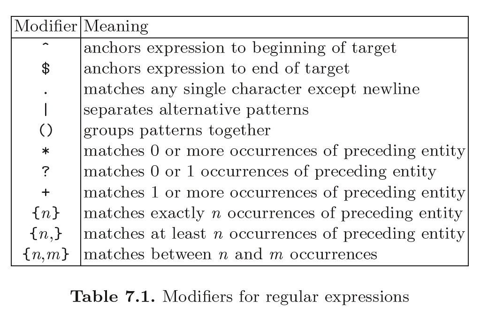
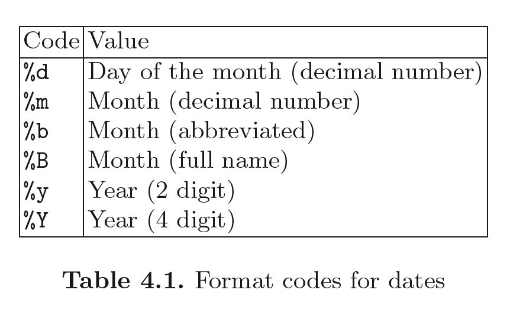
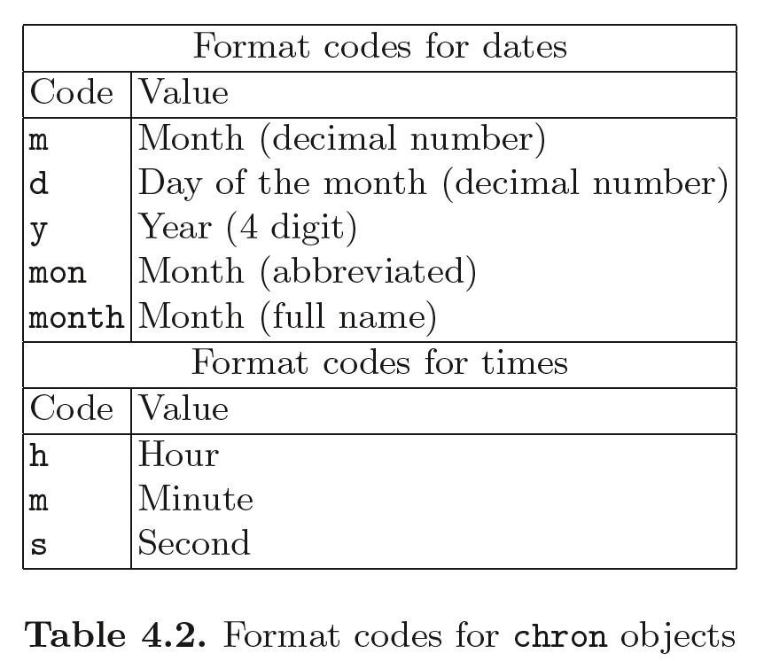
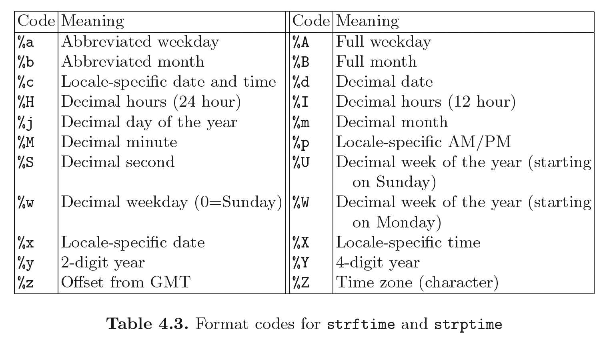

```{r, include=FALSE}
## By default, show code for all chunks in the knitted document,
## as well as the output. To override for a particular chunk
## use echo = FALSE in its options.
knitr::opts_chunk$set(
   echo=TRUE, message=FALSE, warning=FALSE
)
```

```{r, echo=FALSE}
# CONFIG
user_name <- "fernandomillanvillalobos" # your Git username (only needed if
# you want to deploy to GH pages)
project_name <- "r-data-manipulation" # adapt!
package_date <- "2022-05-01" # date of the CRAN snapshot that
# the checkpoint package uses
r_version <- "4.2.0" # R-Version to use
options(Ncpus = 4) # use 4 cores for parallelized installation of packages
if (r_version != paste0(version$major, ".", version$minor)) {
  stop("ERROR: specified R version does not match currently used.")
}
```

# Notes

This report was generated on `r Sys.time()`. R version: `r paste0(version$major, ".", version$minor)` on `r version$platform`. For this report, CRAN packages as of `r package_date` were used.

...

## R-Script & data

The preprocessing and analysis of the data was conducted in the [R project for statistical computing](https://www.r-project.org/). The RMarkdown script used to generate this document and all the resulting data can be downloaded [under this link](http://%60r%20user_name%60.github.io/%60r%20project_name%60/). Through executing `main.Rmd`, the herein described process can be reproduced and this document can be generated. In the course of this, data from the folder `input` will be processed and results will be written to `output`. The html on-line version of the analysis can be accessed through this [link](https://%60r%20user_name%60.github.io/%60r%20project_name%60/).

## GitHub

The code for the herein described process can also be freely downloaded from [https://github.com/`r user_name`/`r project_name`](https://github.com/%60r%20user_name%60/%60r%20project_name%60).

## License

...

## Data description of output files

#### `abc.csv` (Example)

| Attribute | Type    | Description |
|-----------|---------|-------------|
| a         | Numeric | ...         |
| b         | Numeric | ...         |
| c         | Numeric | ...         |

...

# Set up

```{r, echo=FALSE}
detach_all_packages <- function() {
  basic_packages_blank <-  c("stats",
                             "graphics",
                             "grDevices",
                             "utils",
                             "datasets",
                             "methods",
                             "base")
  basic_packages <- paste("package:", basic_packages_blank, sep = "")

  package_list <- search()[
    ifelse(unlist(gregexpr("package:", search())) == 1, TRUE, FALSE)]

  package_list <- setdiff(package_list, basic_packages)

  if (length(package_list) > 0)  for (package in package_list) {
    detach(package, character.only = TRUE, unload = TRUE)
    print(paste("package ", package, " detached", sep = ""))
  }
}

detach_all_packages()

# this allows multiple persons to use the same RMarkdown
# without adjusting the working directory by themselves all the time
source("scripts/csf.R")
path_to_wd <- csf() # if this - for some reason - does not work,
# replace with a hardcoded path, like so: "~/projects/rddj-template/analysis/"
if (is.null(path_to_wd) | !dir.exists(path_to_wd)) {
  print("WARNING: No working directory specified for current user")
} else {
  setwd(path_to_wd)
}

# suppress scientific notation
options(scipen = 999)

# suppress summarise info
options(dplyr.summarise.inform = FALSE)

# unload global rstudioapi and knitr again to avoid conflicts with checkpoint
# this is only necessary if executed within RStudio
# outside of RStudio, namely in the knit.sh script, this causes RMarkdown
# rendering to fail, thus should not be executed there
if (Sys.getenv("RSTUDIO") == "1") {
  detach_all_packages()
}
```

## Define packages

```{r, echo=TRUE, message=FALSE, warning=FALSE}
# from https://mran.revolutionanalytics.com/web/packages/\
# checkpoint/vignettes/using-checkpoint-with-knitr.html
# if you don't need a package, remove it from here (commenting not sufficient)
# tidyverse: see https://blog.rstudio.org/2016/09/15/tidyverse-1-0-0/
cat("
library(rstudioapi)
library(tidyverse)
library(data.table)
library(tidylog)
library(jsonlite)
library(lintr)
library(rmarkdown)
library(rio)
library(cowplot)
library(patchwork)
library(extrafont)
library(ggrepel)
library(pacman)
library(htmltab)
library(rmiscutils)
library(RSQLite)
library(fs)
library(openxlsx)
library(waldo)
library(vcdExtra)
library(psych)
library(Hmisc)
library(skimr)
library(gapminder)
library(lsr)
library(chron)
library(plm)
library(randomNames)
library(encryptr)
library(robotstxt)
library(tidymodels)
library(janitor)",
file = "manifest.R")
```

## Install packages

```{r, echo=TRUE, message=FALSE, warning=FALSE}
# if checkpoint is not yet installed, install it (for people using this
# system for the first time)
if (!require(checkpoint)) {
  if (!require(devtools)) {
    install.packages("devtools", repos = "http://cran.us.r-project.org")
    require(devtools)
  }
  devtools::install_github("RevolutionAnalytics/checkpoint",
                           ref = "v0.3.2", # could be adapted later,
                           # as of now (beginning of July 2017
                           # this is the current release on CRAN)
                           repos = "http://cran.us.r-project.org")
  require(checkpoint)
}
# nolint start
if (!dir.exists("~/.checkpoint")) {
  dir.create("~/.checkpoint")
}
# nolint end
# install packages for the specified CRAN snapshot date
checkpoint(snapshot_date = package_date,
           project = path_to_wd,
           verbose = T,
           scanForPackages = T,
           use.knitr = F,
           R.version = r_version)
rm(package_date)
```

## Load packages

```{r, echo=TRUE, message=FALSE, warning=FALSE}
source("manifest.R")
unlink("manifest.R")
sessionInfo()
```

## Load additional scripts

```{r, echo=TRUE, message=FALSE, warning=FALSE}
# if you want to outsource logic to other script files, see README for 
# further information
# Load all visualizations functions as separate scripts
knitr::read_chunk("scripts/dviz.supp.R")
source("scripts/dviz.supp.R")
knitr::read_chunk("scripts/themes.R")
source("scripts/themes.R")
knitr::read_chunk("scripts/plot_grid.R")
source("scripts/plot_grid.R")
knitr::read_chunk("scripts/align_legend.R")
source("scripts/align_legend.R")
knitr::read_chunk("scripts/label_log10.R")
source("scripts/label_log10.R")
knitr::read_chunk("scripts/outliers.R")
source("scripts/outliers.R")
```

# Import and export data with R

There are some different ways to do this, depending on how your data is formatted and where it's located.

## Base-R

### Entering data using R commands

R provides a nice GUI for editing tabular data: **the data editor**.

The `c` function has already been introduced as a way to input small amounts of data into R. When the amount of data is large, and especially when typing the data into the console is inappropriate, the `scan` function can be used. `scan` is most appropriate when all the data to be read is of the same mode, so that it can be accommodated by a vector or matrix. The first argument to `scan` can be a quoted string or character variable containing the name of a file or a URL, or it can be any of a number of connections to allow other input sources. If no first argument is given, scan will read from the console, stopping when a completely blank line is entered. By default, `scan` expects all of its input to be numeric data; this can be overridden with the `what=` argument, which specifies the type of data that scan will see.

When reading from the console, R will prompt you with the index of the next item to be entered, and report on the number of elements read when it's done. If the what= argument to scan is a list containing examples of the expected data types, scan will output a list with as many elements as there are data types provided. To specify numeric values, you can pass a value of 0.

Note that, by naming the elements in the list passed through the `what=` argument, the output list elements are appropriately named. When the argument to what= is a list, the `multi.line=` option can be set to FALSE to prevent scan from trying to use multiple lines to read the records for an observation. One of the most common uses for scan is to read in data matrices. Since scan returns a vector, a call to scan can be embedded inside a call to the matrix function.

```{r}
salary <- c(18700000, 14626720, 14137500, 13980000, 12916666)
position <- c("QB", "QB", "DE", "QB", "QB")
team <- c("Colts", "Patriots", "Panthers", "Bengals", "Giants")
name.last <- c("Manning", "Brady", "Pepper", "Palmer", "Manning")
name.first <- c("Peyton", "Tom", "Julius", "Carson", "Eli")
top.5.salaries <- data.frame(name.last, name.first, team, position, salary)
top.5.salaries

# calling the built-in data editor
# top.5.salaries <- edit(top.5.salaries)
# fix(top.5.salaries)

# using scan
# names <- scan(what = "")
# names
# names2 = scan(what=list(a=0,b="",c=0))
# names2

# creating a matrix
# mymat <- matrix(scan(), ncol = 3, byrow = TRUE)
# mymat
```

### Importing data from external files

R includes a family of functions for importing delimited text files into R, based on the `read.table` function. The `read.table` function reads a text file into R and returns a data.frame object. Each row in the input file is interpreted as an observation. Each column in the input file represents a variable. The read.table function expects each field to be separated by a delimiter. The most important options are `sep` and `header`. R includes a set of convenience functions that call `read.table` with different default options for these values. Besides that, you can fetch a CSV file from a single URL.


Although not as common as white-space-, tab-, or comma-separated data, sometimes input data is stored with no delimiters between the values, but with each variable occupying the same columns on each line of input. In cases like this, the `read.fwf` function can be used. The `widths=` argument can be a vector containing the widths of the fields to be read, using negative numbers to indicate columns to be skipped. If the data for each observation occupies more than one line, `widths=` can be a list of as many vectors as there are lines per observation. The `header=`, `row.names=`, and `col.names=` arguments behave similarly to those in `read.table`.

```{r}
snowdata <- read.table("input/BostonWinterSnowfalls.csv", header = TRUE, sep = ",", quote = "\"")

# getting data online
sp500 <- read.csv("http://bit.ly/BostonSnowfallCSV", sep="")

# getting data with no delimiters
ff <- tempfile()
cat(file = ff, "New York, NY 66,834.6 
    Kings, NY 34,722.9 
    Bronx, NY 31,729.8 
    Queens, NY 20,453.0 
    San Francisco, CA 16,526.2 
    Hudson, NJ 12,956.9 
    Suffolk, MA 11,691.6 
    Philadelphia, PA 11,241.1 
    Washington, DC 9,378.0 
    Alexandria IC, VA 8,552.2")
city <- read.fwf(ff, widths = c(18, -19, 8), as.is = TRUE)
city
```
### Exporting data

R can also export R data objects (usually data frames and matrices) as text files. To export data to a text file, use the `write.table` function.There are wrapper functions for `write.table` that call `write.table` with different defaults. These are useful if you want to create a file of comma-separated values.

```{r}
# write.table(snowdata, file = "output/snowdata.txt", quote = FALSE, sep = ",", row.names = FALSE)
# write.csv(snowdata, file = "output/snowdata.csv", row.names = FALSE)
```

### Importing data from databases

In order to connect directly to a database from R, you will need to install some optional packages. The packages you need depend on the database(s) to which you want to connect and the connection method you want to use.

There are two sets of database interfaces available in R:

-   **RODBC**. The RODBC package allows R to fetch data from ODBC (Open DataBase Connectivity) connections. ODBC provides a standard interface for different programs to connect to databases.

-   **DBI**. The DBI package allows R to connect to databases using native database drivers or JDBC drivers. This package provides a common database abstraction for R software.

DBI is not a single package, but instead is a framework and set of packages for accessing databases.One important difference between the DBI packages and the RODBC package is in the objects they use: DBI uses S4 objects to represent drivers, connections, and other objects. To open a connection with DBI, use the dbConnect function. The argument drv can be a DBIDriver object or a character value describing the driver to use. You can generate a DBIDriver object with a call to the DBI driver. The dbConnect function can take additional options, depending on the type of database you are using. For SQLite databases, the most important argument is dbname (which specifies the database file). Check the help files for the database you are using for more options. Even arguments for parameters like usernames are not the same between databases.

As example we can easily copy an R data frame into a SQLite database with dbWriteTable().

```{r}
# to connect with an external database
# drv <- dbDriver("SQLite")
# con <- dbConnect(drv, dbname = system.file("extdata", "bb.db", package = "nutshell"))

# creating our database
mydb <- dbConnect(RSQLite::SQLite(), "")
dbWriteTable(mydb, "mtcars", mtcars)
dbWriteTable(mydb, "iris", iris)
dbListTables(mydb)

# Issue a query with dbGetQuery()
dbGetQuery(mydb, 'SELECT * FROM mtcars LIMIT 5')

# disconnecting from dabase
dbDisconnect(mydb)
```

## Tidyverse

### Reading data

El paquete readr, incluido en la familia tidyverse, admite la lectura de múltiples formatos de archivo usando funciones que comienzan por `read_*` o `write_*`. Por defecto, la función `read_excel()` importa la primera hoja. Para importar una hoja diferente es necesario indicarlo con el argumento sheet o bien el número o el nombre (segundo argumento). La función más importante para leer múltiples hojas es `map()` del paquete *purrr* que forma para de la colección de paquetes tidyverse. `map()` permite aplicar una función a cada elemento de un vector o lista. Existe una variante de `map()` que directamente nos une todas las tablas por fila: `map_df()`. Si fuese necesario unir por columna, se debería usar `map_dfc()`.

La función `dir_ls()` del paquete *fs* (<https://github.com/r-lib/fs>), a pesar de ser similar a `dir()` de R Base, tiene algunas ventajas, como su total compatibilidad con la colección de funciones de *tidyverse*. Por ejemplo, el argumento `regexp` permite buscar con una expresión regular un patrón en las rutas y ficheros.


Most of us would probably read the CSV file first and then do the data cleaning. For example, using the `clean_names` function from the _janitor_ package. The same can be achieved inside `read_csv` with the function `make_clean_names` for the `name_repair` argument. The function uses the snake naming convention by default. Snake converts all names to lowercase and separates words with an underscore. Besides that, `clean_names` does not work with vectors, but `make_clean_names` does.

 

With make_clean_names you can also replace certain characters from the column names. If you are familiar with regular expressions, you can make more complex replacements. Apart from cleaning your column names, you can also select columns directly from `read_csv` using the `col_select` argument.

```{r}
# janitor approach
mpg_new <- read_csv("input/mpg_uppercase.csv", show_col_types = FALSE) %>%
  janitor::clean_names() %>%
  select(c(manufacturer, model)) %>%
  glimpse()

# tidyverse approach
read_csv("input/mpg_uppercase.csv", name_repair = make_clean_names, show_col_types = FALSE) %>%
  glimpse()

# replacing and removing character strings with make_clean_names
make_clean_names(c("A", "B%", "C"), replace = c("%" = "_percent"))
# with reg expressions
make_clean_names(c("A_1", "B_1", "C_1"), replace = c("^A_" = "a"))

# snake naming convention per default
make_clean_names(c("myHouse", "MyGarden"), case = "snake")
make_clean_names(c("myHouse", "MyGarden"), case = "none")

read_csv("input/mpg_uppercase.csv", show_col_types = FALSE, name_repair = ~ make_clean_names(., case = "upper_camel")) %>% # The dot . in make_clean_names denotes the vector of column names. 
  glimpse()

# selecting specific columns
read_csv("input/mpg_uppercase.csv", show_col_types = FALSE, name_repair = make_clean_names, col_select = c(manufacturer, model)) %>% 
  glimpse()
```

Column names often contain spaces, special characters, or are written in a mixture of lower and upper case characters. Such poorly formatted column names can lead to numerous problems. We could easily solve these issues with the `rename` function but this approach does not
scale. The main difference between remain and `remain_with` is that remain_with changes the column names using a function. The three main arguments of the function are `.data`, `.fn` and `.cols`. `.data` stands for the data frame, `.fn` for the function to apply to the column names, and .`cols` for the columns to apply the function to.

Use a specific naming convention for column names using the `make_clean_names` function from the _janitor_ package. It is used the tilde operator to indicate an anonymous function. This shortcut is needed whenever you need to call certain arguments of a function.

Another use case of `rename_with` is the replacement of characters. We use the `gsub` function to replace a specific character. Alternatively, we could have used the `str_replace` function. With `pattern` we said that we are looking for a group of characters containing one or more digits (\\d+). \\d+ is a regular expression. A group in the `argument` pattern is everything between two brackets. With `replacement` we said that we want to put an underscore in front of this group. The group itself is specified by \\1. If we had two groups, the second group would be specified by \\2.

You can use `.cols` to specify which column names to apply the function to. And you can even use our _tidyselect_ functions for that. Another useful function is `matches.` With `matches`, you can search for specific patterns in your column names and apply a function to the column names that match the pattern.

```{r}
mpg %>%
  rename_with(
    .fn = toupper,
    .cols = everything()
  )
# the same as
mpg %>%
  rename_with(
    .fn = toupper,
    .cols = everything()
  ) %>%
  colnames()

# using janitor to build a specific name convention
iris %>%
  rename_with(~ janitor::make_clean_names(., case = "big_camel")) %>%
  colnames()

# replacing characters
mpg %>%
  rename_with(~ gsub("e", "_", .)) %>%
  colnames()
# or
mpg %>%
  rename_with(~ str_replace(., "e", "_")) %>%
  colnames()

# replacing characters using grouping function
anscombe %>%
  rename_with(~ str_replace(.,
    pattern = "(\\d+)",
    replacement = "_\\1"
  )) %>%
  colnames()

# renaming variables for specific variables
anscombe %>%
  rename_with(~ str_replace(
    ., "([:alpha:])([1-2])",
    "\\1psilon\\2_"
  ), c(y1, y2)) %>%
  colnames()

# using tidyverse functions
mpg %>%
  rename_with(~ toupper(.), where(is.numeric)) %>%
  colnames()

iris %>%
  rename_with(
    ~ str_replace(., "\\.", "_"),
    starts_with("Sepal")
  ) %>%
  colnames()

# using matches
iris %>%
  rename_with(
    ~ str_replace(., "\\.", "_"),
    matches("[Ww]idth$")
  ) %>%
  colnames()
```

You don"t always read just one file into R. It is not uncommon for your data to be scattered in hundreds or thousands of files. Of course, you don"t want to read these files into R manually. So you need an automatic method for reading in files. Before we can read the files into R, we need to create a character vector of the file paths. You have several options to create such a vector. You can use the R base function `list.files`, which returns character vectors of the names of files in a directory or you use the function `dir_ls` from the _fs_ package. The other option is to use the `dir_ls` function from the _fs_ package. _fs_ provides a cross-platform interface for accessing files on your hard disk. It supports all file operations (deleting, creating files, moving files, etc.).

Now that we know the file paths, we can load the files into R. The tidyverse way to do this is to use the `map_dfr` function from the _purrr_ package. `map_dfr` loops through all the file paths and binds the data frames into a single data frame. The `.x` in the following code stands for the file name. To output the actual csv files and not the filenames, we need to put `.x` (the path) in a `read_*` function. In this example we are working with CSV files. The trick works the same for all rectangular file formats. Another approach is to use the `read_csv` function directly by putting the character vector of the file names directly into `read_csv`.

Sometimes your files are deeply nested. In that case, we need to search through each folder recursively. If you try to load all csv files from the nested_folders folder, you would get an empty vector. This is because `dir_ls` does not look in the nested folders, but only in the parent folder. To make `dir_ls` search through the folders recursively, you need to set the `recurse` argument to `TRUE`. 

You don"t always need all the files in your directory and need to remove some files from the list of file paths. A good way to do this is to use the `str_detect` function from the _stringr_ package. The function returns logical values. To change the actual character vector, we need to add these logical values to the character vector itself. With the `negate` argument you can find only the files that do not match the pattern.

```{r}
horas_sol <- read_csv("input/SS_STAID001395.txt", skip = 19) |> # los datos empiezan en la linea 20
  janitor::clean_names()
head(horas_sol)

# .xlsx files
# importing .xls file
emisiones <- readxl::read_xls("input/env_air_gge.xls", sheet = 1, skip = 362, n_max = 36)
head(emisiones)

# iterate over multiple worksheets in a workbook
path <- "input/madrid_temp.xlsx"
mad <- path %>%
  readxl::excel_sheets() %>%
  set_names() %>%
  map_df(readxl::read_excel,
    path = path, .id = "yr"
  )
head(mad)

# importing and reading several .xlsx files at once without merging
dir_ls("input", regexp = "xlsx") %>%
  map(readxl::read_excel)

# merging into a new column
data_df <- dir_ls("input", regexp = "xlsx") %>% 
  map_df(readxl::read_excel, .id = "city")
# cleaning city column
data_df <- mutate(data_df, city = path_file(city) %>% 
                    path_ext_remove() %>% 
                    str_replace("_temp", ""))
head(data_df)

# .csv files
# adding new directory
# dir_create("input", c("many_files"))

# creating random samples from mpg data set
# mpg_samples <- map(1:25, ~ slice_sample(mpg, n = 20))

# adding .csv files from samples to the new directory
# iwalk(mpg_samples, ~ write_csv(., paste0("input/many_files/", .y, ".csv")))

# creating a character vector of file paths
# with list.files from Base-R
(csv_files_list_files <- list.files(path = "input/many_files", pattern = "csv", full.names = TRUE))
# with dir_ls from fs package
(csv_files_dir_ls <- dir_ls(path = "input/many_files/", glob = "*.csv", type = "file"))

# another example using map.df(), list.files() and rio::import()
contributions <- map_df(list.files("input/mayor_finance_reports", full.names = TRUE), rio::import)
head(contributions)

# another example using r loops
# getting the list of data files
sheets <- list.files("input/covid_data", full.names = TRUE)

# importing the data and saving as one big data frame
for (i in 1:length(sheets)) {
  df <- read_csv(sheets[i])

  # if first time looping, save df as big_df
  if (i == 1) {
    big_df <- df
  } else {
    # if not the first time looping, then rbind it to big_df
    big_df <- rbind(big_df, df)
  }

  print(nrow(big_df))
}
glimpse(big_df)

# using janitor::tabyl() function to count number of rows within a group
contributions <- map_df(list.files("input/mayor_finance_reports", full.names = TRUE), rio::import) %>%
  filter(City == "Framingham", !str_detect(tolower(Address), "box")) %>%
  distinct(Contributor, Address, .keep_all = TRUE) %>%
  tabyl(Recipient, sort = TRUE) %>%
  # mutate(percent = round(percent * 100, 1)) %>% 
  select(Candidate = Recipient, Pct_Local_Contributors = percent)
contributions

# using adorn_percentages()
results <- readr::read_csv("input/election_framingham_mayor_2017_09.csv", col_names = TRUE) %>% 
  dplyr::select(Candidate, Totals)
results

results <- results %>%
  filter(!(Candidate %in% c("Blanks", "Write-Ins"))) %>%
  adorn_percentages(denominator = "col") %>% 
   rename(Pct_Vote = Totals)
results

contributions_split <- tidyr::separate(
  contributions, Candidate,
  c("LastName", "FirstName"), ", ", 2
) %>%
  select(-FirstName)
head(contributions_split)

results_split <- tidyr::separate(results, Candidate, c("FirstName", "MiddleName", "LastName"), " ")
tail(results_split)

results_split %<>%
  mutate(
    LastName = ifelse(is.na(LastName), MiddleName, LastName),
    LastName = str_replace(LastName, ",", "")
  ) %>%
  select(-FirstName, -MiddleName)
tail(results_split)

# reading the files from a character vector of paths
data_frames <- map_dfr(csv_files_dir_ls, ~ read_csv(.x, show_col_types = FALSE))
glimpse(data_frames)
# and with a new column representing the file name
map_dfr(csv_files_dir_ls, ~ read_csv(.x, , show_col_types = FALSE) %>%
  mutate(filename = .x)) %>%
  glimpse()

# using directly read_csv
read_csv(csv_files_dir_ls, id = "filename", show_col_types = FALSE) %>% 
  glimpse

# inconsistent column names
# generating the samples with inconsistent column names
mpg_samples2 <- map(1:10, ~ slice_sample(mpg, n = 20))
inconsistent_dframes <- map(mpg_samples2, ~ janitor::clean_names(dat = .x, case = "random"))
map(inconsistent_dframes, ~ colnames(.x)) %>% 
  head

# selecting a random set of columns per data frame
inconsistent_dframes <- map(inconsistent_dframes, ~ .x[sample(1:length(.x), sample(1:length(.x), 1))])
map(inconsistent_dframes, ~ colnames(.x)) %>%
  head()

# saving to disk
# dir_create(c("input/unclean_files"))
# iwalk(inconsistent_dframes, ~ write_csv(.x, paste0("input/unclean_files/", .y, ".csv")))

# loading and cleaning the data frames
many_columns_data_frame <- dir_ls(path = "input/unclean_files/", glob = "*.csv", type = "file") %>%
  map_dfr(~ read_csv(.x, name_repair = tolower, show_col_types = FALSE) %>% 
            mutate(filename = .x))

# showing results
many_columns_data_frame %>% 
  glimpse()

# files not in the same folder
mpg_samples3 <- map(1:40, ~ slice_sample(mpg, n = 20)) 

# Create directories
# dir_create(c("input/nested_folders", "input/nested_folders/first_nested_folder", "input/nested_folders/second_nested_folder"))

# First folder 
# iwalk(mpg_samples[1:20], ~ write_csv(.x, paste0("input/nested_folders/first_nested_folder/", .y, "_first.csv")))

# Second folder 
# iwalk(mpg_samples[21:40], ~ write_csv(.x, paste0("input/nested_folders/second_nested_folder/", .y, "_second.csv")))

# searching through nested folders recursively
(csv_files_nested <- dir_ls("input/nested_folders/", glob = "*.csv", type = "file", recurse = TRUE))
map_dfr(csv_files_nested, ~ read_csv(.x, show_col_types = FALSE) %>% 
          mutate(filename = .x)) %>%
  glimpse()

# selecting the files to import from a string pattern
csv_files_nested[str_detect(csv_files_nested, pattern = "[2-4]_first|second\\.csv$", negate = TRUE)] %>% 
  map_dfr(~ read_csv(.x, show_col_types = FALSE) %>% 
            mutate(filename = .x)) %>% 
  glimpse()
```
### Writing data

The `write_csv` function writes tabular data to an ASCII file in CSV format. Each row of data creates one line in the file, with data items separated by commas (,).

```{r}
# write_csv(horas_sol, "output/horas_sol.csv")
```

## Packages

### The magic of rio

"The aim of **rio** is to make data file I/O [import/output] in R as easy as possible by implementing three simple functions in Swiss-army knife style," according to the project's GitHub page. Those functions are `import()`, `export()`, and `convert()`. So, the rio package has just one function to read in many different types of files: `import()`. Once you've analyzed your data, if you want to save the results as a CSV, Excel spreadsheet, or other format, rio's `export()` function can handle that. You can use R's `download.file` function with the syntax `download.file("url", "destinationFileName.csv")` to download files directly from the web. It's possible rio will ask you to re-download the file in binary format, in which case you'll need to run `download.file(“http://bit.ly/BostonSnowfallCSV”, “BostonWinterSnowfalls.csv”, mode=‘wb"`).

```{r}
# getting data from the web with R-built-in
download.file("http://bit.ly/BostonSnowfallCSV", "input/BostonWinterSnowfalls.csv")
# download.file(“http://bit.ly/BostonSnowfallCSV”, “BostonWinterSnowfalls.csv”, mode=‘wb")

# import data with rio locally
snowdata2 <- rio::import("input/BostonWinterSnowfalls.csv")
suicides <- rio::import("input/PDT-suicidesData.csv")
# rio::import("mySpreadsheet.xlsx", which = 2, col_names = c("City", "State", "Population"))
```

#### Import a file from the Web

If you want to download and import a file from the Web, you can do so if it's publicly available and in a format such as Excel or CSV you can use `rio`. A lot of systems will be able to follow the redirect URL to the file even after first giving you an error message, as long as you specify the format as "csv" since the file name here doesn't include ".csv". rio can also import well-formatted HTML tables from Web pages, but the tables have to be extremely well-formatted. In real life, though, Web data rarely appears in such neat, isolated form. A good option for cases that aren't quite as well crafted is often the **htmltab** package. Since it wasn't specified which table, it pulled the first HTML table on the page. To download a specific table use the `which` argument.

The most popular way to install packages from GitHub is to use a package called **devtools**. devtools is an extremely powerful package designed mostly for people who want to write their own packages, and it includes a few ways to install packages from other places besides CRAN. However, devtools usually requires a couple of extra steps to install compared to a typical package. However, the **pacman** package will also install packages from non-CRAN sources like GitHub. You can use the `number_with_commas()` function to change those character strings that should be numbers back into numbers. The **rmiscutils** package isn't the only way to deal with imported numbers that have commas, the tidyverse readr package also includes a function that turns character strings into numbers, `parse_number()`. One advantage of `readr::parse_number()` is that you can define your own `locale()` to control things like encoding and decimal marks. There's an R package called **janitor** that can automatically fix troublesome column names imported from a non-R-friendly data source. You can create new clean column names using janitor's `clean_names()` function.

```{r}
# getting data from the web with rio
snowdata3 <- rio::import("http://bit.ly/BostonSnowfallCSV", format = "csv")

# getting html tables
design.tokens1 <- rio::import("https://designsystem.digital.gov/design-tokens/", format = "html")
citytable <- htmltab("https://en.wikipedia.org/wiki/List_of_United_States_cities_by_population", which = 5)
design.tokens2 <- htmltab("https://designsystem.digital.gov/design-tokens/", which = 6)

# installing packages from GitHub with pacman
pacman::p_load_gh("smach/rmiscutils")

# changing those character strings that should be numbers back into numbers
citytable$PopEst2021 <- number_with_commas(citytable$`2021estimate`)
citytable$Census2020 <- readr::parse_number(citytable$`2020census`)

# cleaning cols names
citytable_cleaned <- janitor::clean_names(citytable)
names(citytable_cleaned)
```

#### Import data from packages

If you are interested in state or local government data in the US or Canada, you may want to check out RSocrata to see if an agency you're interested in posts data there. I've yet to find a complete list of all available Socrata data sets, but there's a search page at <https://www.opendatanetwork.com>.

### What's a data frame? And what can you do with one?

It's easy to add a column to a data frame. The name of the new column is on the left, and there's a formula on the right. Some of these special dataframe functions (technically called "methods") not only give you information, but let you change characteristics of the data frame. So, `names(snowdata)` tells you the column names in the data frame but it will change the column names in the data frame.

```{r}
# adding cols
snowdata$Meters <- snowdata$Total * 0.0254

# changing col names
names(snowdata) <- c("Winter", "SnowInches", "SnowMeters")

# changing from num to chr
download.file("https://raw.githubusercontent.com/smach/R4JournalismBook/master/data/bostonzips.txt", "input/bostonzips.txt")
zips <- rio::import("input/bostonzips.txt", colClasses = c("character", "character"))
# or
# zips <- rio::import("input/bostonzips.txt", colClasses = rep("character", 2))
# rep("character", 2) is the same as c(“character”, “character”), so colClasses = rep("character", 2) is equivalent to colClasses = c("character", "character")
```

### Exporting data

Often after you've wrangled your data in R, you'll want to save your results. Here are some of the ways to export your data:

-   Save to a CSV file with `rio::export(myObjectName, file="myFileName.csv")` and to an Excel file with `rio::export(myObjectName, file="myFileName.xlsx")`. rio understands what file format you want based on the extension of the file name. There are several other available formats, including .tsv for tab-separated data, .json for JSON and .xml for XML.

-   Save to an R binary object that makes it easy to load back into R in future sessions. There are two options.

Generic `save()` will save one or more objects into a file, such as `save(objectName1, objectName2, file="myfilename.RData")`. To read this data back into R, you just use the command `load("myfilename.RData")` and all the objects return with the same names in the same state they had before.

You can also save a single object into a file with `saveRDS(myobject, file="filename.rds")`. The logical assumption would be that loadRDS would read the file back in, but instead the command is readRDS -- and in this case, just the data has been stored, not the object name. So, you need to read the data into a new object name, such as `mydata <- readRDS("filename.rds")`.

You can also export an R object into your Windows or Mac clipboard with rio: `rio::export(myObjectName, format = "clipboard")`. And, you can import data into R from your clipboard the same way: `rio::import(file = "clipboard")`.

rio's `convert()` function lets you convert one file type to another without having to manually pull the data into and then out of R.

The *openxlsx* package makes writing to Excel files relatively easy. While there are lots of options in *openxlsx*, a typical pattern is to specify an Excel filename and a sheet name.

```{r}
# write.xlsx(horas_sol, sheetName = "horas_sol", file = "output/horas_sol.xlsx")
```

### Additional resources

While rio is a great Swiss Army knife of file handling, there may be times when you want a bit more control over how your data is pulled into or saved out of R. In addition, there have been times when I've had a challenging data file that rio choked on but another package could handle. Some other functions and packages you may want to explore:

-   Base R's `read.csv()` and `read.table()` to import text files (use ?read.csv and ?read.table to get more information). `stringsAsFactors = FALSE` is needed with these if you want to keep your character strings as character strings. `write.csv()` will save to CSV.

-   Wickham's readr package is also worth a look as part of the "tidyverse." **readr** includes functions to read CSV, tab-separated, fixed-width, Web logs, and several other types of files. readr prints out the type of data it has determined for each column -- integer, character, double (non-whole numbers), etc. It creates tibbles.

-   The **googlesheets** package lets you import data from a Google Sheet, even if it's private, by authenticating your Google account. The package is available on CRAN; install it with with `install.packages("googlesheets")`.

If you are working with large data sets, speed may become important to you when saving and loading files. The **data.table** package has a speedy `fread()` function, but beware that resulting objects are data.tables and not plain data frames; some behaviors are different. If you want a conventional data frame, you can get one with the `as.data.frame(mydatatable)` syntax. `fwrite()` function is aimed at writing to a CSV file considerably faster than base R's `write.csv()`.

The **feather** package saves in a binary format that can be read either into R or Python. And, the **fst** package's `read.fst()` and `write.fst()` offer fast saving and loading of R data frame objects -- plus the option of file compression.

# Reshaping data

## Base-R

Often the values required for a particular operation can be found in a data frame, but they are not organized in the appropriate way. As a simple example, data for multiple groups are often stored in spreadsheets or data summaries as columns, with a separate column for each group. Most of the modeling and graphics functions in R will not be able to work with such data; they expect the values to be in a single column with an additional column that specifies the group from which the data arose. The `stack` function can reorganize datasets to have this property. If there were other variables in the data frame that did not need to be converted to this form, the `select=` argument to stack allows you to specify the variables that should be used, similar to the same argument to the `subset` function. The `unstack` function will reorganize stacked data back to the one column per group form. To use `unstack`, a formula must be provided to explain the roles of the variables to be unstacked.

For more complex reorganizations, the concept of “wide” versus “long” datasets is often helpful. When there are multiple occurrences of values for a single observation, a data frame is said to be long if each occurrence is a separate row in the data frame; if all of the occurrences of values for a given observation are in the same row, then the dataset is said to be wide. The `reshape` function converts datasets between these two forms. Perhaps the most common use of reshape involves repeated measures analyses, where the same variable is recorded for each observation at several different times.

To use reshape to convert the dataset to wide format, we need to provide five arguments. The first argument is the data frame to be reshaped. The next three arguments provide the names of the columns that will be involved in the reshaping. The idvar= argument provides the names of the variables that define the experimental unit which was repeatedly measured. In this case, it"s the subj variable. The v.names= argument tells reshape which variables in the long format will be used to create the multiple variables in the wide format. In this example, we want both x and y be to be expanded to multiple variables, so we"d specify a vector with both those names. The timevar= variable tells which variable identifies the sequence number that will be used to create the multiple versions of the v.names variables; in this case it will be time. Finally, the direction= argument accepts values of "wide" or "long", depending on which transformation is to be performed.

The names x.1, y.1, etc. were formed by joining together the variable names of the variables specified in the `v.names=` argument with the values of the `timevar=` variable. Any variables not specified in the `v.names=` argument are assumed to be constant for all observations with the same values as the `idvar=` variables, and a single copy of such variables will be included in the output data frame. Only the variables whose names appear in the `v.names=` argument will be converted into multiple variables, so if any variables that are in the data frame but not in the `v.names=` argument are not constant, reshape will print a warning message, and use the first value of such variables when converting to wide format. To prevent variables from being transferred to the output data frame, the drop= argument can be used to pass a vector of variable names to be ignored in the conversion.

The information about the reshaping procedure is stored as attributes in converted data frames, so once a data frame has been converted with reshape, it can be changed to its previous format by passing just the data frame with no additional arguments to `reshape`.

Since reshape can handle multiple sets of variables, the `varying=` argument should be passed a list containing vectors with the names of the different sets of variables that should be mapped to a single variable in the long dataset. The automatically generated variable id is simply a numeric index corresponding to the type variable; using `idvar="type"` will suppress its creation. The automatically generated variable time defaults to a set of consecutive integers; providing more meaningful values through the `times=` argument will label the values properly. Finally, the name of the column representing the values (which defaults to the first name in the varying= argument) can be set to a more meaningful name with the v.names= argument.

The _reshape_ package uses the concept of “melting” a dataset (through the melt function) into a data frame which contains separate columns for each id variable, a variable column containing the name of each measured variable, and a final column named value with the variable"s value. It may be noticed that this melting operation is essentially a “wide-to-long” reshaping of the data.

For long-to-wide conversions, recall that variables appearing to the left of the tilde in the formula passed to cast will appear in the columns of the output, while those on the right will appear in the rows.

At the most basic level, two or more data frames can be combined by rows using `rbind`, or by columns using `cbind`. For `rbind`, the data frames must have the same number of columns; for `cbind`, the data frames must have the same number of rows. Vectors or matrices passed to `cbind` will be converted to data frames, so the mode of columns passed to `cbind` will be preserved. While `cbind` will demand that data frames and matrices are conformable (that is, they have the same number of rows), vectors passed to cbind will be recycled if the number of rows in the data frame or matrix is an even multiple of the length of the vector. It may be a good idea to use unique names when combining data frames in this way. An easy way to test is to pass the names of the two data frames to the `intersect` function. When using `rbind`, the names and classes of values to be joined must match, or a variety of errors may occur.

Although the `rbind` function will demand that the names of the objects being combined agree, `cbind` does not do any such checking. To combine data frames based on the values of common variables, the `merge` function should be used. This function is designed to provide the same sort of functionality and behavior as the table joins provided by relational databases. Although merge is limited to operating on two data frames at a time, it can be called repeatedly to deal with more than two data frames. The default behavior of `merge` is to join together rows of the data frames based on the values of all of the variables (columns) that the data frames have in common. (In database terminology, this is known as a natural join.) When called without any other arguments, merge returns only those rows which had observations in both data frames.

Although there were six unique values for a between the two data frames, only those rows with values of a in both data frames are represented in the output. To modify this, the `all=`, `all.x=`, and `all.y=` arguments can be used. Specifying `all=TRUE` will include all rows (full outer join, in database terminology), `all.x=TRUE` will include all rows from the first data frame (left outer join), and `all.y=TRUE` does the same for the second data frame (right outer join).

To take more control over which variables are used to merge rows of the data frame, the `by=` argument can be used. You provide the `by=` argument with a vector of the name or names of the variables that should be used for the merge. If the merging variables have different names in the data frames to be merged, the `by.x=` and `by.y=` arguments can be used.

```{r}
mydata <- data.frame(grp1 = c(12, 15, 19, 22, 25), grp2 = c(18, 12, 42, 29, 44), grp3 = c(8, 17, 22, 19, 31))

# reshaping data frame
sdata <- stack(mydata)
sdata

# converting the the original form
mydata <- unstack(sdata, values ~ ind)
mydata

# using reshape
set.seed(17)
obs <- data.frame(subj = rep(1:4, rep(3, 4)), time = rep(1:3), x = rnorm(12), y = rnorm(12))
head(obs)

# from long to wide
wideobs <- reshape(obs, idvar = "subj", v.names = c("x", "y"), timevar = "time", direction = "wide")
head(wideobs)

# from wide to long
obs <- reshape(wideobs)
head(obs)

# from wide to long (complex example)
usp <- data.frame(type = rownames(USPersonalExpenditure), USPersonalExpenditure, row.names = NULL)
head(usp)

rr <- reshape(usp, varying = list(names(usp)[-1]), idvar = "type", times = seq(1940, 1960, by = 5), v.names = "expend", direction = "long")
head(rr)

# an alternative way of reshaping the usp data frame, without having to explicitly provide the values of the times
rr1 <- reshape(usp, varying = names(usp)[-1], idvar = "type", split = list(regexp = "X1", include = TRUE), direction = "long")
head(rr1)

# using melt from reshape package (wide-to-long)
musp = reshape::melt(usp)
# or
# reshape::cast(musp,variable + type ~ .)
head(musp)

# getting rid of "X" and changing type to numeric
musp$variable <- as.numeric(sub("X", "", musp$variable))
# renaming columns
names(musp)[2:3] <- c("time", "expend")
head(musp)

# using cast from reshape package (long-to-wide)
set.seed(999)
obs2 <- data.frame(subj = rep(1:4, rep(3, 4)), time = rep(1:3), x = rnorm(12), y = rnorm(12))
mobs <- reshape::melt(obs2)
# reshape::cast(subj ~ variable + time, data = mobs)

# combining data sets using cbind and rbind
x <- data.frame(a = c("A", "B", "C"), x = c(12, 15, 19))
y <- data.frame(a = c("D", "E", "F", "G"), x = c(19, 21, 14, 12))
intersect(names(x), names(y))
cbind(y, z = c(1, 2))

# combining data sets based on the values of common variables
x <- data.frame(a = c(1, 2, 4, 5, 6), x = c(9, 12, 14, 21, 8))
y <- data.frame(a = c(1, 3, 4, 6), y = c(8, 14, 19, 2))
merge(x, y)

# outer join
merge(x, y, all = TRUE)

# left outer join
merge(x, y, all.x = TRUE)

# right outer join
merge(x, y, all.y = TRUE)

cities <- data.frame(city = c("New York", "Boston", "Juneau", "Anchorage", "San Diego", "Philadelphia", "Los Angeles", "Fairbanks", "Ann Arbor", "Seattle"), state.abb = c("NY", "MA", "AK", "AK", "CA", "PA", "CA", "AK", "MI", "WA"))
states <- data.frame(state.abb = c("NY", "MA", "AK", "CA", "PA", "MI", "WA"), state = c("New York", "Massachusetts", "Alaska", "California", "Pennsylvania", "Michigan", "Washington"))

merge(cities, states)

# another example
# mayordata <- merge(contributions_split, results_split, all.x = TRUE, all.y = TRUE, by.x = "LastName", by.y = "LastName")
```

## Tidyverse

There are three interrelated rules which make **a dataset tidy**: 1. Each variable must have its own column. 2. Each observation must have its own row. 3. Each value must have its own cell. These three rules are interrelated because it"s impossible to only satisfy two of the three: 1. Put each dataset in a tibble. 2. Put each variable in a column.

- **Wide** form: every row corresponds to a unique *subject.*
- **Long** form: every row corresponds to a unique *measurement.*


`pivot_longer()` "lengthens" data, increasing the number of rows and decreasing the number of columns. The inverse transformation is `pivot_wider()`. `pivot_longer()` is an updated approach to `gather()`, designed to be both simpler to use and to handle more use cases. We recommend you use `pivot_longer()` for new code; `gather()` isn't going away but is no longer under active development.

`pivot_wider()` "widens" data, increasing the number of columns and decreasing the number of rows. The inverse transformation is `pivot_longer()`. `pivot_wider()` is an updated approach to `spread()`, designed to be both simpler to use and to handle more use cases. We recommend you use `pivot_wider()` for new code; `spread()` isn't going away but is no longer under active development.

```{r}
# wide to long
# where column names are character data
head(relig_income)
relig_income %>%
  pivot_longer(!religion, names_to = "income", values_to = "count")

# columns have common prefix and missing missings are structural so should be dropped
head(billboard)
billboard %>%
  pivot_longer(
    cols = starts_with("wk"),
    names_to = "week",
    names_prefix = "wk",
    values_to = "rank",
    values_drop_na = TRUE
  )

# multiple variables stored in column names
head(tidyr::who)
tidyr::who %>%
  pivot_longer(
cols = new_sp_m014:newrel_f65,
names_to = c("diagnosis", "gender", "age"),
names_pattern = "new_?(.*)_(.)(.*)",
values_to = "count"
)
 
# multiple observations per row
head(anscombe)
anscombe %>% 
  pivot_longer(everything(),
 names_to = c(".value", "set"),
 names_pattern = "(.)(.)"
)

# long to wide
head(fish_encounters)
fish_encounters %>% 
  pivot_wider(names_from = station, values_from = seen)

# filling in missing values
fish_encounters %>%
  pivot_wider(names_from = station, values_from = seen, values_fill = 0)

# generating column names from multiple variables
head(us_rent_income)
us_rent_income %>% 
  pivot_wider(names_from = variable, values_from = c(estimate, moe))

# when there are multiple `names_from` or `values_from`, you can use use `names_sep` or `names_glue` to control the output variable names
us_rent_income %>%
  pivot_wider(
    names_from = variable,
    names_sep = ".",
    values_from = c(estimate, moe)
  )

us_rent_income %>%
 pivot_wider(
    names_from = variable,
    names_glue = "{variable}_{.value}",
    values_from = c(estimate, moe)
  )

warpbreaks <- as_tibble(warpbreaks[c("wool", "tension", "breaks")])
head(warpbreaks)
warpbreaks %>%
  pivot_wider(
    names_from = wool,
    values_from = breaks,
    values_fn = mean
  )
```

Existen otras tres funciones que son muy útiles para la manipulación de datos: `separate()`, que sirve para asegurar una columna en varias nuevas; `case_when()`, que sirve para establecer condionales y es similar a `ifelse()` y `complete()` que sirve para completar una variable o una combinación de variables.

Para mostrar la primera función convertimos la fecha en tres columnas: año (yr), mes (mo) y día (dy), cuyos elementos están separados por “-“. Por ello, es necesario indicar la columna afectada, los nombres de las nuevas columnas y el símbolo separador. La función `mutate_all()` aplica a todas las columnas otra función, en este caso, `as.numeric()` para convertir todas en numéricas.

En lugar de encapsular y encadenar `ifelse()`, podemos usar la función `case_when()`, en la que empleamos fórmulas en dos tiempos: por un lado la condición; por otro, la acción cuando se cumpla esa condición.

Nuestro conjunto de datos contiene datos diarios desde el 1 de enero de 1980 hasta el 31 de diciembre de 2015. Así que únicamente debemos crear un vector con fechas de este periodo. En la función `complete()` indicamos la columna que queremos completar y le asignamos el vector entero de fechas. El resultado es un nuevo `data.frame` con todas las fechas, rellenando el resto de columnas con NA.

The `extract` function is basically the separate function with super powers and works with groups instead of separators. The `separate` function allows you to split a character variable into multiple variables. The key difference between `separate` and `extract` is that `extract` works with groups within its regular expressions. Each captured group is converted into a new column. So instead of thinking of the separator in separate with `extract`, we think of groups. `extract` takes a few arguments:

- _col_ specifies the character column to be split into several columns.
- _into_ specifies the name of the columns to be created
- _regex_ defines the regular expression in which we capture the groups that will represent the new columns
- _remove_ tells the function if the original column should be removed (by default TRUE)

To extract columns that are more complicated and confusing, we need to learn the concept of __non-grouping parentheses__. Non-grouping parentheses define groups that are not captured. In other words, these groups are not converted into a new column. A non-grouping parenthesis is defined by a group that starts with a question mark and a colon: (`?:`). The advantage of this method is that we can solve column separation problems caused by messy or inconsistent variables.

tidyr’s `separate()` function will split a data frame column into multiple columns based on a delimiter of your choice. The syntax is `separate(my_df, my_col_name, my_new_col_names, my_delimiter, my_number_of_new_columns)`.

 

```{r}
ta_vigo <- read_csv( "input/TG_STAID001395.txt", skip = 20)
head(ta_vigo)

ta_vigo <- mutate(ta_vigo, DATE = lubridate::ymd(DATE), TG = ifelse(TG == -9999, NA, TG / 10)) %>%
  filter(DATE >= "1980-01-01", DATE <= "2015-12-31") %>%
  select(-STAID:-SOUID, -Q_TG) %>%
  rename(date = DATE)
head(ta_vigo)

horas_sol <- read_csv("input/SS_STAID001395.txt", skip = 19)
horas_sol <- mutate(horas_sol, DATE = lubridate::ymd(DATE), SS = ifelse(SS == -9999, NA, SS / 10), month = month(DATE), year = year(DATE))
horas_sol <- rename(horas_sol, date = DATE, sunhours = SS)
horas_sol
data_vigo <- left_join (ta_vigo, horas_sol, by = "date" )
data_vigo
rio::export(data_vigo, file = "input/data_vigo.csv")

# using separate() 
# data_vigo <- rio::import("input/data_vigo.csv")
time_df <- select(data_vigo, date) %>%
  separate(date, c("yr", "mo", "dy"), sep = "-") %>%
  mutate_all(as.numeric)
head(time_df)

# another example
contributions_split <- tidyr::separate(
  contributions, Candidate,
  c("LastName", "FirstName"), ", ", 2
) %>%
  select(-FirstName)
head(contributions_split)

results_split <- tidyr::separate(results, Candidate, c("FirstName", "MiddleName", "LastName"), " ")
tail(results_split)

results_split %<>%
  mutate(
    LastName = ifelse(is.na(LastName), MiddleName, LastName),
    LastName = str_replace(LastName, ",", "")
  ) %>%
  select(-FirstName, -MiddleName)
tail(results_split)

# using case_when()
time_df <- mutate(time_df, season = case_when(
  mo %in% c(12, 1:2) ~ "invierno",
  mo %in% 3:5 ~ "primavera",
  mo %in% 6:8 ~ "verano",
  mo %in% 9:11 ~ "otoño"
))

# preparing the data
data_vigo <- gather(data_vigo, Variable, Valor, TG:sunhours)
data_vigo_subset <- filter(data_vigo, Variable == "TG") %>%
  slice(sample(nrow(data_vigo), 10000)) %>%
  arrange(date)
head(data_vigo_subset)
date_ts <- seq(lubridate::ymd("1980-01-01"), lubridate::ymd("2015-12-31"), "day")

# using complete()
data_vigo_subset <- complete(data_vigo_subset, date = date_ts)
head(data_vigo_subset)

# using extract()
# example with separate()
tibble(
  variable = c("a-b", "a-d", "b-c", "d-e")
) %>%
  separate(
    variable,
    into = c("a", "b"),
    sep = "-",
    remove = FALSE
  )

# with extract
tibble(
  variable = c("a-b", "a-d", "b-c", "d-e")
) %>%
  extract(
    col = variable,
    into = c("a", "b"),
    regex = "([a-z])-([a-z])",
    remove = FALSE
  )

# without separator
tibble(
  variable = c("x1", "x2", "y1", "y2")
) %>%
  extract(
    variable,
    into = c("letter", "number"),
    regex = "([xy])(\\d)",
    remove = FALSE
  )

tibble(
  variable = c(
    "David Jude Heyworth Law", "Elton Hercules John",
    "Angelina Jolie Voight", "Jennifer Shrader Lawrence"
  )
) %>%
  extract(
    variable,
    into = c("short name", "remainder"),
    regex = "(\\w+) .* (\\w+)",
    remove = FALSE
  )

# extracting from non-grouping parentheses
tibble(
  variable = c(
    "x -> 1",
    "y -> 2",
    "p-> 34"
  )
) %>%
  extract(
    variable,
    into = c("letter", "number"),
    remove = FALSE,
    regex = "([a-z])(?: ?-> ?)(\\d+)?"
  )

# another example
df <- tibble(
  variable = c(
    "x ->-> 1",
    "y -> 2",
    "p-> 34",
    "f 4"
  )
)

df %>%
  extract(
    variable,
    into = c("letter", "number"),
    remove = FALSE,
    regex = "([a-z]) ?(?:->){0,} ?(\\d+)?"
  )

# another one
df <- tibble(
  variable = c(
    "x ->aslkdfj 1", "y-> 2",
    "p 34",
    "8"
  )
)

df %>%
  extract(
    variable,
    into = c("letter", "number"),
    remove = FALSE,
    regex = "([a-z])? ?(?:->\\w*)? ?(\\d+)"
  )

# last example
tibble(
  value = c(
    "3.10 = AX",
    "3.1345 = AX:?_40",
    "3.8983 =:$15",
    ".873 = PFS:4"
  )
) %>%
  extract(
    value,
    into = c("v0", "v2", "v3", "v4"),
    regex = "(\\d)?\\.(\\d+) ?= ?(?:(\\w+)?:?)?(?:[?_$]*)(\\d+)?",
    remove = FALSE
  )

# another example
results_regexp <- results %>%
  mutate(
    LastName = str_replace_all(Candidate, ".*\\s(.*?)\\,?$", "\\1")
  )
tail(results_regexp)
```
Techniques for __anonymizing__ and __pseudoanonymizing__ columns avoid data breaches that they are potentially dangerous for those affected. For that We will find out how to use the function `fct_anon`, how to replace names with random names, how to mask values, how to group numeric variables, how to remove house numbers from street names, and how to encode and decode values.The difference between pseudonymization and anonymization is that pseudonymization is reversible, while anonymization is not.

The EU defines pseudonymization as follows:

“The processing of personal data in such a manner that the personal data can no longer be attributed to a specific data subject without the use of additional information provided that such additional information is kept separately and is subject to technical and organisational measures to ensure
that the personal data are not attributed to an identified or identifiable natural person.” (https://edps.europa.eu/system/files/2021-04/21-04-27_aepdedps_ anonymisation_en_5.pdf)
 
By this definition, pseudonymization is reversible and requires additional information to reverse the process.
 
Sometimes you want to make your data completely anonymous so that other people can’t see sensitive information. A simple function to anonymize such discrete data is `fct_anon`. The function takes two arguments. The factor you want to anonymize, and the prefix you put in front of the anonymized factor. The numbers are generated randomly. So, each time you run this code, you will get a different set of numbers.

Names are also sensitive data. To anonymize names, you can simply replace them with random names. This can be done with the `randomNames` function from the __randomNames__ package. You get a different set of names each time you run the function. If we want to be more specific about how the names are generated, we can provide some additional information to the function.

Another common use case is __the masking of values__. Masking is a technique that hides some characters of a string. Mostly by “X”s. The `.x` stands for the piped variable (in this case height). Then I provide a regular expression that searches for the last character of the string (`.$`). This character should then be replaced by an X. The regular expression `^.{10}` indicates that we are looking for the first 10 characters of the string. We replace this pattern with 10 “X”s, specified by `strrep("X", 10)`. The function __strrep__ is a basic function of R, which simply repeats a series of characters.

Another common technique for anonymizing data is to __divide it into groups__. With the function `cut_width` we can create groups of arbitrary width from a numeric variable. The round bracket means that a number is not included in the set. The square bracket means that a number is included in the set. The function `cut_number` creates a certain number of sets. Note, however, that the width of each group varies.

Finally, we can anonymize each column by encrypting it. When we encrypt a column, we convert the values of a column into another form, which we call ciphertext. The ciphertext is not readable by humans, but it can be converted back to the original value. There are two forms of encryption. Symmetric encryption, where a single key is used to encrypt and decrypt a value, and asymmetric encryption, where two keys are used to encrypt and decrypt a value. A key is plaintext that translates between the two representations. Once you have the key in symmetric encryption, you can decrypt values. To decrypt values in asymmetric encryption, you need the public key and the private key. The public key is as it says public, so open to anyone. The private key is a key you should not share with anyone. Only when you have both, can you decrypt a value. Also, private key cannot be guessed from the public key. To add another level of security, the private key also sometimes has a passphrase (or password) to it.

We can encrypt this data with the package __encryptr__. First we need to load the package and create the private and public keys using the `genkeys` function. The function prompted us to provide a passphrase for the private key. This passphrase and the private key should not be shared with anyone! Once we have the passphrase, we can encrypt our columns. To decrypt the column, we simply use the `decrypt` function. You must provide the passphrase to decrypt the column. Also, this works only if the R file is in the same directory as the public and private keys.

```{r}
levels(gss_cat$relig)

# converting these levels into numeric values and add a prefix to them
gss_cat %>%
  mutate(
    relig = fct_anon(relig, prefix = "religion_")
  ) %>%
  glimpse()

# anonymizing names
presidential %>%
  mutate(
    name = randomNames(nrow(.),
      sample.with.replacement = FALSE
    )
  )

# customizing random names
presidential %>%
  mutate(
    name = randomNames(nrow(.),
      sample.with.replacement = FALSE,
      ethnicity = c(1, 2, 4),
      name.order = "first.last",
      name.sep = " "
    )
  )

# masking values
starwars %>%
  mutate(
    height = map_chr(height, ~ str_replace(.x, ".$", "X"))
  )

# masking more than one character
ccards <- tibble(
  creditcards = c(
    36555224524299,
    36350489667466,
    36002887965170,
    5447552069207504,
    2221002654361034,
    5127699386148536
  )
)

# converting the first 10 characters
ccards %>%
  mutate(
    creditcards_masked = map_chr(creditcards, ~ str_replace(.x, "^.{10}",
      replacement = strrep("X", 10)
    ))
  )

# converting the last 5 characters
ccards %>%
  mutate(
    creditcars = map_chr(creditcards, ~ str_replace(.x, "\\d{5}$",
      replacement = strrep("X", 5)
    ))
  )

# dividing values into groups
# get the data
(age_starwars <- starwars %>%
  mutate(age = as.integer(format(Sys.Date(), "%Y")) - birth_year) %>%
  select(name, age) %>%
  drop_na(age))

# using cut_width()
age_starwars %>%
  mutate(
    age_groups = cut_width(age, 10)
  )

# using cut_number()
age_starwars %>%
  mutate(
    age_groups = cut_number(age, 10)
  )

# converting to millennia
age_starwars %>%
  mutate(
    millenium = 1000 * (age %/% 1000)
  )

# converting to decades
age_starwars %>%
  mutate(
    decade = 10 * (age %/% 10)
  )

# removing house numbers from street names
street_names <- tibble(
  street_name = c(
    "Bromley Lanes 34",
    "Woodsgate Avenue 12",
    "Ardconnel Terrace 99",
    "Gipsy Birches 45",
    "Legate Close 8",
    "Stevenson Oval 9",
    "St Leonard's Boulevard 112",
    "Copper Chare 435",
    "Glastonbury Glebe 82",
    "Southern Way 91"
  )
)

street_names %>%
  mutate(
    street_names_no_number = str_remove_all(street_name, "\\d")
  )

# encrypting and decrypting columns
users <- tibble(
  name = c("Alexander", "Marie", "John"),
  password = c(12345, "8$43_45*", "becker23#")
)

# genkeys() generates a public and private key pair
# Passphrase: 456#7
# genkeys()

# encrypting a column
# users_encrypted <- users %>%
#   encrypt(password)

# users_encrypted %>%
#   glimpse()

# decrypting the column
# users_encrypted %>% decrypt(password)
```

## Packages

Sometimes it makes sense to spread an observation over multiple rows (long format), and sometimes it makes more sense to spread a variable across multiple columns (wide format). Some analyses require long data, whereas others require wide data.

When going from a __long format to a wide format__, you choose columns to group the observations by (in the _gapminder_ case: `country` and maybe also `continent`), columns to take values names from (`lifeExp`, `pop` and `gdpPercap`), and columns to create variable names from (year). In _data.table_, the transformation from long to wide is done using the `dcast` function.

In _data.table_, __wide-to-long__ formatting is done using `melt`.

```{r}
gm <- as.data.table(gapminder)
head(gm)

# from long to wide
gmw <- dcast(gm, country + continent ~ year, value.var = c("pop", "lifeExp", "gdpPercap"))
head(gmw)

# wide-to-long (not the best approach!)
gm <- melt(gmw, id.vars = c("country", "continent"), measure.vars = 2:37)
head(gm)

# splitting columns and casting
gm[, c("variable", "year") := tstrsplit(variable, "_", fixed = TRUE)]
gm <- dcast(gm, country + year ~ variable, value.var = c("value"))
head(gm)

# merging columns
aq <- as.data.table(airquality)
head(aq)

# creating a new column Date and mergin Month and Day into it (date format)
aq[, Date := as.Date(paste(1973, aq$Month, aq$Day, sep = "-"))]
head(aq)
```
It is common that data is spread over multiple tables. Consequently, it is important to be able to merge data from different tables. The simplest types of merges are binds, which can be used when you have two tables where either the rows or the columns match each other exactly.

An operation that combines columns from two tables is called a __join__. There are two main types of joins: __inner joins__ and __outer joins__.

- __Inner joins__: create a table containing all observations for which the key appeared in both tables. So if we perform an inner join on the `rev_data` and `weather_data` tables using `DATE` as the key, it won"t contain data for the days that are missing from either the revenue table or the weather table. 

In contrast, outer joins create a table retaining rows, even if there is no match in the other table. There are three types of outer joins:

- __Left join__: retains all rows from the first table. In the revenue example, this means all dates present in rev_data. 
- __Right join__: retains all rows from the second table. In the revenue example, this means all dates present in weather_data. 
- __Full join__: retains all rows present in at least one of the tables. In the revenue example, this means all dates present in at least one of `rev_data` and `weather_data`.

__Semijoins__ and __antijoins__ are similar to joins, but work on observations rather than variables. That is, they are used for filtering one table using data from another table:

- __Semijoin__: retains all observations in the first table that have a match in the second table. 
- __Antijoin__: retains all observations in the first table that do not have a match in the second table.

The same thing can be achieved using the filtering techniques, but semijoins and antijoins are simpler to use when the filtering relies on conditions from another table.

```{r}
# preparing the data
rev_data <- read.csv("input/sales-rev.csv", sep = ";")
weather_data <- read.csv("input/sales-weather.csv", sep = ";")

rev_data <- as.data.table(rev_data)
rev_data$DATE <- as.Date(rev_data$DATE)
weather_data <- as.data.table(weather_data)
weather_data$DATE <- as.Date(weather_data$DATE)

rev_jan <- rev_data[DATE %between% c("2020-01-01", "2020-01-31"), ]
rev_feb <- rev_data[DATE %between% c("2020-02-01", "2020-02-29"), ]
weather_jan <- weather_data[DATE %between% c("2020-01-01", "2020-01-31"), ]

str(rev_jan) 
str(rev_feb) 
str(weather_jan)

# with Base-R
# Join columns of datasets that # have the same rows: 
cbind(rev_jan, weather_jan)

# Join rows of datasets that have # the same columns: 
rbind(rev_jan, rev_feb)

# with dplyr
# Join columns of datasets that # have the same rows: 
# bind_cols(rev_jan, weather_jan) 

# Join rows of datasets that have # the same columns: 
# bind_rows(rev_jan, rev_feb)

# merging tables using keys
# data.table
# inner join
merge(rev_data, weather_data, by = "DATE")
# Or:
# setkey(rev_data, DATE)
# rev_data[weather_data, nomatch = 0]

# # dplyr
# rev_data %>% 
#   inner_join( weather_data, by = "DATE")

# outer join (left)
# data.table
merge(rev_data, weather_data, all.x = TRUE, by = "DATE") 
# Or: 
# setkey(weather_data, DATE) 
# weather_data[rev_data]

# dplyr
# rev_data %>% 
#   left_join( weather_data, by = "DATE")

# outer join (right)
# data.table
merge(rev_data, weather_data, all.y = TRUE, by = "DATE") 
# Or: 
# setkey(rev_data, DATE) 
# rev_data[weather_data]

# dplyr
# rev_data %>%
#   right_join(weather_data, by = "DATE")

# full join
# data.table
merge(rev_data, weather_data, all = TRUE, by = "DATE")

# dplyr
# rev_data %>% 
#   full_join( weather_data, by = "DATE")

# another example
mayordata <- full_join(contributions_split, results_split, by = "LastName")
str(mayordata)
head(mayordata)

# preparing the data
filter_data <- weather_data[TEMPERATURE < 0 & DATE %between% c("2020-02-01", "2020-02-29"), ]
head(filter_data)

# using a semijoin
# data.table
setkey(rev_data, DATE)
rev_data[rev_data[filter_data, which = TRUE]]

# dplyr
# rev_data %>%
#   semi_join(filter_data, by = "DATE")

# antijoin
# data.table
setkey(rev_data, DATE)
rev_data[!filter_data]

# dplyr
# rev_data %>%
#   anti_join(filter_data, by = "DATE")
```

# Summarizing data sets

## Base-R

```{r}
# returns column index names in table format
data.frame(colnames(snowdata))
# returns row index numbers in table format
data.frame(as.integer(rownames(snowdata)))

# getting a sense of the data set
str(snowdata)
# showing the number of rows and columns...
dim(snowdata)
nrow(snowdata)
ncol(snowdata)

# ...and names 
dimnames(snowdata)
rownames(snowdata)
colnames(snowdata)

# a brief statistical summary of a data set, run the summary() function
summary(snowdata)
```

## Tidyverse

```{r}
glimpse(snowdata)
```

## Packages

Find and concisely describe the difference between a pair of R objects with *waldo* package. One of the first things worth doing after importing a data set is looking at the first few rows, the last few rows, and a summary of some basic stats. This can be easily achieved thanks to the `headTail()` function of the *psych* package. To get a brief statistical summary you can use the `describe()` function of the *Hmisc* package or the *psych* package (only works for numeric data). The *skimr* package's `skim()` function will show information on each column, including a little histogram for each numeric one.

```{r}
df1 <- data.frame(X = c(1, 2, 3), Y = c("a", "b", "c"), A = c(3, 4, 5))
df2 <- data.frame(X = c(1, 2, 3, 4), Y = c("A", "b", "c", "d"), Z = c("k", "l", "m", "n"), A = c("3", "4", "5", "6"))
waldo::compare(df1, df2)

# getting the first and last rows
headTail(snowdata)

# getting statistical info
Hmisc::describe(snowdata)
psych::describe(snowdata)
skim(snowdata)
```

# Subsetting and modifying data frames

## Base-R

For objects that contain more than one element (vectors, matrices, arrays, data frames, and lists), subscripting is used to access some or all of those elements. Besides the usual numeric subscripts, R allows the use of character or logical values for subscripting. Subscripting operations are very fast and efficient, and are often the most powerful tool for accessing and manipulating data in R.

Like most computer languages, numeric subscripts can be used to access the elements of a vector, array, or list. The first element of an object has subscript 1; subscripts of 0 are silently ignored. In addition to a single number, a vector of subscripts (or, for example, a function call that returns a vector of subscripts) can be used to access multiple elements. The colon operator and the `seq` function are especially useful here. Negative subscripts in R extract all of the elements of an object except the ones specified in the negative subscript; thus, when using numeric subscripts, subscripts must be either all positive (or zero) or all negative (or zero).

If a subscriptable object is named, a character string or vector of character strings can be used as a subscript. Negative character subscripts are not permitted; if you need to exclude elements based on their names, the `grep` function can be used.

Logical values can be used to selectively access elements of a subscriptable object, provided the size of the logical object is the same as the object (or part of the object) that is being subscripted. Elements corresponding to TRUE values in the logical vector will be included, and objects corresponding to FALSE values will not. Logical subscripting provides a very powerful and simple way to perform tasks that might otherwise require loops. Like most operations in R, logical operators are vectorized; applying a logical subscript to a vector or an array will produce an object of the same size and shape as the original object. To find the indices of elements, R provides the `which` function, which accepts a logical vector, and returns __a vector containing the subscripts of the elements for which the logical vector was true__. Logical subscripts allow for modification of elements that meet a particular condition by using an appropriately subscripted object on the left-hand side of an assignment statement.

Lists are the most general way to store a collection of objects in R, because there is no limitation on the mode of the objects that a list may hold. Although it hasn"t been explicitly stated, one rule of subscripting in R is that subscripting will always return an object of the same mode as the object being subscripted. For matrices and vectors, this is completely natural, and should never cause confusion. But for lists, there is a subtle distinction between part of a list, and the object which that part of the list represents.

If the elements of the list are named, the actual contents of the elements can be accessed by separating the name of the list from the name of the element with a dollar sign ($). For interactive sessions, using the dollar sign notation is the natural way to perform operations on the elements of a list. For those situations where the dollar sign notation would be inappropriate (for example, accessing elements through their index or through a name stored in a character variable), R provides the double bracket subscript operator. Double brackets are not restricted to respect the mode of the object they are subscripting, and will extract the actual list element from the list.

__The key thing to notice is that in this case, single brackets will always return a list containing the selected element(s), while double brackets will return the actual contents of selected list element.__

Since data frames are a cross between a list and a matrix, it"s not surprising that both matrix and list subscripting techniques apply to data frames. When using logical subscripts with data frames containing missing values, it may be necessary to remove the missing values before the logical comparison is made, or unexpected results may occur. This situation is so common that R provides the `subset` function which accepts a data frame, matrix or vector, and a logical expression as its first two arguments, and which returns a similar object containing only those elements that meet the condition of the logical expression. It insures that missing values don"t get included, and, if its first argument is a data frame or matrix with named columns, it also resolves variable names inside the logical expression from the object passed as the first argument. A further convenience is offered by the `select=` argument which will extract only the specified columns from the data frame passed as the first argument. The argument to `select=` is a vector of integers or variable names which correspond to the columns that are to be extracted. Unlike most other functions in R, names passed through the `select=` argument can be either quoted or unquoted. To ignore columns, their name or index number can be preceded by a negative sign (-). Since the `select=` argument works by replacing variable names with their corresponding column indices, ranges of columns can be specified using variable names. The `subset` function will always return a new data frame, matrix or vector, so it is __not suited for modifying selected parts of a data frame__.

To sort the elements of an object, use the `sort` function. Add the `decreasing=TRUE` option to sort in reverse order. You can control the treatment of NA values by setting the `na.last` argument. To sort a data frame, you need to create a permutation of the indices from the data frame and use these to fetch the rows of the data frame in the correct order. You can generate an appropriate permutation of the indices using the `order` function. The `order` function takes a set of vectors as arguments. It sorts recursively by each vector, breaking ties by looking at successive vectors in the argument list. At the end, it returns a permutation of the indices of the vector corresponding to the sorted order.

```{r}
# subsetting a list
simple <- list(a = c("fred", "sam", "harry"), b = c(24, 17, 19, 22))
mode(simple)
simple[2]
mode(simple[2])

simple$b
mean(simple$b)
mean(simple[[2]])

# single brackets return a list
simple[1]
# double brackets return the actual contents of selected list element
simple[[1]]

# subsetting a data frame
# First, we check the order of the columns:
data.frame(names(airquality))

airquality[5, 4]    # The 5th element from the 4th column,
                    # i.e. the same as airquality$Temp[5]
airquality[5,]      # The 5th row of the data
airquality[, 4]     # The 4th column of the data, like airquality$Temp
airquality[[4]]     # The 4th column of the data, like airquality$Temp
airquality[, c(2, 4, 6)] # The 2nd, 4th and 6th columns of the data
airquality[, -2]    # All columns except the 2nd one

airquality[, c("Temp", "Wind")] # The Temp and Wind columns

age <- c(28, 48, 47, 71, 22, 80, 48, 30, 31)
purchase <- c(20, 59, 2, 12, 22, 160, 34, 34, 29)
bookstore <- data.frame(age, purchase)

bookstore$age[2] <- 18
# or
bookstore[2, 1] <- 18

# subsetting with logical values
nums = c(12,9,8,14,7,16,3,2,9)
nums > 10
nums[nums > 10]

which(nums > 10)
# equal to
seq(along = nums)[nums > 10]

which.max(airquality$Temp)
airquality[which.max(airquality$Temp),]
airquality[airquality$Temp > 90, ]

# knowing if all elements in a vector fulfill the condition
all(airquality$Temp > 90)
# knowing whether at least one element in a vector fulfill the condition
any(airquality$Temp > 90)
# finding how many elements that fulfill a condition
sum(airquality$Temp > 90)

# modifying elements through logical subscriptions
nums[nums > 10] <- 0
nums
dd <- data.frame(a = c(5, 9, 12, 15, 17, 11), b = c(8, NA, 12, 10, NA, 15))

dd[dd$b > 10, ]

bookstore$visit_length <- c(5, 2, 20, 22, 12, 31, 9, 10, 11)
bookstore

# storing the TRUE or FALSE values in a new variable
airquality$Hot <- airquality$Temp > 90
airquality$Hot

# filtering and creating a new variable
temp_may <- airquality$Temp[airquality$Month == 5]
temp_june <- airquality$Temp[airquality$Month == 6]

# splitting vectors into lists
temps <- split(airquality$Temp, airquality$Month)
names(temps) <- c("May", "June", "July", "August", "September")
temps
temps$June

# collapsing lists into vectors
unlist(temps)

# using subset
subset(dd, b > 10)
some <- subset(LifeCycleSavings, sr > 10, select = c(pop15, pop75))
head(some)
life1 <- subset(LifeCycleSavings, select = pop15:dpi)
# or
life1 <- subset(LifeCycleSavings, select = 1:3)
head(life1)
life2 <- subset(LifeCycleSavings, select = c(-pop15, -pop75))
# or
life2 <- subset(LifeCycleSavings, select = -c(2, 3))
head(life2)

# sorting with sort()
w <- c(5, 4, 7, 2, 7, 1)
sort(w)
sort(w, decreasing = TRUE)
length(w) <- 7
sort(w, na.last = TRUE)
sort(w, na.last = FALSE)

# using order() to sort a data frame
v <- c(11, 12, 13, 15, 14)
order(v)
v[order(v)]

u <- c("pig", "cow", "duck", "horse", "rat")
w <- data.frame(v, u)
w
w[order(w$v), ] 

snowdata[order(snowdata$SnowInches), ]
snowdata[order(snowdata$SnowInches, snowdata$SnowMeters), ]

# getting the location of the maximum and minimum values
which.max(snowdata$Boston)
which.min(snowdata$Boston)

# using indexes on the rows and/or columns
rows <- Arthritis$Sex == "Female" & Arthritis$Age > 68
cols <- c("Treatment", "Improved")
Arthritis[rows, cols]

# using names of values of a column to subset and create a new variable (no data)
# btw9s[c("BB", "BE", "MV","SN","ST","TH"), "EW"] <- "East"

# creating new variables based on others and reordering (no data)
# Fleiss93 <- within(Fleiss93, {
#   total <- n.e + n.c # create new var based on the sum of two
#   st1 <- as.character(study) # change type
#   st <- reorder(study, -(total)) # reorder var
# })

# fixing the naming (no data)
# exp1_long$condition <- ifelse(exp1_long$condition == "no", "No_communication",
#   ifelse(exp1_long$condition == "go", "High_confidence",
#     ifelse(exp1_long$condition == "me", "Medium_confidence",
#       ifelse(exp1_long$condition == "ba", "Low_confidence",
#         exp1_long$condition
#       )
#     )
#   )
# )

# renaming variables and convert to numeric (no data)
# exp1_long$temperature <- as.numeric(ifelse(exp1_long$temperature == "315", "31.5",
#   ifelse(exp1_long$temperature == "325", "32.5",
#     ifelse(exp1_long$temperature == "335", "33.5",
#       ifelse(exp1_long$temperature == "345", "34.5",
#         ifelse(exp1_long$temperature == "355", "35.5",
#           ifelse(exp1_long$temperature == "365", "36.5",
#             exp1_long$temperature
#           )
#         )
#       )
#     )
#   )
# ))

# recoding Yes/No responses as numeric (Yes=1, No=0) (no data)
# exp1_long$response_code <- ifelse(exp1_long$response == "Yes", 1, 0)

# adding values by row and getting rid of all NAs (no data)
# df.a$expertise_sum <- rowSums(df.a[, 12:19], na.rm = TRUE)

# cutting numeric variables into categories
age <- c(60, 58, 24, 26, 34, 42, 31, 30, 33, 2, 9)
age.breaks <- seq(from = 0, to = 60, by = 20)
age.labels <- c("young", "adult", "older")
age.group <- cut(x = age, breaks = age.breaks, labels = age.labels)
age.df <- data.frame(age, age.group)
age.df

# creating a temporal seq of years and calculate mean (no data)
# yrs <- c(seq(1972, 1988, 4), 1993, seq(1996, 2016, 4)) # seq every 4 years
# Calculating mean for every year 
# mean_age <- gss_lon %>%
#   filter(age %nin% NA && year %in% yrs) %>%
#   group_by(year) %>%
#   summarize(xbar = round(mean(age, na.rm = TRUE), 0))

# splitting a vector by group (no data)
# using split function: x = the variable that needs to be split into groups; y = the grouping variable
# speech.by.char <- split(x = utterance, y = speaker)
# speech.by.char

# pull variables from a list or data frame out and into the workspace
# importList(speech.by.char)

# locating NAs in a data frame
# pos_country <- which(is.na(df$Region))

# replacing NAs in a data frame for the last value with na.locf() (no data)
# replacing NAs for the last value
# df <- mutate(df, Region = zoo::na.locf(Region))
```

## Tidyverse

`filter()` picks rows based on data values, but `select()` chooses columns based on the column names (not values of data within the columns).

Select certain rows based on a logical condition - _dplyr´s_ `filter()`. To check for one condition OR another condition, use the `|` symbol, which means or. You can get the number of rows in a data frame with `nrow()`. To filter by one condition AND a second condition, you can use the `&` sign. Select certain rows based on row number - dplyr"s `slice()`. If we want a way to automatically check a condition across multiple columns, we need functions that are basically a derivative of the `across` function: `if_any` and `if_all`. What both functions have in common is that they produce `TRUE` or `FALSE` values. When working with filter, these logical values are usually generated by checking a condition for a single column. The trick with `if_any` and `if_all` is that they check a condition across multiple columns and return a `TRUE` or `FALSE` value for each row.

- `if_any` indicates whether one of the selected columns fulfills a condition
- `if_all` indicates whether all selected columns satisfy a condition

The following structure applies to both `if_any` and `if_all`:

<DFRAME> %>%
  filter(
    if_any(
      .cols = <SELECTION OF COLUMNS>,
      .fns = <CONDITION TO BE CHECKED FOR EACH COLUMN>,
    )
)

Both functions were introduced in __dplyr__ in February 2021. One reason for their introduction is that `across` was not feasible with `filter`. Similar to `across`, we can use tidyselect functions to select columns for which we want to check the condition.

Another very useful use case is filtering rows based on missing values across multiple columns. Besides that, we can combine `case_when` with `if_any` / `if_all` to create a new column based on multiple column-spanning conditions. This works because the left side of the two-sided `case_when` formulas expects a logical value (<LOGICAL VALUE> == <RIGHT HAND SIDE>).

Both slicing and filtering allow you to remove or keep rows in a data frame. Essentially, you can use both to achieve the same result, but their approaches differ. While `filter` works with conditions (e.g. `displ > 17`), `slice` works with indices. `slice` keeps all rows for which you specify positive indices. Note that in R indexing starts with 1 and not with 0 as in most other programming languages. You can also provide a vector of indices instead of the comma-separated indices in the `slice` function. To remove specific rows, we can use negative indices. A common use case within the `slice` family is to slice rows that have the highest or lowest value within a column. Finding these rows with `filter` would be tedious. A much easier way to achieve the same result is to use `slice_max()`. For the first argument `order_by` you specify the column for which the highest values should be taken. With `n` you specify how many of the rows with the highest values you want to keep. If you are more interested in the percentage of rows with the highest value, you can use the argument `prop`. Similarly, you can keep the rows with the lowest values in a given column with `slice_min()`. The `slice` functions become especially powerful when combined with `group_by`. The trick is that any function called after `group_by` is only applied to the subgroups. Another useful function is `slice_sample`. It randomly selects rows from your data frame. You define how many should be selected. `slice_sample` by default samples without replacement. Once we have selected a row, we cannot select it again. Consequently, there will be no duplicate rows in our data frame. However, if we set the `replace` argument to `TRUE`, we will perform sampling with replacement. We can find the duplicate rows with the function `get_dupes` from the __janitor__ package.

This functionality allows us to create bootstraps from our data frame. Bootstrapping is a technique where a set of samples of the same size are drawn from a single original sample.For example, if you have a vector `c(1, 4, 5, 6)`, you can create the following bootstraps from this vector: `c(1, 4, 4, 6)`, `c(1, 1, 1, 1)` or `c(5, 5, 1, 6)`. Some values appear more than once because bootstrapping allows each value to be pulled multiple times from the original data set. Once you have your bootstraps, you can calculate metrics from them. For example, the mean value of each bootstrap. The underlying logic of this technique is that since the sample itself is from a population, the bootstraps act as proxies for other samples from that population. We can create many bootstrap from our sample. frames. Once we have the bootstraps, we can calculate any metric from them. Usually one calculates confidence intervals, standard deviations, but also measures of center like the mean from the bootstraps.

Use `arrange(dataframe, colname)` to sort in ascending order and `arrange(dataframe, desc(colname))` to sort in descending order. To sort by a second column in case there are ties in the first column, the syntax is `arrange(dataframe, col1, col2)`.

You can select by specific column name, no quotes or `c()` needed: `select(snowdata, Winter, Boston)`. Select a contiguous group of columns, such as starting with Boston and ending with New York City, with the syntax `select(snowdata, Boston:NYC)`. You can select based on column names containing certain characters; for example, if you had a data frame with column names in the format city_state such as Boston_MA, Chicago_IL, NYC_NY, Fargo_ND and Syracuse_NY, you could select all the New York State entries using `select(dataframe, contains("_NY"))` or `select(dataframe, ends_with("_NY")`. You can delete columns by putting a minus sign before your selection, such as `select(snowdata, -(Boston:Chicago))` or `select(dataframe, -contains("_NY"))`. `select_if()` lets you use `is. functions` such as `is.numeric()` or `is.character()` to choose columns by data type.

The __tidyselect__ functions give you many options to select columns in R. The first function is `everything`. As the name suggests, it lets you select all columns of a data frame. Then we have `last_col`. With this function you can select the last column in a data frame. We have the two functions `starts_with` and `ends_with`. You use these functions when you want to select columns that start or end with exactly a certain string. `starts_with` and `ends_with` works with any character, but also with a vector of characters.

Next we have the `contains` function. `contains` searches for columns that contain a specific string. Note that it does not work with regular  expressions, but searches for exactly the string you specify. By default, however, the function is not case-sensitive. It doesn´t matter if your columns are in uppercase or lowercase. If you are concerned about case sensitivity, set the `ignore.case` argument to `FALSE` (this also works with `starts_with`, `ends_with`, and `matches`). Unlike contains, `matches` works with regular expressions.

The function `num_range` is useful if your column names follow a certain pattern.

Finally, there is the `where` function. `where` is used when you want to select variables of a certain data type. Other predicate functions are:

- `is.double` 
- `is.logical` 
- `is.factor` 
- `is.integer`

You can combine the different selection functions with the `&` and `|` operators.

With `mutate` you normally specify the new column to be created or overwritten. With `across` you don’t have to do that. Without specifying the `.names` argument, the names of your columns remain the same, you just apply the function(s) to those columns.

When we impute missing values, we replace them with substituted values.

Some of the simplest calculations in R can be confusing at times. For instance, `mean`, `sum`, `min`, `max`, and `median` are not a vectorized function because it does not perform its calculations vector by vector. Instead, it throws each vector into a box and calculates the overall average of all its values. So the problem occurs with functions that are not vectorized (e.g. `mean`) and with base R functions that compute summary statistics. `rowwise` was introduced in dplyr in 2020 with version 1.1.0. Essentially, the function ensures that operations are performed row by row. It works similar to `group_by`. It does not change how the data frame looks, but how calculations are performed with the data frame. It is not possible to add a tidyselect function within `mean` or any of the other functions. In these cases `c_across` comes to your rescue. It was developed especially for rowwise and can be considered a wrapper around `c()`. Instead of `c()` you can use any tidyselect function of your choice. When using rowwise functions The most common mistake is forgetting to `ungroup` the data frame. I told you that rowwise does nothing but group the data so that the calculations are performed row by row. Similar to `group_by`, rowwise can also be ungrouped with `ungroup()`. If you don’t do that, problems like this can occur.

A nice use case of `rowwise` is to convert your values into proportions. To calculate proportions, you must first calculate the sum of all values.Since the data is in a wide format, this can be done with rowwise. For small data sets `rowwise` is sufficient. However, if your data frame is very large, `rowwise`
will show performance problems compared to alternative approaches. You can use other functions to calculate summary statistics on a row-by-row basis without using `rowwise`. If you are working with really large data frames, keep in mind that `rowwise` is not the most efficient method. Consider the alternatives. For instance, `pmin` and `pmax` calculate the minimum and maximum value for one or more vectors. Another one is `rowSums` which calculates the sums for rows. The function works with a matrix or a data frame. Providing a vector of values will not work, so we have to use a matrix trick to make it work. We can calculate the mean of each row with `rowMeans`.

```{r}
snowdata <- rio::import("input/BostonChicagoNYCSnowfalls.csv")
# knowing how may rows
snowdata[nrow(snowdata), ]

# using filter from dplyr
filter(snowdata, Boston > 100)

# OR
filter(snowdata, Boston < 20 | Boston > 100)
# AND
filter(snowdata, Boston > 40 & Boston < 50)
filter(snowdata, Boston > 50, Boston < 80)

# how to filter rows based on a condition across mulitple columns
# getting the data
df <- tibble(
  a = c(1, 2, 3),
  b = c(NA, 4, 8),
  c = c(1, 4, 1)
)
# filtering all rows that contain missing values (wrong version!)
df %>%
  filter(!is.na(a) & !is.na(b) & !is.na(c))

# with if_any()
billboard %>%
  filter(
    if_any(
      .cols = contains("wk"),
      .fns = ~ . == 1
    )
  )

# with if_all()
billboard %>%
  filter(
    if_all(
      .cols = matches("wk[1-5]$"),
      .fns = ~ . <= 50
    )
  )

# how to filter rows that contain missing values
# This data frame comes from the tidyr documentation:
# https://tidyr.tidyverse.org/reference/complete.html
(df <- tibble(
  item_name = c("a", "a", "b", "b"),
  group = c(1, NA, 1, 2),
  value1 = c(1, NA, 3, 4),
  value2 = c(4, 5, NA, 7)
))

# keeping all rows whose numeric columns do not contain missing value
df %>%
  filter(
    if_all(
      .cols = where(is.numeric),
      .fns = ~ !is.na(.)
    )
  )

# how to create new columns based conditions across multiple columns
billboard %>%
  mutate(
    top_song = case_when(
      if_any(
        .cols = contains("wk"),
        .fns = ~ . == 1
      ) ~ "top song",
      TRUE ~ "no top song"
    )
  ) %>%
  select(artist, track, top_song)

# using slice()
myresults <- slice(snowdata, 60:76)

# using a vector of indices with slice()
economics %>%
  rownames_to_column(var = "row_number") %>%
  slice(c(4, 8, 10))

# removing the fist row in a data set
economics %>%
  slice(-1)

# removing the last row
economics %>%
  slice(-nrow(.))

# how to slice off the top and bottom of a data frame
# getting the data
survey_results <- tribble(
  ~id, ~name, ~pre, ~post,
  1, "Test", 4, 4,
  2, "Test", 6, 8,
  3, "Millner", 2, 9,
  4, "Josh", 4, 7,
  5, "Bob", 3, 4
)

# slicing the top n rows of a data frame
survey_results %>%
  slice_tail(
    n = nrow(.) - 2
  )
# or
survey_results %>%
  slice_tail(n = 3)
# or
survey_results %>%
  filter(name != "Test")

# slicing the bottom n rows
survey_results %>%
  slice_head(
    n = 2
  )

# how to slice rows with the highest and lowest values in a given column
# with filter
economics %>%
  filter(unemploy >= sort(.$unemploy, decreasing = TRUE)[10]) %>%
  arrange(desc(unemploy)) %>%
  select(date, unemploy)

# with slice_max()
economics %>%
  slice_max(
    order_by = unemploy,
    n = 10
  ) %>%
  select(date, unemploy)

# the percentage of rows with the highest value
economics %>%
  slice_max(
    order_by = unemploy,
    prop = .1
  )

# rows with the lowest values in a given column
economics %>%
  slice_min(
    order_by = unemploy,
    n = 3
  )

# how to combine the slice functions with group_by
(highest_unemploy_per_month <- economics %>%
  group_by(year = year(date)) %>%
  slice_max(
    order_by = unemploy,
    n = 1
  ) %>%
  ungroup()) # At the end we terminate the grouping function with ungroup. Otherwise we would not apply the next functions to the whole data frame, but to the individual groups.

# visualizing the results
highest_unemploy_per_month %>%
  mutate(
    month = month(date) %>% as.factor()
  ) %>%
  count(month) %>%
  ggplot(aes(x = month, y = n)) +
  geom_col()

# how to create bootstraps with slice_sample
economics %>%
  slice_sample(n = 20)

# setting replacement
set.seed(455)
(sample_with_replacement <- economics %>%
  slice_sample(prop = 1, replace = TRUE))

# getting duplicates
sample_with_replacement %>%
  janitor::get_dupes()

# creating bootstrap
bootstraps <- map(1:2000, ~ slice_sample(economics, prop = 1, replace = TRUE))
bootstraps %>% head(n = 2)

# getting the mean from the bootstraps
means <- map_dbl(bootstraps, ~ mean(.$unemploy))
p1 <- ggplot(NULL, aes(x = means)) +
  geom_histogram(fill = "grey80", color = "black") +
  labs(x = "means slice_sample")

# getting the mean of our data set (pretty close to the mean value of our bootstraps!)
economics$unemploy %>% mean

# comparing our bootstraps with the one created with tidymodels
boostraps_tidymodels <- rsample::bootstraps(economics, times = 2000)
means_tidymodels <- map_dbl(
  boostraps_tidymodels$splits,
  ~ mean(rsample::analysis(.)$unemploy)
)

p2 <- ggplot(NULL, aes(x = means_tidymodels)) +
  geom_histogram(fill = "grey80", color = "black")

(p1 | p2)

# arranging data frames
# ascending order
arrange(snowdata, Boston)
# descencing order
arrange(snowdata, desc(Boston))
# by a second column
arrange(snowdata, Boston, NYC)

# selecting columns
select(snowdata, Winter, Boston)
select(snowdata, Boston:NYC)
select(snowdata, contains("C"))
select(snowdata, ends_with("C"))
select(snowdata, -ends_with("C"))
snowdata_numeric <- select_if(snowdata, is.numeric)
psych::describe(snowdata_numeric)

# subsetting by row and column numbers
lastrow <- nrow(snowdata)
snowdata[lastrow, ]

# one line of code gives you the same exact result as another
identical(snowdata[76,], snowdata[lastrow,])

# getting the lowest and the highest value
range(snowdata$Boston)

# pulling the row from snowdata that has the lowest Boston winter snow total
slice(snowdata, which.min(Boston))

# tidyselect
# relocating columns with everything()
mpg %>%
  select(manufacturer, cyl, everything()) %>%
  glimpse()

# selecting the last column
mpg %>%
  select(last_col()) %>%
  glimpse()

# selecting all columns except the last one
mpg %>%
  select(!last_col()) %>%
  glimpse()

# you can use last_col to select the n-to-last column
mpg %>%
  select(last_col(1)) %>%
  glimpse()

# select all columns that start with the letter “m”
mpg %>%
  select(starts_with("m")) %>%
  glimpse()

mpg %>%
  select(ends_with(c("l", "r"))) %>%
  glimpse()

# selecting columns that contain certain strings
mpg %>%
  select(contains("m")) %>%
  glimpse()

mpg %>%
  rename(Manufacturer = manufacturer) %>%
  select(contains("m", ignore.case = FALSE)) %>%
  glimpse()

# selecting all columns that contain a number
billboard %>%
  select(matches("\\d")) %>%
  colnames()

billboard %>%
  select(matches("wk\\d{1}$")) %>%
  colnames()

anscombe %>%
  select(matches("[xy][1-2]")) %>%
  glimpse()

# selecting columns with number ranges
anscombe %>%
  select(num_range("x", 1:2)) %>%
  glimpse()

billboard %>%
  select(num_range("wk", 1:15)) %>%
  glimpse()

# selecting columns of a specific type
billboard %>%
  select(where(is.character)) %>%
  glimpse()

# combining selections
mpg %>%
  select(where(is.character) & contains("l")) %>%
  glimpse()

mpg %>%
  select(where(is.character) | contains("l")) %>%
  glimpse()

# how to change the variable type across many columns
mpg %>%
  mutate(
    across(
      .cols = where(is.character),
      .fns = as_factor,
      .names = "{.col}_as_factor"
    )
  ) %>%
  dplyr::select(where(is.factor) | where(is.character)) %>%
  glimpse()

# how to normalize many columns (mean of 0 and a standard deviation of 1)
scaled_columns <- mpg %>%
  transmute(
    across(
      .cols = where(is.numeric),
      .fns = ~ scale(.)[,1],
    )
  )

scaled_columns %>%
  glimpse()

# checking the results
scaled_columns %>%
  dplyr::summarise(
    across(
      .cols = everything(),
      .fns = list(mean = mean, sd = sd)
    )
  ) %>%
  glimpse()

# how to impute values across many columns
# getting the data
(dframe <- tibble(
  group = c("a", "a", "a", "b", "b", "b"),
  x = c(3, 5, 4, NA, 4, 8),
  y = c(2, NA, 3, 1, 9, 7)
))

# replace each missing value with the mean value of the respective column
dframe %>%
  mutate(
    across(
      .cols = c(x, y), # or everything()
      .fns = ~ ifelse(test = is.na(.),
        yes = mean(., na.rm = TRUE),
        no = .
      )
    )
  )
# or
dframe %>%
  mutate(
    across(
      .cols = c(x, y), # or everything()
      .fns = ~ case_when(
        is.na(.) ~ mean(., na.rm = TRUE),
        TRUE ~ .
      )
    )
  )

# you can also impute the values within groups
dframe %>%
  group_by(group) %>%
  mutate(
    across(
      .cols = c(x, y), # or everything()
      .fns = ~ case_when(
        is.na(.) ~ mean(., na.rm = TRUE),
        TRUE ~ .
      )
    )
  ) %>%
  ungroup()

# how to replace characters across many columns
# getting the data
typo_dframe <- tribble(
  ~pre_test, ~post_test,
  "goud", "good",
  "medium", "good",
  "metium", "metium",
  "bad", "goud"
)

(typo_corrected <- typo_dframe %>%
  mutate(
    across(
      .cols = everything(),
      .fns = ~ case_when(
        str_detect(., "goud") ~ str_replace(., "goud", "good"),
        str_detect(., "metium") ~ str_replace(., "metium", "medium"),
        TRUE ~ .
      )
    )
  ))

# how to do rowwise calculations
# getting the data
(dframe <- tibble(
name = c("Jakob", "Eliud", "Jamal", "Emily"),
first = c(1, 4, 7, 10),
second = c(2, 5, 8,11),
third = c(3, 6, 9, 12)
))

# calculating the mean (rowwise)
dframe %>%
  rowwise() %>%
  mutate(
    mean_performance = mean(c(first, second, third))
  )
# or with group_by()
dframe %>%
  group_by(name) %>%
  mutate(
    mean = mean(c(first, second, third))
  )

# with other summary statistics
dframe %>%
  rowwise() %>%
  mutate(
    mean_performance = mean(c(first, second, third)),
    sum_performance = sum(c(first, second, third)),
    min_performance = min(c(first, second, third)),
    max_performance = max(c(first, second, third)),
    median_performance = median(c(first, second, third))
  )

# how to use tidyselect functions with rowwise
dframe %>%
  rowwise() %>%
  mutate(
    mean_performance = mean(c_across(c(first, second, third)))
  )

# c_across with other tidyverse functions
billboard %>%
  rowwise() %>%
  transmute(
    artist,
    track,
    sum = sum(c_across(contains("wk")), na.rm = TRUE)
  )

# rowwise without ungroup() -> wrong!
dframe %>%
  rowwise() %>%
  mutate(
    mean = mean(c(first, second, third))
  ) %>%
  summarise(
    mean_across_students = mean(mean)
  )

# with ungroup()
dframe %>%
  group_by(name) %>%
  mutate(
    mean = mean(c(first, second, third))
  ) %>%
  ungroup() %>%
  summarise(
    mean_across_students = mean(mean)
  )

# calculating proportions with rowwise
(sums_per_row <- dframe %>%
  rowwise() %>%
  mutate(sum_per_row = sum(first, second, third)) %>%
  ungroup())

sums_per_row %>%
  transmute(
    name,
    across(
      .cols = where(is.numeric),
      .fns = ~ . / sum_per_row
    )
  )

# using pmin() and pmax()
dframe %>%
  mutate(
    max = pmax(first, second, third),
    min = pmin(first, second, third)
  )

# using rowSums() with a matrix
dframe %>%
  mutate(
    sum = rowSums(matrix(c(first, second, third), ncol = 3))
  )

# using a subset of a data frame
rowSums(dframe %>% select(-name))

# not using a matrix
dframe %>%
  mutate(
    sum1 = rowSums(select(., first, second, third)),
    sum2 = rowSums(across(first:third)),
    sum3 = rowSums(select(., matches("first|second|third"))),
  )

# using rowMeans()
dframe %>%
  mutate(
    sum1 = rowMeans(matrix(c(first, second, third), ncol = 3)),
    sum2 = rowMeans(across(first:third)),
    sum3 = rowMeans(select(., first, second, third)),
    sum4 = rowMeans(select(., matches("first|second|third")))
  )
```
## Packages

__data.table__ and the __tidyverse__ packages offer simpler solutions and speed up the workflow for the types of problems we are dealing with. Both can be used for the same tasks. You can learn one of them or both. The syntax used for data.table is often more concise and arguably more consistent than that in dplyr (it is in essence an extension of the `[i, j]` notation that we have already used for data frames). Second, it is fast and memory-efficient, which makes a huge difference if you are working with big data. On the other hand, many people prefer the syntax in dplyr and __tidyr__, which lends itself exceptionally well for usage with pipes. If you work with small or medium-sized datasets, the difference in performance between the two packages is negligible. __dplyr__ is also much better suited for working directly with databases, which is a huge selling point if your data already is in a database.

__data.table__ relies heavily on the `[i, j]` notation that is used for data frames in R. It also adds a third element: `[i, j, by]`. Using this, R selects the rows indicated by i, the columns indicated by j and groups them by by. This makes it easy e.g. to compute grouped summaries. With the __tidyverse__ packages you will instead use new functions with names like `filter` and `summarise` to perform operations on your data. These are typically combined using the pipe operator, `%>%`, which makes the code flow nicely from left to right.

__data.table__ syntax, as it only works on __data.table__ objects. __Luckily, __dplyr__ works perfectly when used on data.table objects__. Note that when using data.table, there is not an explicit assignment. Note that when using data.table, there is not an explicit assignment. We don"t use <- to assign the new data frame to aq - instead the assignment happens automatically. This means that you have to be a little bit careful, so that you don"t inadvertently data when playing around with it.

When working with __tidyverse__ packages, commands are usually chained together using `%>%` pipes. When using __data.table__, commands are chained by repeated use of `[]` brackets on the same line.

To change the name of a variable, we can use `setnames` from __data.table__ or `rename` from __dplyr__.

You"ll frequently want to filter away some rows from your data. Perhaps you only want to select rows where a variable exceeds some value, or want to exclude rows with NA values. This can be done in several different ways: using row numbers, using conditions, at random, or using regular expressions.

In some situations you may wish to draw a random sample from your data. This is done using the `sample` (data.table) and `sample_n` (dplyr) functions.

In some cases, particularly when working with text data, you"ll want to filter using regular expressions. __data.table__ has a convenience function called `%like%` that can be used to call `grepl` in an alternative (less opaque?) way. With __dplyr__ we use `grepl` in the usual fashion.

Another common situation is that you want to remove some variables from your data. Perhaps the variables aren"t of interest in a particular analysis that you"re going to perform, or perhaps you"ve simply imported more variables than you need. As with rows, this can be done using numbers, names or regular expressions. When selecting a single column from a data frame, you sometimes want to extract the column as a vector and sometimes as a single-column data frame (for instance if you are going to pass it to a function that takes a data frame as input). You should be a little bit careful when doing this, to make sure that you get the column in the correct format.

In __data.table__, using regular expressions to select columns is done using `grep`. __dplyr__ differs in that it has several convenience functions for selecting columns, like `starts_with`, `ends_with`, `contains`.

Sometimes you don"t want to filter rows, but rearrange their order according to their values for some variable. Similarly, you may want to change the order of the columns in your data. This is often useful for presentation purposes, but can at times also aid in analyses.

In some cases, you may want to fill missing values of a variable with the previous non-missing entry. To fill the missing values with the last non-missing entry, we can now use `nafill` or `fill`.

dplyr’s `distinct()` function will remove data frame rows based on duplication in certain columns. If you want to keep all the other variables in a data frame and not just the non-repetitive ones, `distinct()` needs the additional `.keep_all = TRUE` argument. Otherwise, it will return a data frame with only the columns you want to ensure haven’t been duplicated.

```{r}
aq <- as.data.table(airquality)

# modifying a variable
# data.table
aq[, Wind := Wind * 0.44704]
# dplyr
aq %>% mutate(Wind = Wind * 0.44704) -> aq

# computing a new variable based on existing variables
# data.table
aq[, Hot := Temp > 90]
# dplyr
aq %>% mutate(Hot = Temp > 90) -> aq

# renaming a variable
# data.table
setnames(aq, "Hot", "HotDay")
# dplyr
# aq %>% rename(HotDay = Hot) -> aq

# removing a variable
# data.table
aq[, HotDay := NULL]
aq[, c("Month", "Day") := NULL] # multiple cols
# dplyr
# aq %>% select(-HotDay) -> aq
# aq %>% select(-Month, -Day) -> aq # multiple cols

# chaining commands
# data.table
aq <- as.data.table(airquality)
aq[, Month := nafill(Month, "locf")][, .N, Month]
# dplyr
aq %>%
  fill(Month) %>%
  group_by(Month, across(days = n()))

# realoading the data
aq <- as.data.table(airquality)

# filtering using row numbers
# data.table
aq[3, ]
aq[3:5, ]
aq[c(3, 7, 15), ]
aq[-c(3, 7, 15), ]
# dplyr
aq %>% slice(3)
aq %>% slice(3:5)
aq %>% slice(c(3, 7, 15))
aq %>% slice(-c(3, 7, 15))

# filtering using conditions
# data.table
aq[Temp > 90, ]
aq[Month == 6, ]
aq[Temp > 90 & Month == 6, ]
aq[Temp %between% c(80, 90), ]
aq[frankv(-Temp,
  ties.method = "min"
) <= 5, ]
unique(aq) # removing duplicate rows
na.omit(aq) # removing rows with missing data
na.omit(aq, "Ozone") # removing rows with missing Ozone values
# dplyr
aq %>% filter(Temp > 90)
aq %>% filter(Month == 6)
aq %>% filter(
  Temp > 90,
  Month == 6
)
aq %>% filter(dplyr::between(Temp, 70, 90))
aq %>% top_n(5, Temp)
aq %>% distinct # removing duplicate rows based on duplication on certain columns

# another example of distinct()
# contributions <- map_df(list.files("mayor_finance_reports",
#   full.names = TRUE
# ), rio::import) %>%
#   filter(City == "Framingham", !str_detect(tolower(Address), "box")) %>%
#   distinct(Contributor, Address, .keep_all = TRUE)

aq %>% drop_na # removing rows with missing data
aq %>% drop_na("Ozone") # removing rows with missing Ozone values

# selecting rows at random
# data.table
aq[sample(.N, 5), ]
# dplyr
aq %>% sample_n(5)

# using regular expressions to select rows
dogs <- data.table(
  Name = c(
    "Bianca", "Bella", "Mimmi", "Daisy",
    "Ernst", "Smulan"
  ),
  Breed = c(
    "Greyhound", "Greyhound", "Pug", "Poodle",
    "Bedlington Terrier", "Boxer"
  ),
  Desc = c(
    "Fast, playful", "Fast, easily worried",
    "Intense, small, loud",
    "Majestic, protective, playful",
    "Playful, relaxed",
    "Loving, cuddly, playful"
  )
)

# data.table
dogs[Name %like% "^B", ]
# or:
dogs[grepl("^B", Name), ]
dogs[Desc %like% "[pP]layful", ]
# dplyr
dogs %>% filter(grepl("B[a-z]", Name))
dogs %>% filter(grepl("[pP]layful", Desc))

# selecting a single column
# data.table
# Return a vector:
aq$Temp
# or
aq[, Temp]
# Return a data.table:
aq[, "Temp"]
aq[, .(Temp, Month, Day)]
aq[, Wind:Month]
aq[, -c("Month", "Day")]
aq[, sapply(msleep, class) == "numeric"] # selecting all numeric variables
aq[, .SD, .SDcols = colSums(is.na(aq)) == 0] # removing cols with missing values
# dplyr
# Return a vector:
aq$Temp
# or
aq %>% pull(Temp)
# Return a tibble:
aq %>% select(Temp)
aq %>% select(Temp, Month, Day)
aq %>% select(Wind:Month)
aq %>% select(-Month, -Day)
aq %>% select_if(is.numeric)
aq %>% select_if(~all(!is.na(.)))

# using regular expressions to select columns
# data.table
vars <- grepl("n", names(aq))
aq[, ..vars]
# dplyr
# contains is a convenience
# function for checking if a name
# contains a string:
aq %>% select(contains("n"))
# matches can be used with any
# regular expression:
aq %>% select(matches("n"))

# subsetting using columns numbers
# using column numbers can yield different results depending on what type of data table you"re using
aq <- as.data.frame(airquality)
str(aq[,2])
# data.table:
aq <- as.data.table(airquality)
str(aq[,2])
# tibble:
aq <- as_tibble(airquality)
str(aq[,2])

# aq[[2]]  works the same for data frames, data tables and tibbles, returning a vector
aq <- as.data.frame(airquality)
str(aq[[2]])
# data.table:
aq <- as.data.table(airquality)
str(aq[[2]])
# tibble:
aq <- as_tibble(airquality)
str(aq[[2]])

# changing the column order
# data.table
setcolorder(aq, c("Month", "Day"))
# dplyr
aq %>% relocate("Month", "Day")

# changing row order
# sorting a single vector
aq <- data.table(airquality)
sort(aq$Wind)
sort(aq$Wind, decreasing = TRUE)
sort(c("C", "B", "A", "D"))
# data.table
aq[order(Wind), ] # ascending order
aq[order(-Wind), ] # descending order
aq[order(Temp, -Wind), ]
# dplyr
aq %>% arrange(Wind) # ascending order
aq %>% arrange(-Wind) # descending order
# or
aq %>% arrange(desc(Wind))
aq %>% arrange(Temp, desc(Wind))

# filling in missing values
aq$Month[c(2:3, 36:39, 70)] <- NA
# data.table
aq[, Month := data.table::nafill(Month, "locf")] # fill the missing values with the last non-missing entry
aq[, Month := nafill(Month, "nocb")] # fill the missing values with the next non-missing entry
# dplyr
aq %>% fill(Month) -> aq 
aq %>% fill(Month, .direction = "up") -> aq
```

# String manipulation

## Base-R

Character values in R can be stored as scalars, vectors, or matrices, or they can be columns of a data frame or elements of a list. When applied to objects like this, the `length` function will report the number of character values in the object, not the number of characters in each string. To find the number of characters in a character value, the `nchar` function can be used. Like most functions in R, `nchar` is vectorized.

Like other objects in R, character values will be displayed when their name is typed at the console or when they are passed to the print function. However, it is often more convenient to print or display these objects directly without the subscripts that the print function provides. The `cat` function will combine character values and print them to the screen or a file directly. The `cat` function coerces its arguments to character values, then concatenates and displays them. This makes the function ideal for printing messages and warnings from inside of functions.

`cat` will always print a newline when it encounters a newline character. When there are multiple strings passed to `cat`, or when the argument to `cat` is a vector of character strings, the `fill=` argument can be used to automatically insert newlines into the output string. If `fill=` is set to `TRUE`, the value of the system width option will be used to determine the linesize; if a numeric value is used, the output will be displayed using that width, although cat will not insert newlines into individual elements of its input.

The cat function also accepts a `file=` argument to specify that its output should be directed to a file. When the `file=` argument is used, the `append=TRUE` argument can also be provided to have cat append its output to an already existing file. For more control over the way that character values are concatenated, the `paste` function can be used. In its simplest usage, this function will accept an unlimited number of scalars, and join them together, separating each scalar with a space by default. To use a character string other than a space as a separator, the `sep=` argument can be used. If any object passed to paste is not of mode character, it is converted to character. If a character vector is passed to paste, the `collapse=` argument can be used to specify a character string to place between each element of the vector.

When multiple arguments are passed to `paste`, it will vectorize the operation, recycling shorter elements when necessary. This makes it easy to generate variable names with a common prefix.

Individual characters of character values are not accessible through ordinary subscripting. Instead, the `substring` function can be used either to extract parts of character strings, or to change the values of parts of character strings. In addition to the string being operated on, `substring` accepts a `first=` argument giving the first character of the desired `substring`, and a `last=` argument giving the last character. If not specified, `last=` defaults to a large number, so that specifying just a `start=` value will operate from that character to the end of the string. Like most functions in R, `substring` is vectorized, operating on multiple strings at once. In the case of strings that have fewer characters than specified in the `last=` argument, `substring` returns as many characters as it finds with no padding provided.

For finding locations of particular characters within a character string, the string first needs to be converted to a character vector containing individual characters. This can be done by passing a vector consisting of all the characters to be processed as both the `first=` and `last=` arguments, and then applying `which` to the result.

Regular expressions are supported in the R functions `strsplit`, `grep`, `sub`, and `gsub`, as well as in the `regexpr` and `gregexpr` functions which are the main tools for working with regular expressions in R. Regular expression syntax varies depending on the particular implementation a program uses. R tries to provide a great deal of flexibility regarding the regular expressions it understands. By default, R uses a basic set of regular expressions similar to those used by UNIX utilities like grep. The `extended=TRUE` argument to R functions that support regular expressions extend the set of regular expressions to include those supported by the POSIX 1003.2 standard. To use regular expressions like those supported by scripting languages such as perl and python, the `perl=TRUE` argument can be used.

The backslash character (`\`) is used in regular expressions to signal that certain characters with special meaning in regular expressions should be treated as normal characters. In R, this means that two backslash characters need to be entered into an input string anywhere that special characters need to be escaped. Although the double backslash will display when the string is printed, `nchar` or `cat` can verify that only a single backslash is actually included in the string.

Single backslashes, like those which are part of a newline character (`\n`), will be interpreted correctly inside of regular expressions.


The `strsplit` function can use a character string or regular expression to divide up a character string into smaller pieces. The first argument to `strsplit` is the character string to break up, and the second argument is the character value or regular expression which should be used to break up the string into parts.Like other functions that can return different numbers of elements from their inputs, `strsplit` returns its results as a list, even when its input is a single character string. Because `strsplit` can accept regular expressions to decide where to split a character string, a wide variety of situations can be easily handled.

The `grep` function accepts a regular expression and a character string or vector of character strings, and returns the indices of those elements of the strings which are matched by the regular expression. If the `value=TRUE` argument is passed to grep, it will return the actual strings which matched the expression instead of the indices. If the string to be matched should be interpreted literally (i.e., not as a regular expression), the `fixed=TRUE` argument should be used. One important use of `grep` is to extract a set of variables from a data
frame based on their names. To create a data frame with just these variables, we can use the output of `grep` as a subscript. To find regular expressions without regard to the case (upper or lower) of the input, the `ignore.case=TRUE` argument can be used.

Surrounding a string with escaped angle brackets (`\\< and \\>`) restricts matches to the case where the string is surrounded by either white space, punctuation, or a line ending or beginning. If the regular expression passed to grep is not matched in any of its inputs, `grep` returns an empty numeric vector. Thus, the any function can be used to test if a regular expression occurs anywhere in a vector of strings.

While the `grep` function can be used to test for the presence of a regular expression, sometimes more details regarding the matches that are found are needed. In R, the `regexpr` and `gregexpr` functions can be used to pinpoint and possibly extract those parts of a string that were matched by a regular expression. The output from these functions is a vector of starting positions of the regular expressions which were found; if no match occurred, a value of -1 is returned. In addition, an attribute called match.length is associated with the vector of starting positions to provide information about exactly which characters were involved in the match. The `regexpr` function will only provide information about the first match in its input string(s), while the `gregexpr` function returns information about all matches found. The input arguments to `regexpr` and `gregexpr` are similar to those of grep; however, the `ignore.case=TRUE` argument is not available in versions of R earlier than version 2.6.

Since `regexpr` only reports the first match it finds, it will always return a vector, with -1 in those positions where no match was found. To extract the strings that actually matched, `substr` can be used, after calculating the ending position from the `regexpr` output and the `match.length` attribute.

For substituting text based on regular expressions, R provides two functions: `sub` and `gsub.` Each of these functions accepts a regular expression, a string containing what will be substituted for the regular expression, and the string or strings to operate on. The `sub` function changes only the first occurrence  of the regular expression, while the `gsub` function performs the substitution on all occurrences within the string. One important use of these functions concerns numeric data which is read from text sources like web pages or financial reports, and which may contain commas or dollar signs.

When using the substitution functions, a powerful feature known as tagging of regular expressions is available. When part of a regular expression is surrounded by (unescaped) parentheses, that part can be used in a substitution pattern by representing it as a backslash followed by a number. The first tagged pattern is represented by `\\1`, the second by `\\2`, and so on. To extract just the tagged pattern from a regular expression, one possibility is to use the regular expression beginning and end anchor characters (`^` and `$`, respectively) to account for all the nontagged characters in the string, and specify just the tagged expression for the substitution string.

If you wish to create a number of similar strings based on information from other variables, you can use `sprintf`, which allows you to write a string using `%s` as a placeholder for the values that should be pulled from other variables.

```{r}
# finding the lengths of the names of the states of USA
nchar(state.name)

# using cat function
x = 7
y = 10
cat("x should be greater than y, but x=',x,' and y=',y,' x should be greater than y, but x = 7 and y = 10")
# with fill argument
cat("Long strings can", "be displayed over", "several lines using", "the fill= argument", fill = 40)

# using paste
paste("one", 2, "three", 4, "five")
paste(c("one", "two", "three", "four"), collapse = " ")
paste(c("X", "Y"), 1:5, sep = "")
paste(c("X", "Y"), 1:5, sep = "_", collapse = "|")
paste(c("X", "Y"), 1:5, sep = "_") # with space -> no collapse argument

# working with parts of character values
substring(state.name, 2, 6)

# finding location of particular characters
state <- "Mississippi"
ll <- nchar(state)
ltrs <- substring(state, 1:ll, 1:ll)
ltrs
which(ltrs == "s")

# regular expressions
expr <- ".*\\.txt"
nchar(expr)
cat(expr, "\n")

# breaking apart character values
sentence <- "R is a free software environment for statistical computing"
parts <- strsplit(sentence, " ")
parts
length(parts)
length(parts[[1]])
sapply(parts, length)
allparts <- unlist(parts)
allparts

str <- "one two three four"
strsplit(str, " +")

# using regex
grep("^pop", names(LifeCycleSavings)) # indices
grep("^pop", names(LifeCycleSavings), value = TRUE) # values

# creating a data frame using grep as a subscript
head(LifeCycleSavings[, grep("^pop", names(LifeCycleSavings))])

# ignoring upper or lower case
inp <- c("run dog run", "work doggedly", "CAT AND DOG")
grep("\\<dog\\>", inp, ignore.case = TRUE)

# checking if a regex occurs anywhere in text
str1 <- c("The R Foundation", "is a not for profit organization", "working in the public interest")
str2 <- c(" It was founded by the members", "of the R Core Team in order", "to provide support for the R project")
any(grep("profit", str1))
any(grep("profit", str2))

# using regexpr
tst <- c("one x7 two b1", "three c5 four b9", "five six seven", "a8 eight nine")
wh <- regexpr("[a-z][0-9]", tst)
wh
res <- substring(tst, wh, wh + attr(wh, "match.length") - 1)
res

# using gregexpr
wh1 <- gregexpr("[a-z][0-9]", tst)
wh1
res1 = list()
for (i in 1:length(wh1)) {
  res1[[i]] <- substring(
    tst[i], wh1[[i]],
    wh1[[i]] +
      attr(wh1[[i]], "match.length") - 1
  )
}
res1

# substitutions
values <- c("$11,317.35", "$11,234.51", "$11,275.89", "$11,278.93", "$11,294.94")
as.numeric(gsub("[$,]", "", values))

# tagging
values <- c("75.99", "(20.30)", "55.20")
as.numeric(gsub("\\(([0-9.]+)\\)", "-\\1", values))

# extracting the tagged pattern
str <- "report: 17 value=12 time=2:00"
sub("value=([^ ]+)", "\\1", str)
sub("^.*value=([^ ]+).*$", "\\1", str)

# using variables into strings
names <- c("Irma", "Bea", "Lisa")
ages <- c(5, 59, 36)
sprintf("%s is %s years old.", names, ages)
```

## Tidyverse

Para trabajar con la manipulación de cadenas de texto usamos el paquete stringr, cuyas funciones siempre empiezan por `str_*`, seguidas por un verbo y el primer argumento, que siempre es un vector de caracteres. La mayoría de las funciones `str_*` usan expresiones regulares.

```{r}
# data
geo <- pull(emisiones, 1)
# how many characters has every element
head( str_length(geo), 10)

# to lower
head (str_to_lower(geo), 10)

# joining characters
str_c (geo[26 : 35], collapse = ", ")
str_c (geo[ 26 : 35], 1:10, sep = "_" )

# extracting characters between two indices
str_sub(geo[ 26 : 35], 1, 3)

# str_ and regex
str_subset(geo, "[p]")
str_subset(geo, "[pl]")
str_subset(geo, "^E")
str_subset(geo, "E$")

# counting
str_count(geo, "[ou]")

# detecting a pattern
str_detect(geo, "^L")

# extracting a pattern
str_extract(geo, "Euro")
str_extract(geo, "[euro]")

# replacing characters
str_replace(geo, "\\(current composition\\)" , "")
geo2 <- str_c(geo[26 : 35], 1 :10, sep="_")
geo2
str_replace(geo2, "_[0-9]{1,2}", "")

# creating the format "leading zero"
str_pad(1:12, 2, "left", "0")
```

# Factors and Levels

## Base-R

Conceptually, factors are variables in R which take on a limited number of different values; such variables are often referred to as categorical variables. One of the most important uses of factors is in statistical modeling; since categorical variables enter into statistical models differently than continuous variables, storing data as factors insures that the modeling functions will treat such data correctly.

Factors in R are stored as a vector of integer values with a corresponding set of character values to use when the factor is displayed. The factor function is used to create a factor. The only required argument to factor is a vector of values which will be returned as a vector of factor values. Both numeric and character variables can be made into factors, but a factor’s levels will always be character values. You can see the possible levels for a factor by calling the `levels` function; the `nlevels` function will return the number of levels of a factor.

To change the order in which the levels will be displayed from their default sorted order, the `levels=` argument can be given a vector of all the possible values of the variable in the order you desire. If the ordering should also be used when performing comparisons, use the optional `ordered=TRUE` argument.In this case, the factor is known as an __ordered factor__.

The levels of a factor are used when displaying the factor’s values. You can change these levels at the time you create a factor by passing a vector with the new values through the `labels=` argument. Note that this actually changes the internal levels of the factor, and to change the labels of a factor after it has been created, the assignment form of the `levels` function is used.

Factors represent a very efficient way to store character values, because each unique character value is stored only once, and the data itself is stored as a vector of integers. Because of this, `read.table` will automatically convert character variables to factors unless the `as.is=TRUE` or `stringsAsFactors=FALSE` arguments are specified, or the `stringsAsFactors` system option is set to `FALSE`. Comparison operators are not supported for unordered factors. The order in which the levels are displayed is determined by the order in which they appear in the `levels=` argument to factor. Sometimes, a factor needs to be reordered on the basis of some property of that factor. The `reorder` function takes three arguments: a factor, a vector of values on which the reordering is based, and a function to operate on those values for each factor level. When reorder is used, it assigns an attribute called `scores` which contains the value used for the reordering.

For some statistical procedures, the interpretation of results can be simplified by forcing a particular order to a factor; in particular, it may be useful to choose a “reference” level, which should be the first level of the factor. The `relevel` function allows you to choose a reference level, which will then be treated as the first level of the factor.

While it may be necessary to convert a numeric variable to a factor for a particular application, it is often very useful to convert the factor back to its original numeric values, since even simple arithmetic operations will fail when using factors. Since the `as.numeric` function will simply return the internal integer values of the factor, the conversion must be done using the levels attribute of the factor, or by first converting the factor to a character value using `as.character`.

When a factor is first created, all of its levels are stored along with the factor, and if subsets of the factor are extracted, they will retain all of the original levels. This can create problems when constructing model matrices and may or may not be useful when displaying the data using, say, the `table` function. To change this, we can use the `drop=TRUE` argument to the subscripting operator. When used with factors, this argument will remove the unused levels.

To exclude certain levels from appearing in a factor, the `exclude=` argument can be passed to factor. By default, the missing value (`NA`) is excluded from factor levels; to create a factor that includes missing values from a numeric variable, use `exclude=NULL`.

Care must be taken when combining variables which are factors, because the `c` function will interpret the factors as integers. To combine factors, they should first be converted back to their original values (through the `levels` function), then concatenated and converted to a new factor.

The `cut` function is used to convert a numeric variable into a factor. The `breaks=` argument to cut is used to describe how ranges of numbers will be converted to factor values. If a number is provided through the `breaks=` argument, the resulting factor will be created by dividing the range of the variable into that number of equal-length intervals; if a vector of values is provided, the values in the vector are used to determine the breakpoints. Note that if a vector of values is provided, the number of levels of the resultant factor will be one less than the number of values in the vector. Notice that the default label for factors produced by cut contains the actual range of values that were used to divide the variable into factors. The `pretty` function can be used to choose cut points that are round numbers, but it may not return the number of levels that’s actually desired. The `labels=` argument to cut allows you to specify the levels of the factors. To produce factors based on percentiles of your data (for example, quartiles or deciles), the `quantile` function can be used to generate the `breaks=` argument, insuring nearly equal numbers of observations in each of the levels of the factor.

If you wish to create a factor based on one of the components of that date, you can extract it with `strftime` and convert it to a factor directly. Sometimes more flexibility can be achieved by using the cut function, which understands time units of months, days, weeks, and years through the `breaks=` argument. (For date/time values, units of hours, minutes, and seconds can also be used.). By default, cut starts weeks on Mondays; to use Sundays instead, pass the `start.on.monday=FALSE` argument to cut. Multiples of units can also be specified through the `breaks=` argument.

Sometimes it is useful to treat all combinations of several factors as if they were a single factor. In situations like these, the `interaction` function can be used. This function will take two or more factors, and create a new, unordered factor whose levels correspond to the combinations of the levels of the input factors. interaction’s default behavior is to include all possible combinations of its input factors. To retain only those combinations for which there were observations, the `drop=TRUE` argument can be passed to interaction. By default, `interaction` forms levels for the new factor by joining the levels of its component factors with a period (`.`). This can be overridden with the `sep=` argument.
 
```{r}
data <- c(1, 2, 2, 3, 1, 2, 3, 3, 1, 2, 3, 3, 1)
fdata <- factor(data)
fdata

# modifying levels in factors
rdata <- factor(data, labels = c("I", "II", "III"))
rdata
levels(fdata) <- c("I", "II", "III")
fdata

# unordered factor
mons <- c("March", "April", "January", "November", "January", "September", "October", "September", "November", "August", "January", "November", "November", "February", "May", "August", "July", "December", "August", "August", "September", "November", "February", "April")
mons <- factor(mons)
table(mons)

# ordered factor
mons <- factor(mons, levels = c("January", "February", "March", "April", "May", "June", "July", "August", "September", "October", "November", "December"), ordered = TRUE)
mons[1] < mons[2]
table(mons)

# reordering levels
levels(InsectSprays$spray)
InsectSprays$spray <- with(InsectSprays, reorder(spray, count, mean))
levels(InsectSprays$spray)
attr(InsectSprays$spray, "scores")

# forcing a particular order to a factor with relevel
levels(InsectSprays$spray)
InsectSprays$spray <- relevel(InsectSprays$spray, "A")
levels(InsectSprays$spray)

# converting factors to numeric
fert <- c(10, 20, 20, 50, 10, 20, 10, 50, 20)
fert <- factor(fert, levels = c(10, 20, 50), ordered = TRUE)
fert
mean(as.numeric(levels(fert)[fert]))
mean(as.numeric(as.character(fert)))

# dropping unused levels
lets <- sample(letters, size = 100, replace = TRUE)
lets <- factor(lets)
table(lets[1:5])
table(lets[1:5, drop = TRUE])
# or
table(factor(lets[1:5]))

# combining factors
fact1 <- factor(sample(letters, size = 10, replace = TRUE))
fact2 <- factor(sample(letters, size = 10, replace = TRUE))
fact12 <- factor(c(levels(fact1)[fact1], levels(fact2)[fact2]))
fact12

# creating factors from continuous variables
wfact <- cut(women$weight, 3)
table(wfact)
wfact <- cut(women$weight, pretty(women$weight, 3))
wfact
wfact <- cut(women$weight, 3, labels = c("Low", "Medium", "High"))
table(wfact)
wfact <- cut(women$weight, quantile(women$weight, (0:4) / 4))
table(wfact)

# creating factors based on dates and times
everyday <- seq(from = as.Date("2005-1-1"), to = as.Date("2005-12-31"), by = "day")
cmonth <- format(everyday, "%b")
months <- factor(cmonth, levels = unique(cmonth), ordered = TRUE)
table(months)

# with cut
wks <- cut(everyday, breaks = "week")
head(wks)

qtrs <- cut(everyday, "3 months", labels = paste("Q", 1:4, sep = ""))
head(qtrs)

# interactions
nlevels(CO2$Plant)
nlevels(CO2$Type)
newfact <- interaction(CO2$Plant, CO2$Type)
nlevels(newfact)

newfact1 <- interaction(CO2$Plant, CO2$Type, drop = TRUE, sep = "_")
nlevels(newfact1)
levels(newfact1)

# converting multiple numeric variables to factor (no data)
# cols <- c(35:74)
# df.j[, cols] <- lapply(df.j[, cols], factor)

# assigning levels to factor variables (no data)
# btw2009 <- within (btw2009, levels(stateA) <- c("BW", "BY", "BE","BB", "HB", "HH", "HE", "MV", "NI", "NW","RP", "SL", "SN", "ST", "SH", "TH"))

# re-ordering levels and assigning to a new factor variable
# ls <- with(btw9s, Bundesland[order(EW, -Voters)]) # reorder levels and supress one var
# btw9s <- within(btw9s, State1 <- factor(Bundesland, levels=ls)) # create a new factor var and assign levels

# re-assigning ordered levels to variables in a data frame 
levels(Arthritis$Improved)
Arthritis$Improved <- ordered(Arthritis$Improved, levels = c("None", "Some", "Marked"))
# or
# exp1_long$condition <- factor(exp1_long$condition, levels = c("No_communication", "High_confidence", "Medium_confidence", "Low_confidence"))

# in table form there are occasions when you need numeric values for the levels of ordered factors in a table (no data)
# Simply re-assign the dimnames attribute of the table variables
# dimnames(JobSat)$income <- c(7.5, 20, 32.5, 60)
# dimnames(JobSat)$satisfaction <- 1:4

# You want to preserve the character labels of table dimensions, but also
# allow them to be sorted in some particular order
# dimnames(JobSat)$income <- paste(1:4, dimnames(JobSat)$income, sep = ":")
# dimnames(JobSat)$satisfaction <- paste(1:4, dimnames(JobSat)$satisfaction, sep = ":")
```

## Tidyverse

A factor is a data structure in R that allows you to create a set of categories. We call these categories __levels__. It is well known in the psychological literature that we can only store a certain number of things in our working memory. Therefore, to help people make sense of categories, we shouldn’t show too many of them. This is where the strength of lumping factors shows. Lumping is nothing more than combining factor levels into a new and larger category. Factor variables are very useful but not very easy to manipulate. __forcats__ contains very useful functions that make working on factor variables painless. The four following functions, `fct_recode()`, `fct_relevel()`, `fct_reorder()` and `fct_relabel()`, are the ones you must know. `fct_reorder()` is especially useful for plotting. `fct_lump*()` functions make it possible to lump several levels of a factor into a new other level. The tidyverse team no longer recommends the use of this function. Instead, we can use the new functions created in 2020: 

- `fct_lump_min`: lump levels that do not occur more than min times.
- `fct_lump_n`: lumps n of the most or least frequently occurring levels.
- `fct_lump_prop`: lumps of levels that occur at most n times * prop. 
- `fct_lump_lowfreq`: lumps the least frequent levels.

`fct_lump_min` summarizes all levels that do not appear more than min times. Compared to `fct_lump_min`, `fct_lump_n` is not about the number of levels. Instead, it simply keeps the most frequent levels or the least frequent levels. We have to decide what to do with the levels that occur the same number of times. If you don’t give the function any additional information, `fct_lump_n` will show you all the levels whose number falls below the last level, which is clearly one of the most frequent levels. You can change this behavior with the ties.method argument. The default argument is `min`. The other options are “average”, “first”, “last”, “random” and “max”.

`fct_lump_prop` represents the percentage at which a particular level occurs within the total number of levels.

Some of these four functions cause the `Other` level not to be the least common level. `fct_lump_lowfreq` simply ensures that so many levels are grouped together that the “Other” is still the least frequent level. It has no additional arguments except `other_level`, which is used to specify the name of the “other” level.

A factor is an ordered data structure in R. What is ordered in a factor are its levels. Usually, you need to know the order of levels when you try to visualize factor columns. Let’s say you want to order the bars in your bar chart. Or you want to order the facets in your chart. Or you want to order the lines in your line chart. We can change the order of the factor levels manually by using the function `fct_relevel`. The first argument is the factor column. Then you list the levels you want to place first. You could also do this with a vector. By default factor levels are ordered by alphabetical order. We can place factor levels wherever we like with the `after` argument. Your levels will be placed at the __nth + 1__ position of this number.

With the function `fct_infreq` we can change the order according to how frequent each level occurs. If you want to reverse the order of the levels, you can use the `fct_rev` function.

The function `fct_reorder` allows to order the levels based on another continuous variable. We can reverse the order in two ways. First, by setting the `.desc` argument to `TRUE` or with the function `fct_rev`. The `.fun` argument is set to the function __median__ and it is useful when you have many values for each factor level. This is always the case when you create a __boxplot__ or a __violin diagram__. The function `fct_reorder2` finds the largest values of one variable at the largest value of another variable. We can reverse the order by setting the `.fun` argument to `first2`.

```{r}
head(gss_cat)
str(gss_cat$marital)
str(gss_cat$rincome)

# recoding levels
gss_cat <- gss_cat %>%
  mutate(marital = fct_recode(marital,
    refuse = "No answer",
    never_married = "Never married",
    divorced = "Separated",
    divorced = "Divorced",
    widowed = "Widowed",
    married = "Married"
  ))

gss_cat %>%
  janitor::tabyl(marital)

# lumping categories with the old not-recommend fct_lump() function
gss_cat <- gss_cat %>%
  mutate(marital = fct_lump(marital, prop = 0.10, other_level = "other"))

gss_cat %>%
  mutate(
    # Description of the different functions taken from help(fct_lump)
    denom_lowfreq = fct_lump_lowfreq(denom), # lumps together the least frequent levels, ensuring that "other" is still the smallest level.
    denom_min = fct_lump_min(denom, min = 10), # lumps levels that appear fewer than min times.
    denom_n = fct_lump_n(denom, n = 3), # lumps all levels except for the n most frequent (or least frequent if n < 0)
    denom_prop = fct_lump_prop(denom, prop = 0.10) # lumps levels that appear in fewer prop * n times.
  )

gss_cat %>%
  tabyl(marital)

# another example
billboard %>%
  ggplot(aes(y = artist)) +
  geom_bar()

billboard %>%
  mutate(artist = fct_lump(as_factor(artist), 10)) %>%
  filter(artist != "Other") %>%
  ggplot(aes(y = artist)) +
  geom_bar()

# fct_lump() new functions
# using fct_lump_min()
billboard %>%
  mutate(artist = fct_lump_min(as_factor(artist), 3)) %>%
  filter(artist != "Other") %>%
  ggplot(aes(y = artist)) +
  geom_bar()

# another example
table(gss_cat$rincome)

gss_cat %>%
  mutate(rincome = fct_lump_min(rincome, 600)) %>%
  ggplot(aes(y = fct_infreq(rincome))) +
  geom_bar()

# using fct_lump_n()
gss_cat %>%
  mutate(rincome = fct_lump_n(rincome, n = 10)) %>% # lump all levels except the 10 most frequent
  ggplot(aes(y = fct_infreq(rincome))) +
  geom_bar()

billboard %>%
  mutate(artist = fct_lump_n(artist, n = -5)) %>% # lump all the levels that occur most often (exactly the opposite of what a positive number does)
  filter(artist != "Other") %>%
  ggplot(aes(y = artist)) +
  geom_bar()

billboard %>%
  mutate(artist = fct_lump_n(artist, 5, ties.method = "min")) %>%
  filter(artist != "Other") %>%
  ggplot(aes(y = artist)) +
  geom_bar()

billboard %>%
  mutate(artist = fct_lump_n(artist, 5, ties.method = "max")) %>%
  filter(artist != "Other") %>%
  ggplot(aes(y = artist)) +
  geom_bar()

billboard %>%
  mutate(artist = fct_lump_n(artist, 5, ties.method = "random")) %>%
  filter(artist != "Other") %>%
  ggplot(aes(y = artist)) +
  geom_bar()

# fct_lump_prop()
# step by step explanation
# 1. how many times all levels occur in total
(total_count_income <- gss_cat %>% count(rincome) %>%
  {
    sum(.$n)
  }) 

# 2. choose a specific income range and how often occurs 
(count_one_range <- gss_cat$rincome[gss_cat$rincome == "$20000 - 24999"] %>%
  length())

# 3. calculating the proportion
count_one_range / total_count_income

# the same but with fct_lump_prop()
gss_cat %>%
  mutate(rincome = fct_lump_prop(rincome, .05)) %>% # levels that occur in less than 5% of all counts
  ggplot(aes(y = fct_infreq(rincome))) +
  geom_bar()

# checking with tidyverse
gss_cat %>%
  count(rincome, name = "count_per_income_range") %>%
  select(rincome, count_per_income_range) %>%
  mutate(
    total_count_income = sum(count_per_income_range),
    percentage = count_per_income_range / total_count_income
  ) %>%
  filter(percentage >= .05)

# using fct_lump_lowfreq)
# without fct_lump_lowfreq()
gss_cat %>%
  mutate(
    rincome = fct_lump_n(rincome, n = 10),
    color_coding_rincome = ifelse(rincome == "Other", "a", "b")
  ) %>%
  ggplot(aes(
    y = fct_infreq(rincome),
    fill = color_coding_rincome
  )) +
  scale_fill_manual(values = c("grey20", "grey80")) +
  geom_bar(show.legend = FALSE)

# with fct_lump_lowfreq()
gss_cat %>%
  mutate(
    rincome = fct_lump_lowfreq(rincome),
    color_coding_rincome = ifelse(rincome == "Other", "a", "b")
  ) %>%
  ggplot(aes(
    y = fct_infreq(rincome),
    fill = color_coding_rincome
  )) +
  scale_fill_manual(values = c("grey20", "grey80")) +
  geom_bar(show.legend = FALSE)

# using fct_reorder()
gss_cat %>%
  tabyl(marital) %>%
  ggplot() +
  geom_col(aes(y = n, x = marital)) +
  coord_flip()

gss_cat %>%
  tabyl(marital) %>%
  mutate(marital = fct_reorder(marital, n, .desc = FALSE)) %>%
  ggplot() +
  geom_col(aes(y = n, x = marital)) +
  coord_flip()

# order factor levels manually
# getting the data
msleep %>%
  filter(name %in% c("Cow", "Dog", "Tiger", "Chimpanzee")) %>%
  ggplot(aes(x = name, y = sleep_total)) +
  geom_col()

# using fct_relevel()
msleep %>%
  dplyr::filter(name %in% c("Cow", "Dog", "Tiger", "Chimpanzee")) %>%
  mutate(
    name = fct_relevel(name, c("Cow", "Dog"))
  ) %>%
  ggplot(aes(x = name, y = sleep_total)) +
  geom_col()

msleep %>%
  filter(name %in% c("Cow", "Dog", "Tiger", "Chimpanzee")) %>%
  mutate(
    name = fct_relevel(name, "Cow", after = 3)
  ) %>%
  ggplot(aes(x = name, y = sleep_total)) +
  geom_col()

# how to order the levels based on how frequently each level occurs
# getting the data
mpg %>%
  ggplot(aes(x = manufacturer)) +
  geom_bar() +
  scale_x_discrete(guide = guide_axis(n.dodge = 2))

# using fct_infreq()
mpg %>%
  mutate(manufacturer = fct_infreq(manufacturer)) %>%
  ggplot(aes(x = manufacturer)) +
  geom_bar() +
  scale_x_discrete(guide = guide_axis(n.dodge = 2))

# in reverse order
mpg %>%
  mutate(manufacturer = fct_infreq(manufacturer) %>% fct_rev()) %>%
  ggplot(aes(x = manufacturer)) +
  geom_bar() +
  scale_x_discrete(guide = guide_axis(n.dodge = 2))

# how to order the levels based on the values of a numeric variable
# getting the data
(sleep_data <- msleep %>%
  filter(name %in% c("Cow", "Dog", "Tiger", "Chimpanzee")) %>%
  select(name, sleep_total))

msleep %>%
  filter(name %in% c("Cow", "Dog", "Tiger", "Chimpanzee")) %>%
  ggplot(aes(x = name, y = sleep_total)) +
  geom_col()

# using fct_reorder()
sleep_data %>%
  mutate(
    name = as.factor(name) %>% fct_reorder(sleep_total)
  ) %>%
  pull(name)

msleep %>%
  filter(name %in% c("Cow", "Dog", "Tiger", "Chimpanzee")) %>%
  mutate(
    name = as.factor(name) %>% fct_reorder(sleep_total)
  ) %>%
  ggplot(aes(x = name, y = sleep_total)) +
  geom_col()

# reversing the order
msleep %>%
  filter(name %in% c("Cow", "Dog", "Tiger", "Chimpanzee")) %>%
  mutate(
    name = as.factor(name) %>%
      fct_reorder(sleep_total, .desc = TRUE)
  ) %>%
  ggplot(aes(x = name, y = sleep_total)) +
  geom_col()
# or
msleep %>%
  filter(name %in% c("Cow", "Dog", "Tiger", "Chimpanzee")) %>%
  mutate(
    name = as.factor(name) %>%
      fct_reorder(sleep_total) %>%
      fct_rev()
  ) %>%
  ggplot(aes(x = name, y = sleep_total)) +
  geom_col()

# using the argument .fun = into de fct_reorder()
mpg %>%
  ggplot(aes(x = displ, y = manufacturer)) +
  geom_boxplot()

# by default .fun is set to median
mpg %>%
  mutate(
    manufacturer = fct_reorder(as.factor(manufacturer), displ)
  ) %>%
  ggplot(aes(x = displ, y = manufacturer)) +
  geom_boxplot()

mpg %>%
  mutate(
    manufacturer = fct_reorder(
      as.factor(manufacturer),
      displ
    )
  ) %>%
  ggplot(aes(x = displ, y = manufacturer)) +
  geom_boxplot() +
  stat_summary(geom = "point", fun = "median", color = "blue") +
  stat_summary(geom = "line", fun = "median", color = "blue", group = 1)

# setting .fun to max
mpg %>%
  mutate(
    manufacturer = fct_reorder(as.factor(manufacturer),
      displ,
      .fun = max
    )
  ) %>%
  ggplot(aes(x = displ, y = manufacturer)) +
  geom_boxplot() +
  stat_summary(geom = "point", fun = "max", color = "blue") +
  stat_summary(geom = "line", fun = "max", color = "blue", group = 1)

# setting .fun to min
mpg %>%
  mutate(
    manufacturer = fct_reorder(as.factor(manufacturer),
      displ,
      .fun = min
    )
  ) %>%
  ggplot(aes(x = displ, y = manufacturer)) +
  geom_boxplot() +
  stat_summary(geom = "point", fun = "min", color = "blue") +
  stat_summary(geom = "line", fun = "min", color = "blue", group = 1)

# setting the .fun to the range between the maximum and the minimum values
mpg %>%
  mutate(
    manufacturer = fct_reorder(as.factor(manufacturer),
      displ,
      .fun = function(x) max(x) - min(x)
    )
  ) %>%
  ggplot(aes(x = displ, y = manufacturer)) +
  geom_boxplot()

# with facets
population %>%
  filter(country %in% c(
    "Afghanistan", "Germany", "Brazil",
    "Canada"
  )) %>%
  mutate(country = fct_reorder(country,
    population,
    .fun = function(x) min(x) - max(x)
  )) %>%
  ggplot(aes(x = year, y = population)) +
  geom_line() +
  facet_wrap(vars(country))

# how to order levels based on the values of two numeric variables
# getting the data
marital_status_per_age <- gss_cat %>%
  count(age, marital) %>%
  group_by(age) %>%
  mutate(
    prop = n / sum(n)
  ) %>%
  ungroup()

marital_status_per_age %>%
  ggplot(aes(x = age, y = prop, color = marital)) +
  stat_summary(geom = "line", fun = mean)

# using fct_reorder2()
marital_status_per_age %>%
  group_by(marital) %>%
  slice_max(age) %>%
  ungroup() %>%
  arrange(desc(prop))

marital_status_per_age %>%
  mutate(
    marital = as.factor(marital) %>%
      fct_reorder2(age, prop)
  ) %>%
  ggplot(aes(x = age, y = prop, color = marital)) +
  stat_summary(geom = "line", fun = mean)

# reversing the order
marital_status_per_age %>%
  mutate(
    marital = as.factor(marital) %>%
      fct_reorder2(age, prop, .fun = first2)
  ) %>%
  ggplot(aes(x = age, y = prop, color = marital)) +
  stat_summary(geom = "line", fun = mean) +
  theme(
    legend.position = "left"
  )
```

# Dates and Times

## Base-R

R provides several options for dealing with date and date/time data. The builtin `as.Date` function handles dates (without times); the contributed package `chron` handles dates and times, but does not control for time zones; and the `POSIXct` and `POSIXlt` classes allow for dates and times with control for time zones. The general rule for date/time data in R is to use the simplest technique possible. Thus, for date only data, `as.Date` will usually be the best choice. If you need to handle dates and times, without time-zone information, the `chron` package is a good choice; the `POSIX` classes are especially useful when time-zone manipulation is important. Also, don’t overlook the various “as.” functions (like `as.Date` and `as.POSIXlt`) for converting among the different date types when necessary. Except for the `POSIXlt` class, dates are stored internally as the number of days or seconds from some reference date. Thus, dates in R will generally have a numeric mode, and the class function can be used to find the way they are actually being stored. The `POSIXlt` class stores date/time values as a list of components (hour, min, sec, mon, etc.) making it easy to extract these parts. To get the current date, the `Sys.Date` function will return a Date object which can be converted to a different class if necessary.

The `as.Date` function allows a variety of input formats through the `format=` argument. The default format is a four-digit year, followed by a month, then a day, separated by either dashes or slashes. If your input dates are not in the standard format, a format string can be composed using the elements shown in the following table.


Internally, Date objects are stored as the number of days since __January 1, 1970__, using negative numbers for earlier dates. The `as.numeric` function can be used to convert a Date object to its internal form. To convert this form back to a Date object, it can be assigned a class of Date directly. To extract the components of the `dates`, the `weekdays`, `months`, `days`, or `quarters` functions can be used.

The `chron` function converts dates and times to chron objects. The dates and times are provided to the `chron` function as separate values, so some preprocessing may be necessary to prepare input date/times for the `chron` function. When using character values, the default format for dates is the decimal month value followed by the decimal day value followed by the year, using the slash as a separator. Alternatively, dates can be specified by a numeric value, representing the number of days since January 1, 1970. To input dates stored as the day of the year, the `origin=` argument can be used to interpret numeric dates relative to a different date. The default format for times consists of the hour, minutes, and seconds, separated by colons. Often the first task when using the `chron` package is to break apart the date and times if they are stored together. Chron values are stored internally as the fractional number of days from January 1, 1970. The `as.numeric` function can be used to access the internal values.


`POSIX` represents a portable operating system interface, primarily for UNIX systems, but available on other operating systems as well. Dates stored in the `POSIX` format are date/time values (like dates with the `chron` package), but also allow modification of time zones. Unlike the `chron` package, which stores times as fractions of days, the `POSIX` date classes store times to the nearest second, so they provide a more accurate representation of times. There are two `POSIX` `date/time` classes, which differ in the way that the values are stored internally. The `POSIXct` class stores date/time values as the number of seconds since January 1, 1970, while the `POSIXlt` class stores them as a list with elements for second, minute, hour, day, month, and year, among others. Unless you need the list nature of the `POSIXlt` class, the `POSIXct` class is the usual choice for storing dates in R. The default input format for `POSIX` dates consists of the year, followed by the month and day, separated by slashes or dashes; for date/time values, the date may be followed by white space and a time in the form hour:minutes:seconds or hour:minutes. Valid POSIX date or date/time inputs:

- 1915/6/16
- 2005-06-24 11:25
- 1990/2/17 12:20:05

If your input date/times are stored as the number of seconds from January 1, 1970, you can create `POSIX` date values by assigning the appropriate class directly to those values. Since many date manipulation functions refer to the `POSIXt` pseudo-class, be sure to include it in the class attribute of the values.

The `POSIX` date/time classes take advantage of the POSIX date/time implementation of your operating system, allowing dates and times in R to be manipulated in the same way they would be in, for example, a C program. The two most important functions in this regard are `strptime`, for inputting dates, and `strftime`, for formatting dates for output. Both of these functions use a variety of formatting codes. Nonformat characters (like the slashes) are interpreted literally. When using `strptime`, an optional time zone can be specified with the `tz=` option.

<!--  -->

Since `POSIX` date/time values are stored internally as the number of seconds since January 1, 1970, they can easily use times that are not represented by a formatted version of the hour, minute, and second. Another way to create POSIX dates is to pass the individual components of the time to the `ISOdate` function. `ISOdate` will accept both numeric and character arguments.

For formatting dates for output, the format function will recognize the type of your input date, and perform any necessary conversions before calling `strftime`, so `strftime` rarely needs to be called directly.

When using `POSIX` dates, the optional `usetz=TRUE` argument to the format function can be specified to indicate that the time zone should be displayed. Additionally, `as.POSIXlt` and `as.POSIXct` can also accept Date or `chron` objects, so they can be input as described in the previous sections and converted as needed. Conversion between the two `POSIX` forms is also possible. The individual components of a `POSIX` date/time object can be extracted by first converting to `POSIXlt` if necessary, and then accessing the components directly.

Many of the statistical summary functions, like `mean`, `min`, `max`, etc are able to transparently handle date objects. If two times (using any of the date or date/time classes) are subtracted, R will return the result in the form of a time difference, which represents a `difftime` object. If an alternative unit of time was desired, the `difftime` function could be called, using the optional `units=` argument with any of the following values: “auto”, “secs”, “mins”, “hours”, “days”, or “weeks”.

Although `difftime` values are displayed with their units, they can be manipulated like ordinary numeric variables; arithmetic performed with these values will retain the original units. To convert a time difference in days to one of years, a good approximation is to divide the number of days by 365.25. However, the `difftime` value will display the time units as days. To modify this, the units attribute of the object can be modified.

The `by=` argument to the seq function can be specified either as a `difftime` value, or in any units of time that the `difftime` function accepts, making it very easy to generate sequences of dates. All the date classes except for `chron` will accept an integer before the interval
provided as a `by=` argument. The `cut` function also understands units of days, weeks, months, and years, making it very easy to create factors grouped by these units.

Format codes can also be used to extract parts of dates, as an alternative to the `weekdays` and other functions. This same technique can be used to convert dates to factors.

```{r}
# using as.Date
as.Date("1915-6-16")
as.Date("1990/02/17")
as.Date("1/15/2001", format = "%m/%d/%Y")
as.Date("April 26, 2001", format = "%B %d, %Y")
as.Date("22JUN01", format = "%d%b%y")

# converting date to numeric and back to date
thedate <- as.Date("1/15/2001", format = "%m/%d/%Y")
ndate <- as.numeric(thedate)
ndate
class(ndate) <- "Date"
ndate

# using chron
dtimes <- c("2002-06-09 12:45:40", "2003-01-29 09:30:40", "2002-09-04 16:45:40", "2002-11-13 20:00:40", "2002-07-07 17:30:40")
dtparts <- t(as.data.frame(strsplit(dtimes, " ")))
row.names(dtparts) <- NULL
thetimes <- chron(dates = dtparts[, 1], times = dtparts[, 2], format = c("y-m-d", "h:m:s"))
thetimes

# using POSIXlt
dts <- c("2005-10-21 18:47:22", "2005-12-24 16:39:58", "2005-10-28 07:30:05 PDT")
as.POSIXlt(dts)

# using POSIXct
dts <- c(1127056501, 1104295502, 1129233601, 1113547501, 1119826801, 1132519502, 1125298801, 1113289201)
mydates <- dts
class(mydates) <- c("POSIXt", "POSIXct")
mydates
# or
# mydates <- structure(dts, class = c("POSIXt", "POSIXct"))

# using strptime
mydate <- strptime("16/Oct/2005:07:51:00", format = "%d/%b/%Y:%H:%M:%S")
mydate

# transforming times that are not represented by a formatted version
mydates <- c("20060515 112504.5", "20060518 101000.3", "20060520 20035.1")
dtparts <- t(as.data.frame(strsplit(mydates, " ")))
dtimes <- strptime(dtparts[, 1], format = "%Y%m%d")
as.numeric(dtparts[, 2])
dtimes

# using ISOdate
ISOdate(2006, 5, 16, 7, 15, 04, tz = "PDT")

# formatting dates for output
thedate <- ISOdate(2005, 10, 21, 18, 47, 22, tz = "PDT")
format(thedate, "%A, %B %d, %Y %H:%M:%S")

# extracting components of POSIX
mydate <- as.POSIXlt("2005-4-19 7:01:00")
names(mydate)
mydate$mday

# operations with dates
b1 <- ISOdate(1977, 7, 13)
b2 <- ISOdate(2003, 8, 14)
b2 - b1
difftime(b2, b1, units = "weeks")

# rdates <- scan(what = "")
# save(rdates, file = "input/rdates.RData")
load("input/rdates.RData")

rdates <- as.data.frame(matrix(rdates, ncol = 2, byrow = TRUE))
rdates[, 2] <- as.Date(rdates[, 2], format = "%d%b%Y")
names(rdates) <- c("Release", "Date")
rdates
mean(rdates$Date)
range(rdates$Date)
rdates$Date[11] - rdates$Date[1]

ydiff <- (b2 - b1) / 365.25
ydiff
attr(ydiff, "units") <- "years"
ydiff

# time sequences
seq(as.Date("1976-7-4"), by = "days", length = 10)
seq(as.Date("2000-6-1"), to = as.Date("2000-8-1"), by = "2 weeks")

# extracting parts of dates
table(format(rdates$Date, "%A"))

# converting dates to factors
fdate <- factor(format(rdates$Date, "%Y"))
fdate
```

## Tidyverse

In R, as in most programming languages, there’s a difference between a character string that looks like a date – “2019-06-21” or “June 21, 2019” – and an actual date object with specific methods (class-specific functions) hat only work on dates. A date object can print out as “2019-06-21”, but its behavior will be different from the string version that also prints out as “2019-06-21”. For example, "2019-06-21" + 1 throws an error if “2019-06-21" is a character string, but will return “2019-06-22” for a date. __lubridate__ is yet another __tidyverse__ package, that makes dealing with dates or durations (and intervals) as painless as possible.

There are several helpful functions included in __lubridate__ to convert columns to dates. For instance if the column you want to convert is of the form “2012-11-21”, then you would use the function `ymd()`, for “year-month-day”. If, however the column is “2012-21-11”, then you would use `ydm()`. There’s a few of these helper functions, and they can handle a lot of different formats for dates. But you have to be careful with leap years. When a year is not a leap year, the computation returns NA. The same goes for months with a different number of days. The way to solve these issues is to use the special `%m+%` infix operator.

```{r}
fechas <- c("1999/12/31", "2000/01/07", "2005/05/20", "2010/03/25")

# converting strings to dates
fechas <- lubridate::ymd(fechas)
class(fechas)

# extracting years
lubridate::year(fechas)

# extracting months
lubridate::month(fechas)
lubridate::month(fechas, label = TRUE)

# weekdays
lubridate::wday(fechas)
lubridate::wday(fechas, label = TRUE)

# week
lubridate::week(fechas)

# semester
lubridate::semester(fechas)

# changing system defaults
sys_time_old <- Sys.getlocale("LC_TIME")
Sys.setlocale("LC_TIME", "Spanish.UTF-8")
lubridate::month(fechas, label = TRUE)
Sys.setlocale("LC_TIME", sys_time_old)

# figuring out differences between dates
diff(fechas)
difftime(fechas[3], fechas[1], units = "weeks")

# sequence
seq(fechas[1], fechas[2], "day")
seq(fechas[1], fechas[3], "year")

# rounding dates
lubridate::round_date(fechas, "month")
lubridate::round_date(fechas, "year")

# time
llegada <- lubridate::ymd_hms("2011-06-04 12:25:00", tz = "Europe/Berlin")
salida <- lubridate::ymd_hms("2011-06-05 14:45:00", tz = "Europe/Berlin")
llegada
salida
lubridate::minute(llegada)
lubridate::with_tz(llegada, "America/Santiago")

independence <- readRDS("input/independence.rds")

# converting variables to date objects
independence <- independence %>%
  mutate(independence_date = lubridate::dmy(independence_date))

df_month <- data.frame(month = 1:12, year = 2000, ta = rnorm(12, 15, 2))
dplyr::mutate(df_month, date = lubridate::make_date(year, month))

# data manipulation with lubridate and dplyr
independence %>%
  filter(year(independence_date) <= 1960) %>%
  pull(country)

independence %>%
  filter(lubridate::month(independence_date) == 12,
         lubridate::day(independence_date) == 24) %>%
  pull(country)

independence %>%
  mutate(today = lubridate::today()) %>%
  mutate(independent_since = lubridate::interval(independence_date, today)) %>%
  select(country, independent_since)

independence %>%
  mutate(today = lubridate::today()) %>%
  mutate(independent_since = lubridate::interval(independence_date, today)) %>%
  select(country, independent_since) %>%
  mutate(years_independent = as.numeric(independent_since, "years"))

independence %>%
  filter(colonial_power %in% c("Belgium", "France", "Portugal", "United Kingdom")) %>%
  mutate(today = lubridate::today()) %>%
  mutate(independent_since = lubridate::interval(independence_date, today)) %>%
  mutate(years_independent = as.numeric(independent_since, "years")) %>%
  group_by(colonial_power) %>%
  dplyr::summarise(last_colony_independent_for = min(years_independent, na.rm = TRUE))

# arithmetic with dates
lubridate::ymd("2018-12-31") + 16
lubridate::ymd("2018-12-31") + lubridate::days(16)
lubridate::ymd("2018-12-31") + lubridate::years(1)

# leap years
library("lubridate")
lubridate::ymd("2016-02-29") + lubridate::years(1)
ymd("2016-02-29") %m+% years(1)
ymd("2018-12-31") %m+% months(2)
```
# Data aggregation

## Base-R

R provides a wide array of functions to aid in aggregating data. For simple tabulation and cross-tabulation, the `table` function is available. For more complex tasks, the available functions can be broken down into two groups: those that are designed to work effectively with arrays and/or lists, like `apply`, `sweep`, `mapply`, `sapply`, and `lapply`, and those that are oriented toward data frames (like `aggregate` and `by`). There is considerable overlap between the two tools, and the output of one can be converted to the equivalent of the output from another, so often the choice of an appropriate function is a matter of personal taste.

The arguments to the `table` function can either be individual vectors representing the levels of interest, or a list or data frame composed of such vectors. The __result from table will always be an array of as many dimensions as the number of vectors being tabulated__, with `dimnames` extracted from the levels of the cross-tabulated variables. By default, `table` will not include missing values in its output; to override this, use the `exclude=NULL` argument. When passed a single vector of values, table returns an object of class table, which can be treated as a named vector. For simple queries regarding individual levels of a tabulated variable, this may be the most convenient form of displaying and storing the values. Alternatively, the output from `table` can be converted to a data frame using
`as.data.frame`. When multiple vectors are passed to `table`, an array of as many dimensions as there are vectors is returned.

When passed a data frame, `table` treats each column as a separate variable, resulting in a table that effectively counts how often each row appears in the data frame. This can be especially useful when the result of table is passed to `as.data.frame`, since its form will be similar to the input data frame. Since the data frame was formed from a `table`, all possible combinations, including those with no observations, are included.

Sometimes it is helpful to display __the margins of a table__, that is, the sum of each row and/or column, in order to understand differences among the levels of the variables from which the table was formed. The `addmargins` function accepts a table and returns a similar table, with the requested margins added. To specify which dimensions should have margins added, the `margin=` argument accepts a vector of dimensions; a value of 1 in this vector means a new row with the margins for the columns will be added, and a value of 2 corresponds to a new column containing row margins. The default operation to create the margins is to use the `sum` function. If some other function is desired, it can be specified through the `FUN=` argument. When a margin is added, the `dimnames` for the table are adjusted to include a description of the margin.

When it’s desired to have a table of proportions instead of counts, one strategy would be to use the `sweep` function dividing each row and column by its corresponding margin. The `prop.table` function provides a convenient wrapper around this operation. `prop.table` accepts a table, and a margin= argument, and returns a table of proportions. With no value specified for `margin=`, the sum of all the cells in the table will be 1; with `margin=1`, each row of the resulting table will add to 1, and with `margin=2`, each column will add to 1. 

For tables with more than two dimensions, it may be useful to present the table in a “flattened” form using the `ftable` function. The `xtabs` function can produce similar results to the `table` function, but uses the formula language interface. If a variable is given on the left-hand side of the tilde (`~`), it is interpreted as a vector of counts corresponding to the values of the variables on the right-hand side, making it very easy to convert already tabulated data into R’s notion of a table.

When confronted with an aggregation problem, there are three main considerations:

1. How are the groups that divide the data defined?
2. What is the nature of the data to be operated on?
3. What is the desired end result?

Thinking about these issues will help to point you to the most effective solution for your needs. The following paragraphs should help you make the best choice. 

_Groups defined as list elements_. If the groups you’re interested in are already organized as elements of a list, then `sapply` or `lapply` are the appropriate functions; they differ in that `lapply` always returns a list, while `sapply` may simplify its output into a vector or array if appropriate. This is a very flexible approach, since the entire data frame for each group is available. Sometimes, if other methods are inappropriate, you can first use the split function to create a suitable list for use with `sapply` or `lapply`.

_Groups defined by rows or columns of a matrix_. When the goal is to operate on each column or row of a matrix, the `apply` function is the logical choice. `apply` will usually return its results as a vector or array, but will return a list if the results of operating on the rows or columns are of different dimensions.

_Groups based on one or more grouping variables_. A wide array of choices is available for the very common task of operating on subsets of data based on the value of a grouping variable. If the computations you desire each involve only a single vector and produce a single scalar as a result (like calculating a scalar-valued statistic for a variable or set of variables), the `aggregate` function is the most likely choice. Since `aggregate` always returns a data frame, it is especially useful if the desired result is to create a plot or fit a statistical model to the aggregated data.

If your computations involve a single vector, but the result is a vector (for example, a set of quantiles or a vector of different statistics), `tapply` is one available option. Unlike `aggregate`, `tapply` returns its results in a vector or array for which individual elements are easy to access but may produce a difficult-to-interpret display for complex problems. Another approach to the problem is provided by the __reshape__ package, available through CRAN, It uses a formula interface, and can produce output in a variety of forms. When the desired result requires access to more than one variable at a time (for example, calculating a correlation matrix, or creating a scatter plot), row indices can be passed to `tapply` to extract the appropriate rows corresponding to each group. Alternatively, the `by` function can be used. Unlike `tapply`, the special list returned by by has a print method which will always produce an easily-readable display of the aggregation, but accessing individual elements of the returned list may be inconvenient. Naturally, for tasks like plotting, there is no clear reason to choose one approach over the other.

As mentioned previously, using split and `sapply/lapply` is a good solution if you find that other methods don’t provide the flexibility you need. Finally, if nothing else seems to work, you can write a loop to iterate over the values returned by unique or intersection, and perform whatever operations you desire. If you take this route, make sure to consider the issues about memory management in loops.

Although most functions in R will automatically operate on each element of a vector, the same is not true for lists. Since many R functions return lists, it’s often useful to process each list element in the same way that R naturally does for vectors. To handle situations like this, R provides two functions: `lapply` and `sapply.` Each of these functions takes a list or vector as its first argument, and a function to be applied to each element as its second argument. The difference between the two functions is that `lapply` will always return its result as a list, while `sapply` will simplify its output to a vector or matrix if possible. Another important use of `sapply` relates to data frames. When treated as a list, each column of a data frame retains its mode and class. To get this information from a data frame `sapply` can be used. When the structure of the data would be lost if `sapply` tried to simplify it into a vector or array. This same idea can be used to extract columns of a data frame that meet a particular condition. `sapply` or `lapply` can be used as an alternative to loops for performing repetitive tasks. When you use these functions, they take care of the details of deciding on the appropriate form of the output, and eliminate the need to incrementally build up a vector or matrix to store the result.

When your data has the added organization of an array, R provides a convenient way to operate on each dimension of the data through the `apply` function. This function requires three arguments: the array on which to perform the operation, an index telling apply which dimension to operate on, and the function to use. Like `sapply`, additional arguments to the function can be placed at the end of the argument list. For matrices, a second argument of 1 means “operate on the rows”, and 2 means “operate on the columns”. One common use of `apply` is in conjunction with functions like `scale`, which require summary statistics calculated for each column of a matrix. Without additional arguments, the `scale` function will subtract the mean of each column and divide by the standard deviation, resulting in a matrix of zscores. To use other statistics, appropriate vectors of values can be calculated using `apply` and provided to scale using the `center=` and `scale=` arguments. Similar to `sapply`, `apply` will try to return its results in a vector or matrix when appropriate, making it useful in cases where several quantities need to be calculated for each row or column of a matrix. `apply` will use names that are present in the input matrix or data frame to properly label the result that it returns. If a vector needs to be processed in non-overlapping groups, it is sometimes easiest to temporarily treat the vector as a matrix, and use `apply` to operate on the groups.

The `apply` function is very general, and for certain applications, there may be more efficient methods available to perform the necessary computations. For example, if the statistic to be calculated is the sum or the mean, matrix computations will be more efficient than calling `apply` with the appropriate function. In cases like this, the `rowSums`, `colSums`, `rowMeans`, or functions can be used. Each of these functions accepts a matrix (or a data frame which will be coerced to a matrix), and an optional `na.rm=` argument to specify the handling of missing values. Since these functions will accept logical values as input as well as numeric values, they can be very useful for counting operations.

A common situation when processing a matrix by rows or columns is that each row or column needs to be processed differently, based on the values of an auxiliary vector which already exists. In cases like this, the `sweep` function can be used. Like `apply`, the first two arguments to sweep are the matrix to be operated on and the index of the dimension to be used for repetitive processing. In addition, `sweep` takes a third argument representing the vector to be used when processing each column, and finally a fourth argument providing the function to be used. `sweep` operates by building matrices which can be operated on in a single call, so, unlike `apply`, only functions which can operate on arrays of values can be passed to `sweep.` All of the built-in binary operators, such as addition ("`+`"), subtraction ("`-`"), multiplication ("`*`"), and division ("`/`") can be used, but, in general, it will be necessary to make sure an arbitrary function will work properly with `sweep`.

To calculate scalar data summaries of one or more columns of a data frame or matrix, the `aggregate` function can be used. Although this function is limited to returning scalar values, it can operate on multiple columns of its input argument, making it a natural choice for data summaries for multiple variables. The first argument to `aggregate` is a data frame or matrix containing the variables to be summarized, the second argument is a list containing the variables to be used for grouping, and the third argument is the function to be used to summarize the data. Since the second argument must be a list, when a data frame is being processed it is often convenient to refer to the grouping columns using single bracket subscripts, since columns accessed this way will naturally be in the form of a list. In addition, with more than one grouping variable, specifying the columns this way will insure that the grouping variables’ names will be automatically transferred to the output data frame. If the columns are passed as manually constructed list, aggregate will use names like Group.1 to identify the grouping variables, unless names are provided for the list elements.

To process a single vector based on the values of one or more grouping vectors, the `tapply` function can also be used. The returned value from `tapply` will be an array with as many dimensions as there were vectors that defined the groups. Unlike `aggregate`, `tapply` is not limited to returning scalars. To convert values like this to data frames, the `dimnames` of the returned object can be combined with the values. When each element of the vector is of the same length, this operation is fairly straightforward, but the problem becomes difficult when the return values are of different lengths. When more than one grouping variable is used with `tapply`, and the return value from the function used is not a scalar, the returned object is somewhat more difficult to interpret.

The `by` function generalizes the idea of `tapply` to operate on entire data frames broken down by a list of grouping variables. Thus, the first argument to `by` is a data frame, and the remaining arguments are similar to those of `tapply`. Each of the rows returned by the `by` function is in the form that we would like for a data frame containing these results, so it would be natural to use `rbind` to convert this result to a data frame; however, it is tedious to pass each row to the `rbind` function individually. In cases like this, the `do.call` function can usually generalize the operation so that it will be carried out properly regardless of how many elements need to be processed. `do.call` takes a list of arguments and passes them to a function as if they were the argument list for the function call.

An alternative approach to aggregation is provided by the __reshape__ package, available from CRAN. The functions in this package provide a unified approach to aggregation, based on an extended formula notation. The core idea behind the __reshape__ package is to create a “melted” version of a dataset (through the `melt` function), which can then be “cast” (with the `cast` function) into an object with the desired orientation. To melt a data frame, list, or array into the appropriate melted form, it is first necessary to divide the variables into id variables and measure or analysis variables; this should generally be obvious from the nature of the data. By default, melt treats factor and integer variables as id variables, and the remaining variables as analysis variables; if your data is structured according to this convention, no additional information needs to be provided to melt. Otherwise, the `id.var=` or `measure.var=` arguments can be used; if you specify one, it will assume all the other variables are of the other type. Once a dataset is melted, it can be cast into a variety of forms. Notice that `melt` displays the names of variables that have been automatically assigned as id variables. The basic melting operation preserves the id variables, and converts the measured variables into two columns named `variable` (which identifies which variable is being measured) and `value` (which contains the actual values). You can use a name other than variable by specifying a variable `name=` argument to melt. The left-hand side of the formula passed to cast represents the variable(s) which will appear in the columns of the result, and the right-hand side describes the variables which will appear in the rows. Formulas used by cast can include a single dot (`.`) to represent an overall summary, or three dots `...` to represent all variables not otherwise included in the formula. When used for aggregation, an aggregation function should be supplied; if not it defers to using `length`. To limit the variables that are used, we can use the `subset=` argument of cast. Since this argument uses the melted data, we need to refer to the variable named variable. A list of functions can be provided to `cast` function. To provide added flexibility, the vertical bar (`|`) can be used to cause cast to produce a list instead of a data frame. The default behavior of `cast` is to only include combinations actually encountered in the data. To include all possible combinations, use the `add.missing=TRUE` argument. In each of the preceding examples, the dataset was first melted, then repeated calls to cast were carried out. If only a single call to cast is needed, the `recast` function combines the melt and cast steps into a single call.

```{r}
pets <- c("dog", "cat", "duck", "chicken", "duck", "cat", "dog")
tt <- table(pets)
tt
tt["cat"]

# converting output from table to a data frame
as.data.frame(tt)

# passing multiple vectors to table
hiinc <- state.x77[, "Income"] > median(state.x77[, "Income"])
stateinc <- table(state.region, hiinc)
stateinc
as.data.frame(stateinc)

# passing a data frame to table and converting it back to a data frame
x <- data.frame(a = c(1, 2, 2, 1, 2, 2, 1), b = c(1, 2, 2, 1, 1, 2, 1), c = c(1, 1, 2, 1, 2, 2, 1))
x
as.data.frame(table(x))

# adding margins
tt <- table(infert$education, infert$parity)
tt

# adding a row of margins
tt1 <- addmargins(tt, 1)
tt1

# adding margins to both rows and columns
tt12 <- addmargins(tt, c(1, 2))
tt12

# getting proportions
prop.table(tt, 2)

# multidimensional table
ftable(UCBAdmissions)

# using xtabs
xtabs(~ state.region + hiinc)
x <- data.frame(a = c(1, 2, 2, 1, 2, 2, 1), b = c(1, 2, 2, 1, 1, 2, 1), c = c(1, 1, 2, 1, 2, 2, 1))
dfx <- as.data.frame(table(x))
xtabs(Freq ~ a + b + c, data = dfx)

# mapping a Function to a Vector or List
text <- c("R is a free environment for statistical analysis", "It compiles and runs on a variety of platforms", "Visit the R home page for more information")
result <- strsplit(text, " ")
result

# reports the number of elements in the returned list (3)
length(result)
# finding out the length of the individual elements of the list (words)
nwords <- sapply(result, length)
nwords

# getting mode and class from a data frame with sapply()
class(ChickWeight)
sapply(ChickWeight, class)

# extracting columns of a data frame that meet a particular condition (numeric) with sapply()
df <- ChickWeight[, sapply(ChickWeight, class) == "numeric"]
df

# a more complex example of using sapply()
maxcor <- function(i, n = 10, m = 5) { # since sapply will always pass an argument to the applied function, a dummy argument (i) is added to the function.
  mat <- matrix(rnorm(n * m), n, m)
  corr <- cor(mat)
  diag(corr) <- NA
  max(corr, na.rm = TRUE)
}
maxcors <- sapply(1:1000, maxcor, n = 100)
mean(maxcors)

# using apply()
sstate <- scale(state.x77, center = apply(state.x77, 2, median), scale = apply(state.x77, 2, mad))
sstate

# another example
summfun <- function(x) c(n = sum(!is.na(x)), mean = mean(x), sd = sd(x))
x <- apply(state.x77, 2, summfun)
t(x)

# apply() for non-overlapping groups
x <- 1:12
apply(matrix(x, ncol = 3, byrow = TRUE), 1, sum) # first need to be converted into a matrix

# specific statistics calculation without apply()
mns <- colMeans(USJudgeRatings)
mns
jscore <- rowSums(USJudgeRatings >= 8)
head(jscore)

# using sweep()
maxes <- apply(state.x77, 2, max)
swept <- sweep(state.x77, 2, maxes, "/")
head(swept)

# non-working sweep() example
# right way to proceed
meds <- apply(state.x77, 2, median)
meanmed <- function(var, med) mean(var[var > med])
meanmed(state.x77[, 1], meds[1]) # for every col
meanmed(state.x77[, 2], meds[2])

# opposite to using sweep()  -> doesn´t work! returns only a single value
sweep(state.x77, 2, meds, meanmed)

# solution via mapply()
mapply(meanmed, as.data.frame(state.x77), meds)

# mapping a function based on groups
aggregate(iris[-5], iris[5], mean)

weights <- aggregate(ChickWeight$weight, ChickWeight[c("Time", "Diet")], mean)
# or
# weights <- aggregate(ChickWeight$weight, list(Time = ChickWeight$Time, Diet = ChickWeight$Diet), mean)
weights

# a single vector based on the values or one or more grouping vectors using tapply()
maxweight <- tapply(PlantGrowth$weight, PlantGrowth$group, max)
as.data.frame(as.table(maxweight), responseName = "MaxWeight")
ranges <- tapply(PlantGrowth$weight, PlantGrowth$group, range)
ranges
# converting the results to a data frame
data.frame(group = dimnames(ranges)[[1]], matrix(unlist(ranges), ncol = 2, byrow = TRUE))

# using more than one grouping variable with tapply() and the returned value is NOT a scalar
ranges1 <- tapply(CO2$uptake, CO2[c("Type", "Treatment")], range)
data.frame(expand.grid(dimnames(ranges1)), matrix(unlist(ranges1), byrow = TRUE, ncol = 2))

# using by()
sumfun <- function(x) data.frame(n = length(x$uptake), mean = mean(x$uptake), sd = sd(x$uptake))
bb <- by(CO2, CO2[c("Type", "Treatment")], sumfun)
bb
cbind(expand.grid(dimnames(bb)), do.call(rbind, bb))

states <- data.frame(state.x77, state = row.names(state.x77), region = state.region, row.names = 1:50)
head(states)
mstates <- reshape::melt(states)
head(mstates)
reshape::cast(mstates, region ~ variable, mean)
reshape::cast(mstates, variable ~ region, mean)
reshape::cast(mstates, region ~ variable, mean, subset = variable %in% c("Population", "Life.Exp"))
reshape::cast(mstates, . ~ variable, c(mean, median, sd), subset = variable %in% c("Population", "Life.Exp"))
# or
# reshape::cast(mstates, variable ~ ., c(mean, median, sd), subset = variable %in% c("Population", "Life.Exp"))
# using a grouping variable
reshape::cast(mstates, region ~ variable, c(mean, median, sd), subset = variable %in% c("Population", "Life.Exp")) # data frame
reshape::cast(mstates, variable ~ . | region, c(mean, median, sd), subset = variable %in% c("Population", "Life.Exp")) # list

# another example
mChick <- reshape::melt(ChickWeight, measure.var = "weight")
head(reshape::cast(mChick, Diet + Time ~ variable, median))
reshape::cast(mChick, Diet ~ Time + variable, mean)
reshape::cast(mChick, Time ~ variable | Diet, mean)

# including all possible combinations
xChickWeight <- subset(ChickWeight, !(Diet == 1 & Time == 4))
mxChick <- reshape::melt(xChickWeight, measure.var = "weight")
head(reshape::cast(mxChick, Diet + Time ~ variable, median))
head(reshape::cast(mxChick, Diet + Time ~ variable, median, add.missing = TRUE))

# using recast()
head(reshape::recast(xChickWeight, measure.var = "weight", Diet + Time ~ variable, median, add.missing = TRUE))
```
## Tidyverse

`group_by()` is a very useful verb; as the name implies, it allows you to create groups and then, for example, compute descriptive statistics by groups. Once your data is grouped, the operations that will follow will be executed inside each group.

Counting is one of the most common tasks you do when working with data. Counting may sound simple, but it can get complicated quickly. Intuitively, one would think that the count function counts the values of discrete variables: The number of players on a team, the number of cars, etc. However, `count` can also be used to calculate the sum of a variable for a particular group or groups. `count` creates a new data frame with the grouping variable and the frequency or sum variable. This is not always what you want. Sometimes you want to add counts to your existing data frame.

The argument `wt` stands for weighted counts. While count calculates the frequency of values within a group without specifying the `wt` argument (`n = n()`), __`wt` calculates the sum of a continuous variable for certain groups (`n = sum(<VARIABLE>)`)__. This technique has its advantages and disadvantages. On the positive side, we only need three lines of code instead of six. On the downside, the code is less explicit, and without knowing the inner workings of count, it’s hard to tell that the function is calculating sums.

`add_tally()` does something similar than `add_count()`. The only difference is that `add_tally` calculates the sum of a given variable instead of a count. `add_tally` has no argument for grouping the data. You must accomplish this with `group_by`.

One of the credos of programming is “Don’t repeat yourself”. The tidyverse team has developed a set of functions that make it easier not to repeat ourselves: the `across` function that follows this general structure:

<DFRAME> %>%
  <DPLYR VERB>(
    across(
    .cols = <SELECTION OF COLUMNS>,
    .fns = <FUNCTION TO BE APPLIED TO EACH COLUMN>,
    .names = <NAME OF THE GENERATED COLUMNS>
    )
)

A couple of things are important here:

- The function across only works __inside dplyr verbs__ (e.g. mutate).
- The function has three important arguments: `.cols` stands for the column to apply a function to. You can use the tidyselect functions here; `.fns` stands for the function(s) that will be applied to these columns; `.names` is used whenever you want to change the names of the selected columns.
- The `.fns` argument takes three different values: (1) A simple function (e.g. `mean`). (2) A purrr-style lambda function (e.g. `~ mean(.x, na.rm = TRUE)`). You use these lamba functions if you need to change the arguments of a function. (3) A list of functions (e.g. `list(mean = mean, sd = sd)`). The list can also be combined with lambda functions (e.g. `list(mean = mean(.x, na.rm = TRUE), sd = sd(.x, na.rm = TRUE))`).

You can be quite creative with `across` and `summmarise`, because you can calculate any summary statistic for many columns. The mean, standard deviation or median are just obvious examples. Making the problem smaller and easier to digest, you might simply ask yourself, “What summary statistics can I compute from a vector?”

```{r}
# loading the data
data(Gasoline, package = "plm")
gasoline <- as_tibble(Gasoline)
gasoline <- gasoline %>%
  mutate(country = tolower(country))

# group_by()
gasoline %>%
  group_by(country)

gasoline %>%
  group_by(country, year)

gasoline %>%
  group_by(country, year) %>% 
  ungroup()

# getting summary statistics
gasoline %>%
  group_by(country) %>%
  dplyr::summarise(mean_gaspcar = mean(lgaspcar))

gasoline %>%
  group_by(country) %>%
  dplyr::summarise(mean_gaspcar = mean(lgaspcar)) %>%
  filter(country == "france")

desc_gasoline <- gasoline %>%
  group_by(country) %>%
  dplyr::summarise(
    mean_gaspcar = mean(lgaspcar),
    sd_gaspcar = sd(lgaspcar),
    max_gaspcar = max(lgaspcar),
    min_gaspcar = min(lgaspcar)
  )

desc_gasoline %>%
  filter(max(mean_gaspcar) == mean_gaspcar)

desc_gasoline %>%
  filter(min(mean_gaspcar) == mean_gaspcar)

# group_by() and across()
gasoline <- gasoline %>%
  mutate(
    year = as.character(year),
    country = as.character(country)
  )

gasoline %>%
  group_by(across(is.character)) %>%
  dplyr::summarise(mean(lincomep))

gasoline %>%
  group_by(across(c(1, 2))) %>%
  dplyr::summarise(mean(lincomep))

gasoline %>%
  group_by(across(seq(1:2))) %>%
  dplyr::summarise(mean(lincomep))

# another across() example
mpg %>%
  group_by(manufacturer) %>%
  dplyr::summarise(
    across(
      .cols = c("displ", "cty"),
      .fns = ~ mean(.x, na.rm = TRUE),
      .names = "mean_{.col}"
    )
  )

# same example as before with changed col names and a func list()
mpg %>%
  group_by(manufacturer) %>%
  dplyr::summarise(
    across(
      .cols = c("displ", "cty"),
      .fns = list(mean = mean, sd = sd),
      .names = "{.fn}_{.col}"
    )
  )

# another example with 3 funcs
mpg %>%
  group_by(manufacturer) %>%
  dplyr::summarise(
    across(
      .cols = where(is.numeric),
      .fns = list(
        mean = mean, sd = sd,
        median = median
      ),
      .names = "{.fn}_{.col}"
    )
  ) %>%
  glimpse()

# how to calculate the number of distinct values across many columns
mpg %>%
  dplyr::summarise(
    across(
      .cols = everything(),
      .fns = n_distinct
    )
  )

# how to count with continuous variables
starwars %>%
  count(
    decade = 10 * (birth_year %/% 10),
    name = "characters_per_decade"
  ) %>%
  glimpse()

# summarise() across many columns
gasoline %>%
  group_by(country) %>%
  dplyr::summarise(across(starts_with("l"), mean))

# applying several functions to many columns at once
gasoline %>%
  group_by(country) %>%
  dplyr::summarise(across(starts_with("l"), tibble::lst(mean, sd, max, min), .names = "{fn}_{col}"))

gasoline %>%
  group_by(country) %>%
  dplyr::summarise(across(dplyr::contains("car"), tibble::lst(mean, sd, max, min), .names = "{fn}_{col}"))

gasoline %>%
  group_by(country) %>%
  dplyr::summarise(across(is.numeric, tibble::lst(mean, sd, min, max), .names = "{fn}_{col}"))

gasoline %>%
  select(-year) %>%
  group_by(country) %>%
  dplyr::summarise(across(everything(), tibble::lst(mean, sd, min, max), .names = "{fn}_{col}"))

# creating bins for continuous variables
starwars %>%
  count(height_intervals = cut_width(height, 10))

# calculating the sum of a variable based on groups
# using group_by() and summarise()
economics %>%
  mutate(
    year = format(date, "%Y")) %>%
  group_by(year) %>%
  dplyr::summarise(sum_unemploy = sum(unemploy, na.rm = TRUE))

# using count()
economics %>%
  count(year = format(date, "%Y"), wt = unemploy, name = "sum_unemploy")

# adding counts as a variable to your data frame with add_count()
mpg %>%
  add_count(manufacturer, name = "number_of_cars_by_manufacturer") %>%
  select(manufacturer, model, number_of_cars_by_manufacturer) %>%
  glimpse()

# adding a new variable to your data frame that contains the sum of a specific variable
mpg %>%
  group_by(model) %>%
  add_tally(wt = displ, name = "sum_display_per_model") %>%
  select(manufacturer, model, sum_display_per_model) %>%
  glimpse()
```

## Packages

To count the number of rows within a group the janitor’s `tabyl()` function makes it really easy. While `tabyl()` counted rows by group, janitor’s `adorn_percentages()` function will calculate percentages in a data frame, allowing you to choose whether the denominator for dividing each item should be a sum by row or col. If you’d like the results to look like conventional percents – multiplied by a hundred and rounded with the percent sign included – add the `adorn_pct_formatting()` function. However, this will turn the percents into character strings because of the percent sign, which R doesn’t recognize as part of a number. So only use that formatting if you don’t need the data as numbers in your data frame. The syntax for calculating percents that are non-rounded fractions: `adorn_percentages(mydf, denominator = "col")` for calculating by column. `adorn_percentages(mydf)` defaults by row.

```{r}
# using janitor::tabyl() function to count number of rows within a group
contributions <- map_df(list.files("input/mayor_finance_reports", full.names = TRUE), rio::import) %>%
  filter(City == "Framingham", !str_detect(tolower(Address), "box")) %>%
  distinct(Contributor, Address, .keep_all = TRUE) %>%
  tabyl(Recipient, sort = TRUE) %>%
  # mutate(percent = round(percent * 100, 1)) %>% 
  select(Candidate = Recipient, Pct_Local_Contributors = percent)
contributions

# using adorn_percentages()
results <- readr::read_csv("input/election_framingham_mayor_2017_09.csv", col_names = TRUE) %>% 
  dplyr::select(Candidate, Totals)
results

results <- results %>%
  filter(!(Candidate %in% c("Blanks", "Write-Ins"))) %>%
  adorn_percentages(denominator = "col") %>% 
   rename(Pct_Vote = Totals)
results
```

# Web scraping and APIs

## Packages

Web scraping process:

1. Check to make sure the site hasn’t blocked automated retrieval.
2. Get a list of all the links we want, with the help of a Chrome extension called __SelectorGadget__ and the __rvest__ R package.
3. Download the files.

### Step 1: Follow the rules with robotstxt

It’s a World Wide Web convention that if a site wants to restrict automated bots from “crawling” its pages – either all pages or just some – it posts those details in a robots.txt file in its root directory. So, for a site at www.thesiteurl.com, robots.txt can be found at http://thesiteurl.com/robots.txt (or, in many cases, http://www.thesiteurl.com/robots.txt or https://www.thesiteurl.com/robots.txt).

To be a responsible and considerate Internet citizen, you should make sure a site hasn’t refused bots and scripts from accessing its pages before starting to scrape.
You can look at these files manually – for example, checking RStudio’s robots.txt file by going to https://wwwrstudio.com/robots.txt in a browser. But it’s more elegant – and automated – to use the robotstxt package to check for you. Plus, each time you run a scraper (if it’s one you want to use more than once), you’ll be sure the site’s robots.txt hasn’t changed to exclude you. An easy way to do this is using the package `robotstxt` and the `paths_allowed()` function.

### Step 2: Get a list of links

__SelectorGadget__ is a point-and-click tool that lets you easily figure out what CSS selectors to use in order to extract a portion of a Web page. CSS makes those more useful by categorizing those broad HTML elements into subsets, using identifiers hopefully added by the creator of an HTML page, such as class and id. When you’ve got exactly the selection you want, look at the text at the bottom right of the page: That’s your CSS selector. Copy it and paste it into an R variable. Once you know where your data is, there are several steps to parsing an HTML page with __rvest__ and extracting data. rvest’s `read_html()` function will return a list with special R object classes of “xml_document” and “xml_node”. To extract the portion of the page we want, we use CSS selectors and rvest’s `html_nodes()` function. The page we read in is the first argument to `html_nodes()`; the CSS selector is second. There’s another __rvest__ function that can extract a specific attribute: the `html_attr()` function. For example, for the ‘href’ attribute, html_attr('href') would work. If instead of the link attribute, you wanted the text for that link, you would use the `html_text()` function.

### Step 3: Download files

Finally, we’d like to download the files at each of those links. We can do that by applying base R’s `download.file()` function. However, `download.file()` requires both a url (which we have) and a file name (which we don’t have yet), using the syntax `download.file(myurl, myfilename)`. __purrr__ can help. It would be easiest, but pretty clunky, to use the URL as the file name. We’ll be happier later if we extract a file name from the URL and use that for the name. Fortunately, base R has a function to do just that: `basename()`. We want to apply the `basename()` function to all the URLs in my_urls and save the results into an R vector of character strings. purrr’s `map_chr()` will do just that.

Ideally, I’d like to use the vector of URLs and the vector of file names when downloading files, so each URL is downloaded to a file with the appropriate file name. In other words: `download.file(my_urls[1], my_filenames[1])`, `download.file(my_urls[2], my_filenames[2])`, and so on. Both `walk()` and the `map()` family have sister functions designed to do just that: apply a function to two data sets at a time, one by one. For walk, it’s `walk2()`. For map, it’s `map2()`, `map2_df()`,` map2_chr()`, and so on.

In this case, we want to download the files, but the `download.file()` function itself saves the file – there’s no additional value we want to store. So, a `walk()` option is the better choice. `walk2()` uses the syntax `walk2(myfirstvector, mysecondvector, myfunction)` to apply myfunction like `myfunction(myfirstvector[1], mysecondvector[1]), myfunction(myfirstvector[2], mysecondvector[2]), myfunction(myfirstvector[3], mysecondvector[3])`, and so on. This code applies `download.file()` to the URLs and file names one by one in tandem, with the URLs as first argument and file names as the second argument.

```{r}
# 1. Checking
# checking robotstxt
paths_allowed("https://www.rstudio.com/resources/cheatsheets/")

# 2. Getting a list of all links we want
# selecting CSS (using previosly SelectorGadget!)
my_css <- "p .btn-primary"
# reading HTML page
my_html <- rvest::read_html("https://www.rstudio.com/resources/cheatsheets/")
# extracting the portion of the we want using CSS selectors
my_nodes <- rvest::html_nodes(my_html, my_css)
# all the items saved
head(my_nodes)
# looking the items in the list
my_nodes[[2]]
# extracting the href attribute
my_urls <- rvest::html_nodes(my_html, my_css) %>%
rvest::html_attr('href')
head(my_urls)
# looking at the first item on the list
my_urls[2]
# extracting the htext attribute
my_nodes_text <- rvest::html_nodes(my_html, my_css) %>%
  rvest::html_text()
# looking at the first text
my_nodes_text[2]

# 3. Downloading files
# getting the file names
my_filenames <- map_chr(my_urls, basename)
# applying a function to two vectors at a time
# walk2(my_urls, my_filenames, download.file)

# for loop option
# for (i in seq_along(1:length(my_urls)) {
#   download.file(my_urls[i], my_filenames[i])
# }

# another example
url <- "https://en.wikipedia.org/wiki/List_of_Nobel_laureates"
wiki <- rvest::read_html(url)
tables <- rvest::html_nodes(wiki, "table")
tables
laureates <- rvest::html_table(tables[[1]], fill = TRUE)
head(laureates)
```

### APIs

Sometimes you may not need to scrape a website if you can find the JSON a website loads to run. If you enable “Inspect Element” in your browser, you can see all the pieces that a website needs to run when you reload it. If you scrape data, try to follow these general rules:

1. Do not overwhelm their servers. Put in pauses so you’re not effectively running a distributed denial of service attack on them.
2. Do not display any raw data that could identify individuals in the data
3. Only show data relevant to your story and proves your methodology and not any proprietary information

```{r}
# getting JSON requests from APIs
url <-"https://arcos-api.ext.nile.works/v1/combined_county_annual?key=WaPo&county=Mingo&state=WV"
mingo <- fromJSON(url)
mingo

# getting more data
base <- "https://arcos-api.ext.nile.works/v1/combined_county_annual"
county <- "Palm Beach"
county <- URLencode(county)
state <- "FL"
info_key <- "key=WaPo"

API_URL <- str_c(base, "?county=", county, "&state=", state, "&", info_key)

fromJSON(API_URL)

# looping to make an API call
counties <- c("Broward", "Miami-Dade", "Palm Beach")
base <- 'https://arcos-api.ext.nile.works/v1/combined_county_annual'

for (i in 1:length(counties)) {
  county <- counties[i]
  county <- URLencode(county)
  state <- "FL"
  info_key <- "key=WaPo"
  API_URL <- str_c(base, "?county=", county, "&state=", state, "&", info_key)

  df <- fromJSON(API_URL)

  if (i == 1) {
    tidy_df <- df
  } else {
    tidy_df <- rbind(tidy_df, df)
  }
}

tidy_df
```

# Linting

The code in this RMarkdown is linted with the [lintr package](https://github.com/jimhester/lintr), which is based on the [tidyverse style guide](http://style.tidyverse.org/).

```{r echo=TRUE, message=FALSE, warning=FALSE, results='hide'}
# lintr::lint("main.Rmd", linters =
#               lintr::with_defaults(
#                 commented_code_linter = NULL,
#                 trailing_whitespace_linter = NULL
#                 )
#             )
# if you have additional scripts and want them to be linted too, add them here
# lintr::lint("scripts/my_script.R")
```