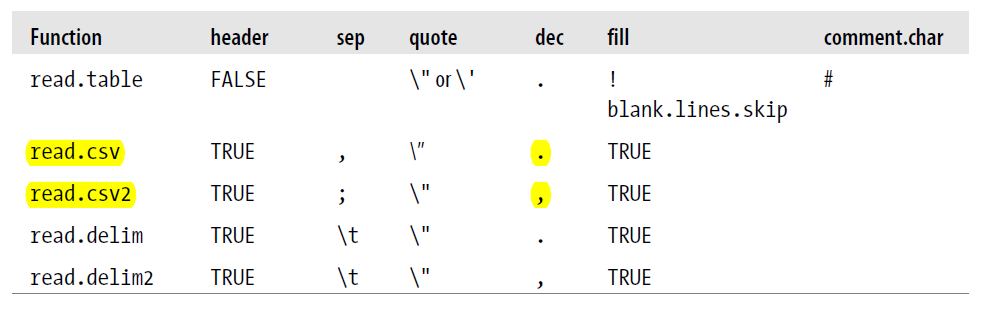
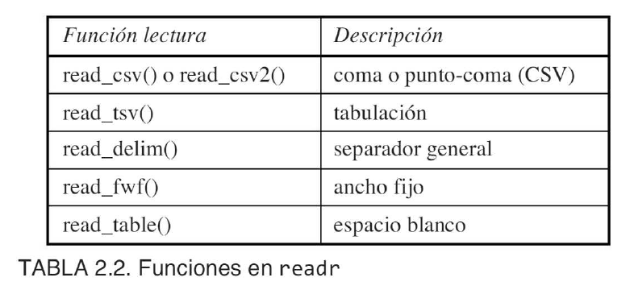
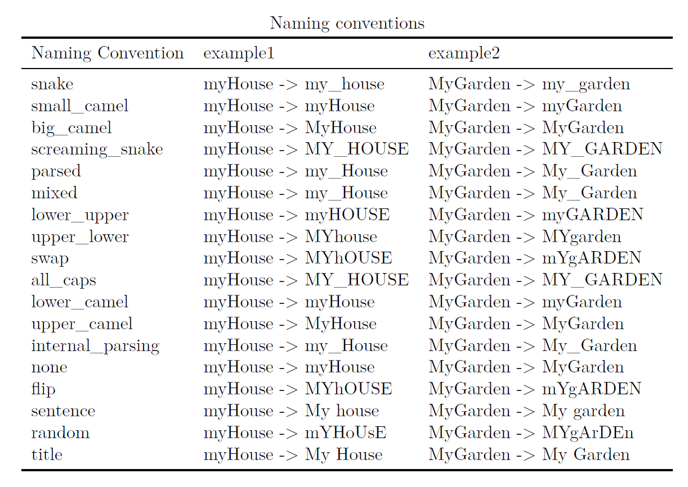
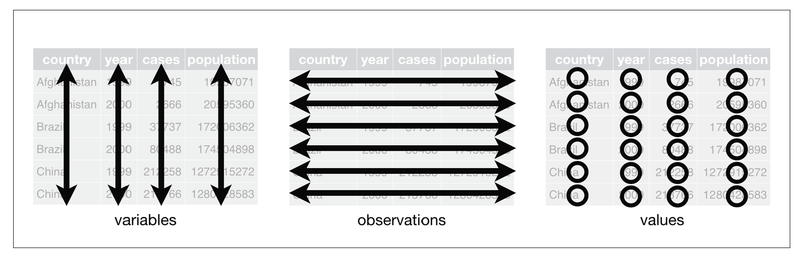

```{r, include=FALSE}
## By default, show code for all chunks in the knitted document,
## as well as the output. To override for a particular chunk
## use echo = FALSE in its options.
knitr::opts_chunk$set(
   echo=TRUE, message=FALSE, warning=FALSE
)
```

```{r, echo=FALSE}
# CONFIG
user_name <- "fernandomillanvillalobos" # your Git username (only needed if
# you want to deploy to GH pages)
project_name <- "rddj-template" # adapt!
package_date <- "2022-05-01" # date of the CRAN snapshot that
# the checkpoint package uses
r_version <- "4.2.0" # R-Version to use
options(Ncpus = 4) # use 4 cores for parallelized installation of packages
if (r_version != paste0(version$major, ".", version$minor)) {
  stop("ERROR: specified R version does not match currently used.")
}
```

# Notes

This report was generated on `r Sys.time()`. R version: `r paste0(version$major, ".", version$minor)` on `r version$platform`. For this report, CRAN packages as of `r package_date` were used.

...

## R-Script & data

The preprocessing and analysis of the data was conducted in the [R project for statistical computing](https://www.r-project.org/). The RMarkdown script used to generate this document and all the resulting data can be downloaded [under this link](http://%60r%20user_name%60.github.io/%60r%20project_name%60/). Through executing `main.Rmd`, the herein described process can be reproduced and this document can be generated. In the course of this, data from the folder `input` will be processed and results will be written to `output`. The html on-line version of the analysis can be accessed through this [link](https://%60r%20user_name%60.github.io/%60r%20project_name%60/).

## GitHub

The code for the herein described process can also be freely downloaded from [https://github.com/`r user_name`/`r project_name`](https://github.com/%60r%20user_name%60/%60r%20project_name%60).

## License

...

## Data description of output files

#### `abc.csv` (Example)

| Attribute | Type    | Description |
|-----------|---------|-------------|
| a         | Numeric | ...         |
| b         | Numeric | ...         |
| c         | Numeric | ...         |

...

# Set up

```{r, echo=FALSE}
detach_all_packages <- function() {
  basic_packages_blank <-  c("stats",
                             "graphics",
                             "grDevices",
                             "utils",
                             "datasets",
                             "methods",
                             "base")
  basic_packages <- paste("package:", basic_packages_blank, sep = "")

  package_list <- search()[
    ifelse(unlist(gregexpr("package:", search())) == 1, TRUE, FALSE)]

  package_list <- setdiff(package_list, basic_packages)

  if (length(package_list) > 0)  for (package in package_list) {
    detach(package, character.only = TRUE, unload = TRUE)
    print(paste("package ", package, " detached", sep = ""))
  }
}

detach_all_packages()

# this allows multiple persons to use the same RMarkdown
# without adjusting the working directory by themselves all the time
source("scripts/csf.R")
path_to_wd <- csf() # if this - for some reason - does not work,
# replace with a hardcoded path, like so: "~/projects/rddj-template/analysis/"
if (is.null(path_to_wd) | !dir.exists(path_to_wd)) {
  print("WARNING: No working directory specified for current user")
} else {
  setwd(path_to_wd)
}

# suppress scientific notation
options(scipen = 999)

# suppress summarise info
options(dplyr.summarise.inform = FALSE)

# unload global rstudioapi and knitr again to avoid conflicts with checkpoint
# this is only necessary if executed within RStudio
# outside of RStudio, namely in the knit.sh script, this causes RMarkdown
# rendering to fail, thus should not be executed there
if (Sys.getenv("RSTUDIO") == "1") {
  detach_all_packages()
}
```

## Define packages

```{r, echo=TRUE, message=FALSE, warning=FALSE}
# from https://mran.revolutionanalytics.com/web/packages/\
# checkpoint/vignettes/using-checkpoint-with-knitr.html
# if you don't need a package, remove it from here (commenting not sufficient)
# tidyverse: see https://blog.rstudio.org/2016/09/15/tidyverse-1-0-0/
cat("
library(rstudioapi)
library(tidyverse)
library(data.table)
library(tidylog)
library(jsonlite)
library(lintr)
library(rmarkdown)
library(rio)
library(cowplot)
library(extrafont)
library(ggrepel)
library(scales)
library(pacman)
library(htmltab)
library(rmiscutils)
library(RSQLite)
library(fs)
library(openxlsx)
library(waldo)
library(vcdExtra)
library(psych)
library(Hmisc)
library(skimr)
library(gapminder)
library(janitor)",
file = "manifest.R")
```

## Install packages

```{r, echo=TRUE, message=FALSE, warning=FALSE}
# if checkpoint is not yet installed, install it (for people using this
# system for the first time)
if (!require(checkpoint)) {
  if (!require(devtools)) {
    install.packages("devtools", repos = "http://cran.us.r-project.org")
    require(devtools)
  }
  devtools::install_github("RevolutionAnalytics/checkpoint",
                           ref = "v0.3.2", # could be adapted later,
                           # as of now (beginning of July 2017
                           # this is the current release on CRAN)
                           repos = "http://cran.us.r-project.org")
  require(checkpoint)
}
# nolint start
if (!dir.exists("~/.checkpoint")) {
  dir.create("~/.checkpoint")
}
# nolint end
# install packages for the specified CRAN snapshot date
checkpoint(snapshot_date = package_date,
           project = path_to_wd,
           verbose = T,
           scanForPackages = T,
           use.knitr = F,
           R.version = r_version)
rm(package_date)
```

## Load packages

```{r, echo=TRUE, message=FALSE, warning=FALSE}
source("manifest.R")
unlink("manifest.R")
sessionInfo()
```

## Load additional scripts

```{r, echo=TRUE, message=FALSE, warning=FALSE}
# if you want to outsource logic to other script files, see README for 
# further information
# Load all visualizations functions as separate scripts
knitr::read_chunk("scripts/dviz.supp.R")
source("scripts/dviz.supp.R")
knitr::read_chunk("scripts/themes.R")
source("scripts/themes.R")
knitr::read_chunk("scripts/plot_grid.R")
source("scripts/plot_grid.R")
knitr::read_chunk("scripts/align_legend.R")
source("scripts/align_legend.R")
knitr::read_chunk("scripts/label_log10.R")
source("scripts/label_log10.R")
knitr::read_chunk("scripts/outliers.R")
source("scripts/outliers.R")
```

# Import and export data with R

There are some different ways to do this, depending on how your data is formatted and where it's located.

## Base-R

### Entering data using R commands

R provides a nice GUI for editing tabular data: **the data editor**.

The `c` function has already been introduced as a way to input small amounts of data into R. When the amount of data is large, and especially when typing the data into the console is inappropriate, the `scan` function can be used. `scan` is most appropriate when all the data to be read is of the same mode, so that it can be accommodated by a vector or matrix. The first argument to `scan` can be a quoted string or character variable containing the name of a file or a URL, or it can be any of a number of connections to allow other input sources. If no first argument is given, scan will read from the console, stopping when a completely blank line is entered. By default, `scan` expects all of its input to be numeric data; this can be overridden with the `what=` argument, which specifies the type of data that scan will see.

When reading from the console, R will prompt you with the index of the next item to be entered, and report on the number of elements read when it's done. If the what= argument to scan is a list containing examples of the expected data types, scan will output a list with as many elements as there are data types provided. To specify numeric values, you can pass a value of 0.

Note that, by naming the elements in the list passed through the `what=` argument, the output list elements are appropriately named. When the argument to what= is a list, the `multi.line=` option can be set to FALSE to prevent scan from trying to use multiple lines to read the records for an observation. One of the most common uses for scan is to read in data matrices. Since scan returns a vector, a call to scan can be embedded inside a call to the matrix function.

```{r}
salary <- c(18700000, 14626720, 14137500, 13980000, 12916666)
position <- c("QB", "QB", "DE", "QB", "QB")
team <- c("Colts", "Patriots", "Panthers", "Bengals", "Giants")
name.last <- c("Manning", "Brady", "Pepper", "Palmer", "Manning")
name.first <- c("Peyton", "Tom", "Julius", "Carson", "Eli")
top.5.salaries <- data.frame(name.last, name.first, team, position, salary)
top.5.salaries

# calling the built-in data editor
# top.5.salaries <- edit(top.5.salaries)
# fix(top.5.salaries)

# using scan
# names <- scan(what = "")
# names
# names2 = scan(what=list(a=0,b="",c=0))
# names2

# creating a matrix
# mymat <- matrix(scan(), ncol = 3, byrow = TRUE)
# mymat
```

### Importing data from external files

R includes a family of functions for importing delimited text files into R, based on the `read.table` function. The `read.table` function reads a text file into R and returns a data.frame object. Each row in the input file is interpreted as an observation. Each column in the input file represents a variable. The read.table function expects each field to be separated by a delimiter. The most important options are `sep` and `header`. R includes a set of convenience functions that call `read.table` with different default options for these values. Besides that, you can fetch a CSV file from a single URL.



Although not as common as white-space-, tab-, or comma-separated data, sometimes input data is stored with no delimiters between the values, but with each variable occupying the same columns on each line of input. In cases like this, the `read.fwf` function can be used. The `widths=` argument can be a vector containing the widths of the fields to be read, using negative numbers to indicate columns to be skipped. If the data for each observation occupies more than one line, `widths=` can be a list of as many vectors as there are lines per observation. The `header=`, `row.names=`, and `col.names=` arguments behave similarly to those in `read.table`.

```{r}
snowdata <- read.table("input/BostonWinterSnowfalls.csv", header = TRUE, sep = ",", quote = "\"")

# getting data online
sp500 <- read.csv("http://bit.ly/BostonSnowfallCSV", sep="")

# getting data with no delimiters
ff <- tempfile()
cat(file = ff, "New York, NY 66,834.6 
    Kings, NY 34,722.9 
    Bronx, NY 31,729.8 
    Queens, NY 20,453.0 
    San Francisco, CA 16,526.2 
    Hudson, NJ 12,956.9 
    Suffolk, MA 11,691.6 
    Philadelphia, PA 11,241.1 
    Washington, DC 9,378.0 
    Alexandria IC, VA 8,552.2")
city <- read.fwf(ff, widths = c(18, -19, 8), as.is = TRUE)
city
```
### Exporting data

R can also export R data objects (usually data frames and matrices) as text files. To export data to a text file, use the `write.table` function.There are wrapper functions for `write.table` that call `write.table` with different defaults. These are useful if you want to create a file of comma-separated values.

```{r}
# write.table(snowdata, file = "output/snowdata.txt", quote = FALSE, sep = ",", row.names = FALSE)
# write.csv(snowdata, file = "output/snowdata.csv", row.names = FALSE)
```

### Importing data from databases

In order to connect directly to a database from R, you will need to install some optional packages. The packages you need depend on the database(s) to which you want to connect and the connection method you want to use.

There are two sets of database interfaces available in R:

-   **RODBC**. The RODBC package allows R to fetch data from ODBC (Open DataBase Connectivity) connections. ODBC provides a standard interface for different programs to connect to databases.

-   **DBI**. The DBI package allows R to connect to databases using native database drivers or JDBC drivers. This package provides a common database abstraction for R software.

DBI is not a single package, but instead is a framework and set of packages for accessing databases.One important difference between the DBI packages and the RODBC package is in the objects they use: DBI uses S4 objects to represent drivers, connections, and other objects. To open a connection with DBI, use the dbConnect function. The argument drv can be a DBIDriver object or a character value describing the driver to use. You can generate a DBIDriver object with a call to the DBI driver. The dbConnect function can take additional options, depending on the type of database you are using. For SQLite databases, the most important argument is dbname (which specifies the database file). Check the help files for the database you are using for more options. Even arguments for parameters like usernames are not the same between databases.

As example we can easily copy an R data frame into a SQLite database with dbWriteTable().

```{r}
# to connect with an external database
# drv <- dbDriver("SQLite")
# con <- dbConnect(drv, dbname = system.file("extdata", "bb.db", package = "nutshell"))

# creating our database
mydb <- dbConnect(RSQLite::SQLite(), "")
dbWriteTable(mydb, "mtcars", mtcars)
dbWriteTable(mydb, "iris", iris)
dbListTables(mydb)

# Issue a query with dbGetQuery()
dbGetQuery(mydb, 'SELECT * FROM mtcars LIMIT 5')

# disconnecting from dabase
dbDisconnect(mydb)
```

## Tidyverse

### Reading data

El paquete readr, incluido en la familia tidyverse, admite la lectura de múltiples formatos de archivo usando funciones que comienzan por `read_*` o `write_*`. Por defecto, la función `read_excel()` importa la primera hoja. Para importar una hoja diferente es necesario indicarlo con el argumento sheet o bien el número o el nombre (segundo argumento). La función más importante para leer múltiples hojas es `map()` del paquete *purrr* que forma para de la colección de paquetes tidyverse. `map()` permite aplicar una función a cada elemento de un vector o lista. Existe una variante de `map()` que directamente nos une todas las tablas por fila: `map_df()`. Si fuese necesario unir por columna, se debería usar `map_dfc()`.

La función `dir_ls()` del paquete *fs* (<https://github.com/r-lib/fs>), a pesar de ser similar a `dir()` de R Base, tiene algunas ventajas, como su total compatibilidad con la colección de funciones de *tidyverse*. Por ejemplo, el argumento `regexp` permite buscar con una expresión regular un patrón en las rutas y ficheros.



Most of us would probably read the CSV file first and then do the data cleaning. For example, using the `clean_names` function from the _janitor_ package. The same can be achieved inside `read_csv` with the function `make_clean_names` for the `name_repair` argument. The function uses the snake naming convention by default. Snake converts all names to lowercase and separates words with an underscore. Besides that, `clean_names` does not work with vectors, but `make_clean_names` does.

 

With make_clean_names you can also replace certain characters from the column names. If you are familiar with regular expressions, you can make more complex replacements. Apart from cleaning your column names, you can also select columns directly from `read_csv` using the `col_select` argument.

```{r}
# janitor approach
mpg_new <- read_csv("input/mpg_uppercase.csv", show_col_types = FALSE) %>%
  janitor::clean_names() %>%
  select(c(manufacturer, model)) %>%
  glimpse()

# tidyverse approach
read_csv("input/mpg_uppercase.csv", name_repair = make_clean_names, show_col_types = FALSE) %>%
  glimpse()

# replacing and removing character strings with make_clean_names
make_clean_names(c("A", "B%", "C"), replace = c("%" = "_percent"))
# with reg expressions
make_clean_names(c("A_1", "B_1", "C_1"), replace = c("^A_" = "a"))

# snake naming convention per default
make_clean_names(c("myHouse", "MyGarden"), case = "snake")
make_clean_names(c("myHouse", "MyGarden"), case = "none")

read_csv("input/mpg_uppercase.csv", show_col_types = FALSE, name_repair = ~ make_clean_names(., case = "upper_camel")) %>% # The dot . in make_clean_names denotes the vector of column names. 
  glimpse()

# selecting specific columns
read_csv("input/mpg_uppercase.csv", show_col_types = FALSE, name_repair = make_clean_names, col_select = c(manufacturer, model)) %>% 
  glimpse()
```
You don"t always read just one file into R. It is not uncommon for your data to be scattered in hundreds or thousands of files. Of course, you don"t want to read these files into R manually. So you need an automatic method for reading in files. Before we can read the files into R, we need to create a character vector of the file paths. You have several options to create such a vector. You can use the R base function `list.files`, which returns character vectors of the names of files in a directory or you use the function `dir_ls` from the _fs_ package. The other option is to use the `dir_ls` function from the _fs_ package. _fs_ provides a cross-platform interface for accessing files on your hard disk. It supports all file operations (deleting, creating files, moving files, etc.).

Now that we know the file paths, we can load the files into R. The tidyverse way to do this is to use the `map_dfr` function from the _purrr_ package. `map_dfr` loops through all the file paths and binds the data frames into a single data frame. The `.x` in the following code stands for the file name. To output the actual csv files and not the filenames, we need to put `.x` (the path) in a `read_*` function. In this example we are working with CSV files. The trick works the same for all rectangular file formats. Another approach is to use the `read_csv` function directly by putting the character vector of the file names directly into `read_csv`.

Sometimes your files are deeply nested. In that case, we need to search through each folder recursively. If you try to load all csv files from the nested_folders folder, you would get an empty vector. This is because `dir_ls` does not look in the nested folders, but only in the parent folder. To make `dir_ls` search through the folders recursively, you need to set the `recurse` argument to `TRUE`. 

You don"t always need all the files in your directory and need to remove some files from the list of file paths. A good way to do this is to use the `str_detect` function from the _stringr_ package. The function returns logical values. To change the actual character vector, we need to add these logical values to the character vector itself. With the `negate` argument you can find only the files that do not match the pattern.

```{r}
horas_sol <- read_csv("input/SS_STAID001395.txt", skip = 19) |> # los datos empiezan en la linea 20
  janitor::clean_names()
head(horas_sol)

# .xlsx files
# importing .xls file
emisiones <- readxl::read_xls("input/env_air_gge.xls", sheet = 1, skip = 362, n_max = 36)
head(emisiones)

# iterate over multiple worksheets in a workbook
path <- "input/madrid_temp.xlsx"
mad <- path %>%
  readxl::excel_sheets() %>%
  set_names() %>%
  map_df(readxl::read_excel,
    path = path, .id = "yr"
  )
head(mad)

# importing and reading several .xlsx files at once without merging
dir_ls("input", regexp = "xlsx") %>%
  map(readxl::read_excel)

# merging into a new column
data_df <- dir_ls("input", regexp = "xlsx") %>% 
  map_df(readxl::read_excel, .id = "city")
# cleaning city column
data_df <- mutate(data_df, city = path_file(city) %>% 
                    path_ext_remove() %>% 
                    str_replace("_temp", ""))
head(data_df)

# .csv files
# adding new directory
# dir_create("input", c("many_files"))

# creating random samples from mpg data set
# mpg_samples <- map(1:25, ~ slice_sample(mpg, n = 20))

# adding .csv files from samples to the new directory
# iwalk(mpg_samples, ~ write_csv(., paste0("input/many_files/", .y, ".csv")))

# creating a character vector of file paths
# with list.files from Base-R
(csv_files_list_files <- list.files(path = "input/many_files", pattern = "csv", full.names = TRUE))
# with dir_ls from fs package
(csv_files_dir_ls <- dir_ls(path = "input/many_files/", glob = "*.csv", type = "file"))

# reading the files from a character vector of paths
data_frames <- map_dfr(csv_files_dir_ls, ~ read_csv(.x, show_col_types = FALSE))
glimpse(data_frames)
# and with a new column representing the file name
map_dfr(csv_files_dir_ls, ~ read_csv(.x, , show_col_types = FALSE) %>%
  mutate(filename = .x)) %>%
  glimpse()

# using directly read_csv
read_csv(csv_files_dir_ls, id = "filename", show_col_types = FALSE) %>% 
  glimpse

# inconsistent column names
# generating the samples with inconsistent column names
mpg_samples2 <- map(1:10, ~ slice_sample(mpg, n = 20))
inconsistent_dframes <- map(mpg_samples2, ~ janitor::clean_names(dat = .x, case = "random"))
map(inconsistent_dframes, ~ colnames(.x)) %>% 
  head

# selecting a random set of columns per data frame
inconsistent_dframes <- map(inconsistent_dframes, ~ .x[sample(1:length(.x), sample(1:length(.x), 1))])
map(inconsistent_dframes, ~ colnames(.x)) %>%
  head()

# saving to disk
# dir_create(c("input/unclean_files"))
# iwalk(inconsistent_dframes, ~ write_csv(.x, paste0("input/unclean_files/", .y, ".csv")))

# loading and cleaning the data frames
many_columns_data_frame <- dir_ls(path = "input/unclean_files/", glob = "*.csv", type = "file") %>%
  map_dfr(~ read_csv(.x, name_repair = tolower, show_col_types = FALSE) %>% 
            mutate(filename = .x))

# showing results
many_columns_data_frame %>% 
  glimpse()

# files not in the same folder
mpg_samples3 <- map(1:40, ~ slice_sample(mpg, n = 20)) 

# Create directories
# dir_create(c("input/nested_folders", "input/nested_folders/first_nested_folder", "input/nested_folders/second_nested_folder"))

# First folder 
# iwalk(mpg_samples[1:20], ~ write_csv(.x, paste0("input/nested_folders/first_nested_folder/", .y, "_first.csv")))

# Second folder 
# iwalk(mpg_samples[21:40], ~ write_csv(.x, paste0("input/nested_folders/second_nested_folder/", .y, "_second.csv")))

# searching through nested folders recursively
(csv_files_nested <- dir_ls("input/nested_folders/", glob = "*.csv", type = "file", recurse = TRUE))
map_dfr(csv_files_nested, ~ read_csv(.x, show_col_types = FALSE) %>% 
          mutate(filename = .x)) %>%
  glimpse()

# selecting the files to import from a string pattern
csv_files_nested[str_detect(csv_files_nested, pattern = "[2-4]_first|second\\.csv$", negate = TRUE)] %>% 
  map_dfr(~ read_csv(.x, show_col_types = FALSE) %>% 
            mutate(filename = .x)) %>% 
  glimpse()
```

### Writing data

The `write_csv` function writes tabular data to an ASCII file in CSV format. Each row of data creates one line in the file, with data items separated by commas (,).

```{r}
# write_csv(horas_sol, "output/horas_sol.csv")
```

## Packages

### The magic of rio

"The aim of **rio** is to make data file I/O [import/output] in R as easy as possible by implementing three simple functions in Swiss-army knife style," according to the project's GitHub page. Those functions are `import()`, `export()`, and `convert()`. So, the rio package has just one function to read in many different types of files: `import()`. Once you've analyzed your data, if you want to save the results as a CSV, Excel spreadsheet, or other format, rio's `export()` function can handle that. You can use R's `download.file` function with the syntax `download.file("url", "destinationFileName.csv")` to download files directly from the web. It's possible rio will ask you to re-download the file in binary format, in which case you'll need to run `download.file(“http://bit.ly/BostonSnowfallCSV”, “BostonWinterSnowfalls.csv”, mode=‘wb"`).

```{r}
# getting data from the web with R-built-in
download.file("http://bit.ly/BostonSnowfallCSV", "input/BostonWinterSnowfalls.csv")
# download.file(“http://bit.ly/BostonSnowfallCSV”, “BostonWinterSnowfalls.csv”, mode=‘wb")

# import data with rio locally
snowdata2 <- rio::import("input/BostonWinterSnowfalls.csv")
suicides <- rio::import("input/PDT-suicidesData.csv")
# rio::import("mySpreadsheet.xlsx", which = 2, col_names = c("City", "State", "Population"))
```

#### Import a file from the Web

If you want to download and import a file from the Web, you can do so if it's publicly available and in a format such as Excel or CSV you can use `rio`. A lot of systems will be able to follow the redirect URL to the file even after first giving you an error message, as long as you specify the format as "csv" since the file name here doesn't include ".csv". rio can also import well-formatted HTML tables from Web pages, but the tables have to be extremely well-formatted. In real life, though, Web data rarely appears in such neat, isolated form. A good option for cases that aren't quite as well crafted is often the **htmltab** package. Since it wasn't specified which table, it pulled the first HTML table on the page. To download a specific table use the `which` argument.

The most popular way to install packages from GitHub is to use a package called **devtools**. devtools is an extremely powerful package designed mostly for people who want to write their own packages, and it includes a few ways to install packages from other places besides CRAN. However, devtools usually requires a couple of extra steps to install compared to a typical package. However, the **pacman** package will also install packages from non-CRAN sources like GitHub. You can use the `number_with_commas()` function to change those character strings that should be numbers back into numbers. The **rmiscutils** package isn't the only way to deal with imported numbers that have commas, the tidyverse readr package also includes a function that turns character strings into numbers, `parse_number()`. One advantage of `readr::parse_number()` is that you can define your own `locale()` to control things like encoding and decimal marks. There's an R package called **janitor** that can automatically fix troublesome column names imported from a non-R-friendly data source. You can create new clean column names using janitor's `clean_names()` function.

```{r}
# getting data from the web with rio
snowdata3 <- rio::import("http://bit.ly/BostonSnowfallCSV", format = "csv")

# getting html tables
design.tokens1 <- rio::import("https://designsystem.digital.gov/design-tokens/", format = "html")
citytable <- htmltab("https://en.wikipedia.org/wiki/List_of_United_States_cities_by_population", which = 5)
design.tokens2 <- htmltab("https://designsystem.digital.gov/design-tokens/", which = 6)

# installing packages from GitHub with pacman
pacman::p_load_gh("smach/rmiscutils")

# changing those character strings that should be numbers back into numbers
citytable$PopEst2021 <- number_with_commas(citytable$`2021estimate`)
citytable$Census2020 <- readr::parse_number(citytable$`2020census`)

# cleaning cols names
citytable_cleaned <- janitor::clean_names(citytable)
names(citytable_cleaned)
```

#### Import data from packages

If you are interested in state or local government data in the US or Canada, you may want to check out RSocrata to see if an agency you're interested in posts data there. I've yet to find a complete list of all available Socrata data sets, but there's a search page at <https://www.opendatanetwork.com>.

### What's a data frame? And what can you do with one?

It's easy to add a column to a data frame. The name of the new column is on the left, and there's a formula on the right. Some of these special dataframe functions (technically called "methods") not only give you information, but let you change characteristics of the data frame. So, `names(snowdata)` tells you the column names in the data frame but it will change the column names in the data frame.

```{r}
# adding cols
snowdata$Meters <- snowdata$Total * 0.0254

# changing col names
names(snowdata) <- c("Winter", "SnowInches", "SnowMeters")

# changing from num to chr
download.file("https://raw.githubusercontent.com/smach/R4JournalismBook/master/data/bostonzips.txt", "input/bostonzips.txt")
zips <- rio::import("input/bostonzips.txt", colClasses = c("character", "character"))
# or
# zips <- rio::import("input/bostonzips.txt", colClasses = rep("character", 2))
# rep("character", 2) is the same as c(“character”, “character”), so colClasses = rep("character", 2) is equivalent to colClasses = c("character", "character")
```

### Exporting data

Often after you've wrangled your data in R, you'll want to save your results. Here are some of the ways to export your data:

-   Save to a CSV file with `rio::export(myObjectName, file="myFileName.csv")` and to an Excel file with `rio::export(myObjectName, file="myFileName.xlsx")`. rio understands what file format you want based on the extension of the file name. There are several other available formats, including .tsv for tab-separated data, .json for JSON and .xml for XML.

-   Save to an R binary object that makes it easy to load back into R in future sessions. There are two options.

Generic `save()` will save one or more objects into a file, such as `save(objectName1, objectName2, file="myfilename.RData")`. To read this data back into R, you just use the command `load("myfilename.RData")` and all the objects return with the same names in the same state they had before.

You can also save a single object into a file with `saveRDS(myobject, file="filename.rds")`. The logical assumption would be that loadRDS would read the file back in, but instead the command is readRDS -- and in this case, just the data has been stored, not the object name. So, you need to read the data into a new object name, such as `mydata <- readRDS("filename.rds")`.

You can also export an R object into your Windows or Mac clipboard with rio: `rio::export(myObjectName, format = "clipboard")`. And, you can import data into R from your clipboard the same way: `rio::import(file = "clipboard")`.

rio's `convert()` function lets you convert one file type to another without having to manually pull the data into and then out of R.

The *openxlsx* package makes writing to Excel files relatively easy. While there are lots of options in *openxlsx*, a typical pattern is to specify an Excel filename and a sheet name.

```{r}
# write.xlsx(horas_sol, sheetName = "horas_sol", file = "output/horas_sol.xlsx")
```

### Additional resources

While rio is a great Swiss Army knife of file handling, there may be times when you want a bit more control over how your data is pulled into or saved out of R. In addition, there have been times when I've had a challenging data file that rio choked on but another package could handle. Some other functions and packages you may want to explore:

-   Base R's `read.csv()` and `read.table()` to import text files (use ?read.csv and ?read.table to get more information). `stringsAsFactors = FALSE` is needed with these if you want to keep your character strings as character strings. `write.csv()` will save to CSV.

-   Wickham's readr package is also worth a look as part of the "tidyverse." **readr** includes functions to read CSV, tab-separated, fixed-width, Web logs, and several other types of files. readr prints out the type of data it has determined for each column -- integer, character, double (non-whole numbers), etc. It creates tibbles.

-   The **googlesheets** package lets you import data from a Google Sheet, even if it's private, by authenticating your Google account. The package is available on CRAN; install it with with `install.packages("googlesheets")`.

If you are working with large data sets, speed may become important to you when saving and loading files. The **data.table** package has a speedy `fread()` function, but beware that resulting objects are data.tables and not plain data frames; some behaviors are different. If you want a conventional data frame, you can get one with the `as.data.frame(mydatatable)` syntax. `fwrite()` function is aimed at writing to a CSV file considerably faster than base R's `write.csv()`.

The **feather** package saves in a binary format that can be read either into R or Python. And, the **fst** package's `read.fst()` and `write.fst()` offer fast saving and loading of R data frame objects -- plus the option of file compression.

# Reshaping data

## Base-R

Often the values required for a particular operation can be found in a data frame, but they are not organized in the appropriate way. As a simple example, data for multiple groups are often stored in spreadsheets or data summaries as columns, with a separate column for each group. Most of the modeling and graphics functions in R will not be able to work with such data; they expect the values to be in a single column with an additional column that specifies the group from which the data arose. The `stack` function can reorganize datasets to have this property. If there were other variables in the data frame that did not need to be converted to this form, the `select=` argument to stack allows you to specify the variables that should be used, similar to the same argument to the `subset` function. The `unstack` function will reorganize stacked data back to the one column per group form. To use `unstack`, a formula must be provided to explain the roles of the variables to be unstacked.

For more complex reorganizations, the concept of “wide” versus “long” datasets is often helpful. When there are multiple occurrences of values for a single observation, a data frame is said to be long if each occurrence is a separate row in the data frame; if all of the occurrences of values for a given observation are in the same row, then the dataset is said to be wide. The `reshape` function converts datasets between these two forms. Perhaps the most common use of reshape involves repeated measures analyses, where the same variable is recorded for each observation at several different times.

To use reshape to convert the dataset to wide format, we need to provide five arguments. The first argument is the data frame to be reshaped. The next three arguments provide the names of the columns that will be involved in the reshaping. The idvar= argument provides the names of the variables that define the experimental unit which was repeatedly measured. In this case, it"s the subj variable. The v.names= argument tells reshape which variables in the long format will be used to create the multiple variables in the wide format. In this example, we want both x and y be to be expanded to multiple variables, so we"d specify a vector with both those names. The timevar= variable tells which variable identifies the sequence number that will be used to create the multiple versions of the v.names variables; in this case it will be time. Finally, the direction= argument accepts values of "wide" or "long", depending on which transformation is to be performed.

The names x.1, y.1, etc. were formed by joining together the variable names of the variables specified in the `v.names=` argument with the values of the `timevar=` variable. Any variables not specified in the `v.names=` argument are assumed to be constant for all observations with the same values as the `idvar=` variables, and a single copy of such variables will be included in the output data frame. Only the variables whose names appear in the `v.names=` argument will be converted into multiple variables, so if any variables that are in the data frame but not in the `v.names=` argument are not constant, reshape will print a warning message, and use the first value of such variables when converting to wide format. To prevent variables from being transferred to the output data frame, the drop= argument can be used to pass a vector of variable names to be ignored in the conversion.

The information about the reshaping procedure is stored as attributes in converted data frames, so once a data frame has been converted with reshape, it can be changed to its previous format by passing just the data frame with no additional arguments to `reshape`.

Since reshape can handle multiple sets of variables, the `varying=` argument should be passed a list containing vectors with the names of the different sets of variables that should be mapped to a single variable in the long dataset. The automatically generated variable id is simply a numeric index corresponding to the type variable; using `idvar="type"` will suppress its creation. The automatically generated variable time defaults to a set of consecutive integers; providing more meaningful values through the `times=` argument will label the values properly. Finally, the name of the column representing the values (which defaults to the first name in the varying= argument) can be set to a more meaningful name with the v.names= argument.

The _reshape_ package uses the concept of “melting” a dataset (through the melt function) into a data frame which contains separate columns for each id variable, a variable column containing the name of each measured variable, and a final column named value with the variable"s value. It may be noticed that this melting operation is essentially a “wide-to-long” reshaping of the data.

For long-to-wide conversions, recall that variables appearing to the left of the tilde in the formula passed to cast will appear in the columns of the output, while those on the right will appear in the rows.

At the most basic level, two or more data frames can be combined by rows using `rbind`, or by columns using `cbind`. For `rbind`, the data frames must have the same number of columns; for `cbind`, the data frames must have the same number of rows. Vectors or matrices passed to `cbind` will be converted to data frames, so the mode of columns passed to `cbind` will be preserved. While `cbind` will demand that data frames and matrices are conformable (that is, they have the same number of rows), vectors passed to cbind will be recycled if the number of rows in the data frame or matrix is an even multiple of the length of the vector. It may be a good idea to use unique names when combining data frames in this way. An easy way to test is to pass the names of the two data frames to the `intersect` function. When using `rbind`, the names and classes of values to be joined must match, or a variety of errors may occur.

Although the `rbind` function will demand that the names of the objects being combined agree, `cbind` does not do any such checking. To combine data frames based on the values of common variables, the `merge` function should be used. This function is designed to provide the same sort of functionality and behavior as the table joins provided by relational databases. Although merge is limited to operating on two data frames at a time, it can be called repeatedly to deal with more than two data frames. The default behavior of `merge` is to join together rows of the data frames based on the values of all of the variables (columns) that the data frames have in common. (In database terminology, this is known as a natural join.) When called without any other arguments, merge returns only those rows which had observations in both data frames.

Although there were six unique values for a between the two data frames, only those rows with values of a in both data frames are represented in the output. To modify this, the `all=`, `all.x=`, and `all.y=` arguments can be used. Specifying `all=TRUE` will include all rows (full outer join, in database terminology), `all.x=TRUE` will include all rows from the first data frame (left outer join), and `all.y=TRUE` does the same for the second data frame (right outer join).

To take more control over which variables are used to merge rows of the data frame, the `by=` argument can be used. You provide the `by=` argument with a vector of the name or names of the variables that should be used for the merge. If the merging variables have different names in the data frames to be merged, the `by.x=` and `by.y=` arguments can be used.

```{r}
mydata <- data.frame(grp1 = c(12, 15, 19, 22, 25), grp2 = c(18, 12, 42, 29, 44), grp3 = c(8, 17, 22, 19, 31))

# reshaping data frame
sdata <- stack(mydata)
sdata

# converting the the original form
mydata <- unstack(sdata, values ~ ind)
mydata

# using reshape
set.seed(17)
obs <- data.frame(subj = rep(1:4, rep(3, 4)), time = rep(1:3), x = rnorm(12), y = rnorm(12))
head(obs)

# from long to wide
wideobs <- reshape(obs, idvar = "subj", v.names = c("x", "y"), timevar = "time", direction = "wide")
head(wideobs)

# from wide to long
obs <- reshape(wideobs)
head(obs)

# from wide to long (complex example)
usp <- data.frame(type = rownames(USPersonalExpenditure), USPersonalExpenditure, row.names = NULL)
head(usp)

rr <- reshape(usp, varying = list(names(usp)[-1]), idvar = "type", times = seq(1940, 1960, by = 5), v.names = "expend", direction = "long")
head(rr)

# an alternative way of reshaping the usp data frame, without having to explicitly provide the values of the times
rr1 <- reshape(usp, varying = names(usp)[-1], idvar = "type", split = list(regexp = "X1", include = TRUE), direction = "long")
head(rr1)

# using melt from reshape package (wide-to-long)
musp = reshape::melt(usp)
# or
# reshape::cast(musp,variable + type ~ .)
head(musp)

# getting rid of "X" and changing type to numeric
musp$variable <- as.numeric(sub("X", "", musp$variable))
# renaming columns
names(musp)[2:3] <- c("time", "expend")
head(musp)

# using cast from reshape package (long-to-wide)
set.seed(999)
obs2 <- data.frame(subj = rep(1:4, rep(3, 4)), time = rep(1:3), x = rnorm(12), y = rnorm(12))
mobs <- reshape::melt(obs2)
# reshape::cast(subj ~ variable + time, data = mobs)

# combining data sets using cbind and rbind
x <- data.frame(a = c("A", "B", "C"), x = c(12, 15, 19))
y <- data.frame(a = c("D", "E", "F", "G"), x = c(19, 21, 14, 12))
intersect(names(x), names(y))
cbind(y, z = c(1, 2))

# combining data sets based on the values of common variables
x <- data.frame(a = c(1, 2, 4, 5, 6), x = c(9, 12, 14, 21, 8))
y <- data.frame(a = c(1, 3, 4, 6), y = c(8, 14, 19, 2))
merge(x, y)

# outer join
merge(x, y, all = TRUE)

# left outer join
merge(x, y, all.x = TRUE)

# right outer join
merge(x, y, all.y = TRUE)

cities <- data.frame(city = c("New York", "Boston", "Juneau", "Anchorage", "San Diego", "Philadelphia", "Los Angeles", "Fairbanks", "Ann Arbor", "Seattle"), state.abb = c("NY", "MA", "AK", "AK", "CA", "PA", "CA", "AK", "MI", "WA"))
states <- data.frame(state.abb = c("NY", "MA", "AK", "CA", "PA", "MI", "WA"), state = c("New York", "Massachusetts", "Alaska", "California", "Pennsylvania", "Michigan", "Washington"))

merge(cities, states)
```

## Tidyverse

There are three interrelated rules which make **a dataset tidy**: 1. Each variable must have its own column. 2. Each observation must have its own row. 3. Each value must have its own cell. These three rules are interrelated because it’s impossible to only satisfy two of the three: 1. Put each dataset in a tibble. 2. Put each variable in a column.

- **Wide** form: every row corresponds to a unique *subject.*
- **Long** form: every row corresponds to a unique *measurement.*



`pivot_longer()` "lengthens" data, increasing the number of rows and decreasing the number of columns. The inverse transformation is `pivot_wider()`. `pivot_longer()` is an updated approach to `gather()`, designed to be both simpler to use and to handle more use cases. We recommend you use `pivot_longer()` for new code; `gather()` isn't going away but is no longer under active development.

`pivot_wider()` "widens" data, increasing the number of columns and decreasing the number of rows. The inverse transformation is `pivot_longer()`. `pivot_wider()` is an updated approach to `spread()`, designed to be both simpler to use and to handle more use cases. We recommend you use `pivot_wider()` for new code; `spread()` isn't going away but is no longer under active development.

```{r}
# wide to long
# where column names are character data
head(relig_income)
relig_income %>%
  pivot_longer(!religion, names_to = "income", values_to = "count")

# columns have common prefix and missing missings are structural so should be dropped
head(billboard)
billboard %>%
  pivot_longer(
    cols = starts_with("wk"),
    names_to = "week",
    names_prefix = "wk",
    values_to = "rank",
    values_drop_na = TRUE
  )

# multiple variables stored in column names
head(who)
who %>% 
  pivot_longer(
cols = new_sp_m014:newrel_f65,
names_to = c("diagnosis", "gender", "age"),
names_pattern = "new_?(.*)_(.)(.*)",
values_to = "count"
)
 
# multiple observations per row
head(anscombe)
anscombe %>% 
  pivot_longer(everything(),
 names_to = c(".value", "set"),
 names_pattern = "(.)(.)"
)

# long to wide
head(fish_encounters)
fish_encounters %>% 
  pivot_wider(names_from = station, values_from = seen)

# filling in missing values
fish_encounters %>%
  pivot_wider(names_from = station, values_from = seen, values_fill = 0)

# generating column names from multiple variables
head(us_rent_income)
us_rent_income %>% 
  pivot_wider(names_from = variable, values_from = c(estimate, moe))

# when there are multiple `names_from` or `values_from`, you can use use `names_sep` or `names_glue` to control the output variable names
us_rent_income %>%
  pivot_wider(
    names_from = variable,
    names_sep = ".",
    values_from = c(estimate, moe)
  )

us_rent_income %>%
 pivot_wider(
    names_from = variable,
    names_glue = "{variable}_{.value}",
    values_from = c(estimate, moe)
  )

warpbreaks <- as_tibble(warpbreaks[c("wool", "tension", "breaks")])
head(warpbreaks)
warpbreaks %>%
  pivot_wider(
    names_from = wool,
    values_from = breaks,
    values_fn = mean
  )
```

Existen otras tres funciones que son muy útiles para la manipulación de datos: `separate()`, que sirve para asegurar una columna en varias nuevas; `case_when()`, que sirve para establecer condionales y es similar a `ifelse()` y `complete()` que sirve para completar una variable o una combinación de variables.

Para mostrar la primera función convertimos la fecha en tres columnas: año (yr), mes (mo) y día (dy), cuyos elementos están separados por “-“. Por ello, es necesario indicar la columna afectada, los nombres de las nuevas columnas y el símbolo separador. La función `mutate_all()` aplica a todas las columnas otra función, en este caso, `as.numeric()` para convertir todas en numéricas.

En lugar de encapsular y encadenar `ifelse()`, podemos usar la función `case_when()`, en la que empleamos fórmulas en dos tiempos: por un lado la condición; por otro, la acción cuando se cumpla esa condición.

Nuestro conjunto de datos contiene datos diarios desde el 1 de enero de 1980 hasta el 31 de diciembre de 2015. Así que únicamente debemos crear un vector con fechas de este periodo. En la función `complete()` indicamos la columna que queremos completar y le asignamos el vector entero de fechas. El resultado es un nuevo `data.frame` con todas las fechas, rellenando el resto de columnas con NA.

```{r}
# ta_vigo <- read_csv( "input/TG_STAID001395.txt", skip = 20)
# head(ta_vigo)
# 
# ta_vigo <- mutate(ta_vigo, DATE = lubridate::ymd(DATE), TG = ifelse(TG == -9999, NA, TG / 10)) %>%
#   filter(DATE >= "1980-01-01", DATE <= "2015-12-31") %>%
#   select(-STAID:-SOUID, -Q_TG) %>%
#   rename(date = DATE)
# head(ta_vigo)
# 
# horas_sol <- read_csv("input/SS_STAID001395.txt", skip = 19)
# horas_sol <- mutate(horas_sol, DATE = lubridate::ymd(DATE), SS = ifelse(SS == -9999, NA, SS / 10), month = month(DATE), year = year(DATE))
# horas_sol <- rename(horas_sol, date = DATE, sunhours = SS)
# horas_sol
# data_vigo <- left_join (ta_vigo, horas_sol, by = "date" )
# data_vigo
# rio::export(data_vigo, file = "data_vigo.csv")

# using separate() 
time_df <- select(data_vigo, date) %>%
  separate(date, c("yr", "mo", "dy"), sep = "-") %>%
  mutate_all(as.numeric)
head(time_df)

# using case_when()
time_df <- mutate(time_df, season = case_when(
  mo %in% c(12, 1:2) ~ "invierno",
  mo %in% 3:5 ~ "primavera",
  mo %in% 6:8 ~ "verano",
  mo %in% 9:11 ~ "otoño"
))

# preparing the data
data_vigo <- gather(data_vigo, Variable, Valor, TG:sunhours)
data_vigo_subset <- filter(data_vigo, Variable == "TG") %>%
  slice(sample(nrow(data_vigo), 10000)) %>%
  arrange(date)
head(data_vigo_subset)
date_ts <- seq(lubridate::ymd("1980-01-01"), lubridate::ymd("2015-12-31"), "day")

# using complete()
data_vigo_subset <- complete(data_vigo_subset, date = date_ts)
head(data_vigo_subset)
```
## Packages

Sometimes it makes sense to spread an observation over multiple rows (long format), and sometimes it makes more sense to spread a variable across multiple columns (wide format). Some analyses require long data, whereas others require wide data.

When going from a __long format to a wide format__, you choose columns to group the observations by (in the _gapminder_ case: `country` and maybe also `continent`), columns to take values names from (`lifeExp`, `pop` and `gdpPercap`), and columns to create variable names from (year). In _data.table_, the transformation from long to wide is done using the `dcast` function.

In _data.table_, __wide-to-long__ formatting is done using `melt`.

```{r}
gm <- as.data.table(gapminder)
head(gm)

# from long to wide
gmw <- dcast(gm, country + continent ~ year, value.var = c("pop", "lifeExp", "gdpPercap"))
head(gmw)

# wide-to-long (not the best approach!)
gm <- melt(gmw, id.vars = c("country", "continent"), measure.vars = 2:37)
head(gm)

# splitting columns and casting
gm[, c("variable", "year") := tstrsplit(variable, "_", fixed = TRUE)]
gm <- dcast(gm, country + year ~ variable, value.var = c("value"))
head(gm)

# merging columns
aq <- as.data.table(airquality)
head(aq)

# creating a new column Date and mergin Month and Day into it (date format)
aq[, Date := as.Date(paste(1973, aq$Month, aq$Day, sep = "-"))]
head(aq)
```
It is common that data is spread over multiple tables. Consequently, it is important to be able to merge data from different tables. The simplest types of merges are binds, which can be used when you have two tables where either the rows or the columns match each other exactly.

An operation that combines columns from two tables is called a __join__. There are two main types of joins: __inner joins__ and __outer joins__.

- __Inner joins__: create a table containing all observations for which the key appeared in both tables. So if we perform an inner join on the `rev_data` and `weather_data` tables using `DATE` as the key, it won’t contain data for the days that are missing from either the revenue table or the weather table. 

In contrast, outer joins create a table retaining rows, even if there is no match in the other table. There are three types of outer joins:

- __Left join__: retains all rows from the first table. In the revenue example, this means all dates present in rev_data. 
- __Right join__: retains all rows from the second table. In the revenue example, this means all dates present in weather_data. 
- __Full join__: retains all rows present in at least one of the tables. In the revenue example, this means all dates present in at least one of `rev_data` and `weather_data`.

__Semijoins__ and __antijoins__ are similar to joins, but work on observations rather than variables. That is, they are used for filtering one table using data from another table:

- __Semijoin__: retains all observations in the first table that have a match in the second table. 
- __Antijoin__: retains all observations in the first table that do not have a match in the second table.

The same thing can be achieved using the filtering techniques, but semijoins and antijoins are simpler to use when the filtering relies on conditions from another table.

```{r}
# preparing the data
rev_data <- read.csv("input/sales-rev.csv", sep = ";")
weather_data <- read.csv("input/sales-weather.csv", sep = ";")

rev_data <- as.data.table(rev_data)
rev_data$DATE <- as.Date(rev_data$DATE)
weather_data <- as.data.table(weather_data)
weather_data$DATE <- as.Date(weather_data$DATE)

rev_jan <- rev_data[DATE %between% c("2020-01-01", "2020-01-31"), ]
rev_feb <- rev_data[DATE %between% c("2020-02-01", "2020-02-29"), ]
weather_jan <- weather_data[DATE %between% c("2020-01-01", "2020-01-31"), ]

str(rev_jan) 
str(rev_feb) 
str(weather_jan)

# with Base-R
# Join columns of datasets that # have the same rows: 
cbind(rev_jan, weather_jan)

# Join rows of datasets that have # the same columns: 
rbind(rev_jan, rev_feb)

# with dplyr
# Join columns of datasets that # have the same rows: 
# bind_cols(rev_jan, weather_jan) 

# Join rows of datasets that have # the same columns: 
# bind_rows(rev_jan, rev_feb)

# merging tables using keys
# data.table
# inner join
merge(rev_data, weather_data, by = "DATE")
# Or:
# setkey(rev_data, DATE)
# rev_data[weather_data, nomatch = 0]

# # dplyr
# rev_data %>% 
#   inner_join( weather_data, by = "DATE")

# outer join (left)
# data.table
merge(rev_data, weather_data, all.x = TRUE, by = "DATE") 
# Or: 
# setkey(weather_data, DATE) 
# weather_data[rev_data]

# dplyr
# rev_data %>% 
#   left_join( weather_data, by = "DATE")

# outer join (right)
# data.table
merge(rev_data, weather_data, all.y = TRUE, by = "DATE") 
# Or: 
# setkey(rev_data, DATE) 
# rev_data[weather_data]

# dplyr
# rev_data %>%
#   right_join(weather_data, by = "DATE")

# full join
# data.table
merge(rev_data, weather_data, all = TRUE, by = "DATE")

# dplyr
# rev_data %>% 
#   full_join( weather_data, by = "DATE")

# preparing the data
filter_data <- weather_data[TEMPERATURE < 0 & DATE %between% c("2020-02-01", "2020-02-29"), ]
head(filter_data)

# using a semijoin
# data.table
setkey(rev_data, DATE)
rev_data[rev_data[filter_data, which = TRUE]]

# dplyr
# rev_data %>%
#   semi_join(filter_data, by = "DATE")

# antijoin
# data.table
setkey(rev_data, DATE)
rev_data[!filter_data]

# dplyr
# rev_data %>%
#   anti_join(filter_data, by = "DATE")
```

# Summarizing data sets

## Base-R

```{r}
# returns column index names in table format
data.frame(colnames(snowdata))
# returns row index numbers in table format
data.frame(as.integer(rownames(snowdata)))

# getting a sense of the data set
str(snowdata)
# showing the number of rows and columns...
dim(snowdata)
nrow(snowdata)
ncol(snowdata)

# ...and names 
dimnames(snowdata)
rownames(snowdata)
colnames(snowdata)

# a brief statistical summary of a data set, run the summary() function
summary(snowdata)
```

## Tidyverse

```{r}
glimpse(snowdata)
```

## Packages

Find and concisely describe the difference between a pair of R objects with *waldo* package. One of the first things worth doing after importing a data set is looking at the first few rows, the last few rows, and a summary of some basic stats. This can be easily achieved thanks to the `headTail()` function of the *psych* package. To get a brief statistical summary you can use the `describe()` function of the *Hmisc* package or the *psych* package (only works for numeric data). The *skimr* package's `skim()` function will show information on each column, including a little histogram for each numeric one.

```{r}
df1 <- data.frame(X = c(1, 2, 3), Y = c("a", "b", "c"), A = c(3, 4, 5))
df2 <- data.frame(X = c(1, 2, 3, 4), Y = c("A", "b", "c", "d"), Z = c("k", "l", "m", "n"), A = c("3", "4", "5", "6"))
waldo::compare(df1, df2)

# getting the first and last rows
headTail(snowdata)

# getting statistical info
Hmisc::describe(snowdata)
psych::describe(snowdata)
skim(snowdata)
```
# Subsetting and modifying data frames

## Base-R

For objects that contain more than one element (vectors, matrices, arrays, data frames, and lists), subscripting is used to access some or all of those elements. Besides the usual numeric subscripts, R allows the use of character or logical values for subscripting. Subscripting operations are very fast and efficient, and are often the most powerful tool for accessing and manipulating data in R.

Like most computer languages, numeric subscripts can be used to access the elements of a vector, array, or list. The first element of an object has subscript 1; subscripts of 0 are silently ignored. In addition to a single number, a vector of subscripts (or, for example, a function call that returns a vector of subscripts) can be used to access multiple elements. The colon operator and the `seq` function are especially useful here. Negative subscripts in R extract all of the elements of an object except the ones specified in the negative subscript; thus, when using numeric subscripts, subscripts must be either all positive (or zero) or all negative (or zero).

If a subscriptable object is named, a character string or vector of character strings can be used as a subscript. Negative character subscripts are not permitted; if you need to exclude elements based on their names, the `grep` function can be used.

Logical values can be used to selectively access elements of a subscriptable object, provided the size of the logical object is the same as the object (or part of the object) that is being subscripted. Elements corresponding to TRUE values in the logical vector will be included, and objects corresponding to FALSE values will not. Logical subscripting provides a very powerful and simple way to perform tasks that might otherwise require loops. Like most operations in R, logical operators are vectorized; applying a logical subscript to a vector or an array will produce an object of the same size and shape as the original object. To find the indices of elements, R provides the `which` function, which accepts a logical vector, and returns __a vector containing the subscripts of the elements for which the logical vector was true__. Logical subscripts allow for modification of elements that meet a particular condition by using an appropriately subscripted object on the left-hand side of an assignment statement.

Lists are the most general way to store a collection of objects in R, because there is no limitation on the mode of the objects that a list may hold. Although it hasn"t been explicitly stated, one rule of subscripting in R is that subscripting will always return an object of the same mode as the object being subscripted. For matrices and vectors, this is completely natural, and should never cause confusion. But for lists, there is a subtle distinction between part of a list, and the object which that part of the list represents.

If the elements of the list are named, the actual contents of the elements can be accessed by separating the name of the list from the name of the element with a dollar sign ($). For interactive sessions, using the dollar sign notation is the natural way to perform operations on the elements of a list. For those situations where the dollar sign notation would be inappropriate (for example, accessing elements through their index or through a name stored in a character variable), R provides the double bracket subscript operator. Double brackets are not restricted to respect the mode of the object they are subscripting, and will extract the actual list element from the list.

__The key thing to notice is that in this case, single brackets will always return a list containing the selected element(s), while double brackets will return the actual contents of selected list element.__

Since data frames are a cross between a list and a matrix, it"s not surprising that both matrix and list subscripting techniques apply to data frames. When using logical subscripts with data frames containing missing values, it may be necessary to remove the missing values before the logical comparison is made, or unexpected results may occur. This situation is so common that R provides the `subset` function which accepts a data frame, matrix or vector, and a logical expression as its first two arguments, and which returns a similar object containing only those elements that meet the condition of the logical expression. It insures that missing values don"t get included, and, if its first argument is a data frame or matrix with named columns, it also resolves variable names inside the logical expression from the object passed as the first argument. A further convenience is offered by the `select=` argument which will extract only the specified columns from the data frame passed as the first argument. The argument to `select=` is a vector of integers or variable names which correspond to the columns that are to be extracted. Unlike most other functions in R, names passed through the `select=` argument can be either quoted or unquoted. To ignore columns, their name or index number can be preceded by a negative sign (-). Since the `select=` argument works by replacing variable names with their corresponding column indices, ranges of columns can be specified using variable names. The `subset` function will always return a new data frame, matrix or vector, so it is __not suited for modifying selected parts of a data frame__.

```{r}
# subsetting a list
simple <- list(a = c("fred", "sam", "harry"), b = c(24, 17, 19, 22))
mode(simple)
simple[2]
mode(simple[2])

simple$b
mean(simple$b)
mean(simple[[2]])

# single brackets return a list
simple[1]
# double brackets return the actual contents of selected list element
simple[[1]]

# subsetting a data frame
# First, we check the order of the columns:
data.frame(names(airquality))

airquality[5, 4]    # The 5th element from the 4th column,
                    # i.e. the same as airquality$Temp[5]
airquality[5,]      # The 5th row of the data
airquality[, 4]     # The 4th column of the data, like airquality$Temp
airquality[[4]]     # The 4th column of the data, like airquality$Temp
airquality[, c(2, 4, 6)] # The 2nd, 4th and 6th columns of the data
airquality[, -2]    # All columns except the 2nd one

airquality[, c("Temp", "Wind")] # The Temp and Wind columns

age <- c(28, 48, 47, 71, 22, 80, 48, 30, 31)
purchase <- c(20, 59, 2, 12, 22, 160, 34, 34, 29)
bookstore <- data.frame(age, purchase)

bookstore$age[2] <- 18
# or
bookstore[2, 1] <- 18

# subsetting with logical values
nums = c(12,9,8,14,7,16,3,2,9)
nums > 10
nums[nums > 10]

which(nums > 10)
# equal to
seq(along = nums)[nums > 10]

which.max(airquality$Temp)
airquality[which.max(airquality$Temp),]
airquality[airquality$Temp > 90, ]

# knowing if all elements in a vector fulfill the condition
all(airquality$Temp > 90)
# knowing whether at least one element in a vector fulfill the condition
any(airquality$Temp > 90)
# finding how many elements that fulfill a condition
sum(airquality$Temp > 90)

# modifying elements through logical subscriptions
nums[nums > 10] <- 0
nums
dd <- data.frame(a = c(5, 9, 12, 15, 17, 11), b = c(8, NA, 12, 10, NA, 15))

dd[dd$b > 10, ]

bookstore$visit_length <- c(5, 2, 20, 22, 12, 31, 9, 10, 11)
bookstore

# storing the TRUE or FALSE values in a new variable
airquality$Hot <- airquality$Temp > 90
airquality$Hot

# filtering and creating a new variable
temp_may <- airquality$Temp[airquality$Month == 5]
temp_june <- airquality$Temp[airquality$Month == 6]

# splitting vectors into lists
temps <- split(airquality$Temp, airquality$Month)
names(temps) <- c("May", "June", "July", "August", "September")
temps
temps$June

# collapsing lists into vectors
unlist(temps)

# using subset
subset(dd, b > 10)
some <- subset(LifeCycleSavings, sr > 10, select = c(pop15, pop75))
head(some)
life1 <- subset(LifeCycleSavings, select = pop15:dpi)
# or
life1 <- subset(LifeCycleSavings, select = 1:3)
head(life1)
life2 <- subset(LifeCycleSavings, select = c(-pop15, -pop75))
# or
life2 <- subset(LifeCycleSavings, select = -c(2, 3))
head(life2)
```

## Tidyverse

Select certain rows based on a logical condition - _dplyr"s_ `filter()`. To check for one condition OR another condition, use the `|` symbol, which means or. You can get the number of rows in a data frame with `nrow()`.

```{r}
# using filter from dplyr
filter(snowdata, "Boston" > 100)
filter(snowdata, "Boston" < 20 | "Boston" > 100)
snowdata[nrow(snowdata), ]

```

## data.table vs Tidyverse

_data.table_ and the _tidyverse_ packages offer simpler solutions and speed up the workflow for the types of problems we are dealing with. Both can be used for the same tasks. You can learn one of them or both. The syntax used for data.table is often more concise and arguably more consistent than that in dplyr (it is in essence an extension of the `[i, j]` notation that we have already used for data frames). Second, it is fast and memory-efficient, which makes a huge difference if you are working with big data. On the other hand, many people prefer the syntax in dplyr and _tidyr_, which lends itself exceptionally well for usage with pipes. If you work with small or medium-sized datasets, the difference in performance between the two packages is negligible. _dplyr_ is also much better suited for working directly with databases, which is a huge selling point if your data already is in a database.

_data.table_ relies heavily on the `[i, j]` notation that is used for data frames in R. It also adds a third element: `[i, j, by]`. Using this, R selects the rows indicated by i, the columns indicated by j and groups them by by. This makes it easy e.g. to compute grouped summaries. With the tidyverse packages you will instead use new functions with names like `filter` and `summarise` to perform operations on your data. These are typically combined using the pipe operator, `%>%`, which makes the code flow nicely from left to right.

_data.table_ syntax, as it only works on _data.table_ objects. __Luckily, _dplyr_ works perfectly when used on data.table objects__.

```{r}
aq <- as.data.table(airquality)

# modifying a variable
# data.table
aq[, Wind := Wind * 0.44704]
# dplyr
aq %>% mutate(Wind = Wind * 0.44704) -> aq


```


# Linting

The code in this RMarkdown is linted with the [lintr package](https://github.com/jimhester/lintr), which is based on the [tidyverse style guide](http://style.tidyverse.org/).

```{r echo=TRUE, message=FALSE, warning=FALSE, results='hide'}
# lintr::lint("main.Rmd", linters =
#               lintr::with_defaults(
#                 commented_code_linter = NULL,
#                 trailing_whitespace_linter = NULL
#                 )
#             )
# if you have additional scripts and want them to be linted too, add them here
# lintr::lint("scripts/my_script.R")
```
musp$variable = as.numeric(sub("X","",musp$variable))
names(musp)[2:3] = c("time","expend")